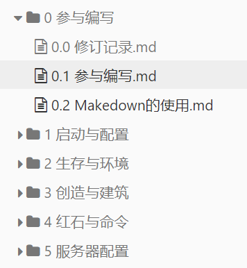

# 目录结构规范 

目录建立的原则：以最少的层次提供最清晰简便的访问结构。

* 目录的命名以小写英文字母（中文）、（下划线）和数字组成。例如 `3.创造与建筑` ，如下图，`0.0~X.X`，再下一层就用 `X.X.X` ，序号后用 `空格` 隔开序号与标题。

* (参照命名规范) 根目录一般只存放index.htm（README.md）以及其他必须的系统文件，每个主要栏目开设一个相应的独立目录 
* 根目录下的images用于存放各页面都要使用的公用图片，子目录下的images目录存放本栏目页面使用的私有图片 （方便删除与连接），**图片用软链接**。
* 对于网页：
  * 所有JS,ASP,PHP等脚本存放在根目录下的scripts目录 
  * 所有CGI程序存放在根目录下的cgi-bin目录 
  * 所有CSS文件存放在根目录下style目录
# 图片使用规范

