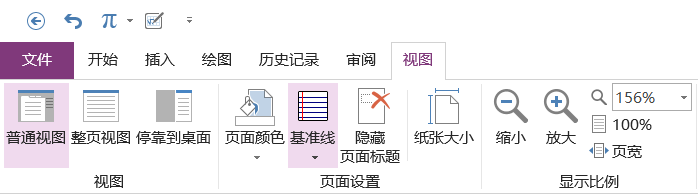
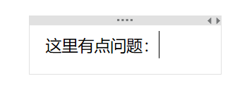
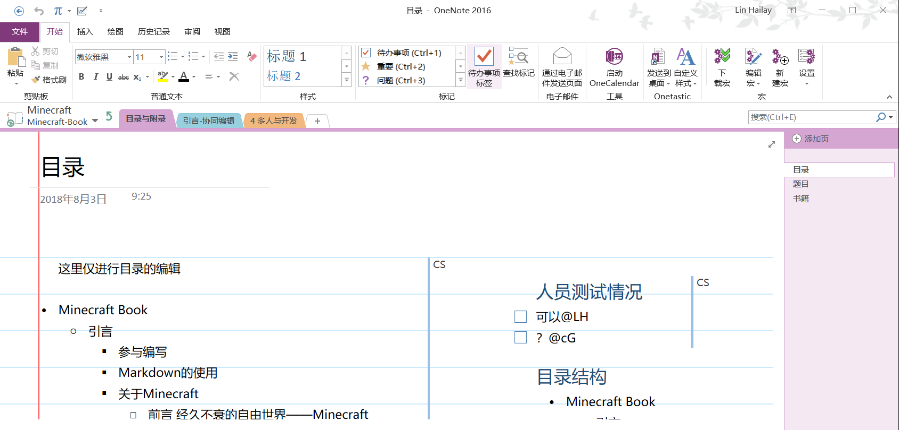

# 共享笔记本

联系Hailay（QQ:784298357），获取OneNote笔记本共享，然后在“打开笔记本”中找到Hailay共享给您的笔记本“Minecraft”，打开“Minecraft-Book”就可以看见本书了，其他的页面请不要编辑。

 

# OneNote的使用注意事项

1. 字体同一为微软雅黑（Microsoft YaHei UI）

2. 字号为11。如果感觉屏幕的字有点小可以 Ctrl+鼠滑轮 放大或缩小页面，或者到“视图”的“显示比例”中调节。

3. * 

4. 可查看其他成员正在编辑的页面，但是不要编辑，否则会造成页面合并的冲突，会非常混乱。所以发现有问题可以在其页面新开一个“框”留言。例如

5. - 

6. 作为一个笔记本，编写内容的时候可以先复制网站的内容到OneNote上，然后简化、概述，并且保留原文链接作为日后引用、打开的依据。

 

# OneNote的使用教程

 

## 版本选择

##  

### Win10 UWP 版

###  

### Office 2016 套件版

两者内容上差别不大，但是更推荐使用前者，只因其免费与美观，但后者功能更强大、完善。

 

## 隐藏拼写检查（UWP）

 

##  去除拼写检查小横线（OneNote2016）

!

F7 之后，选择 添加词典 

 

