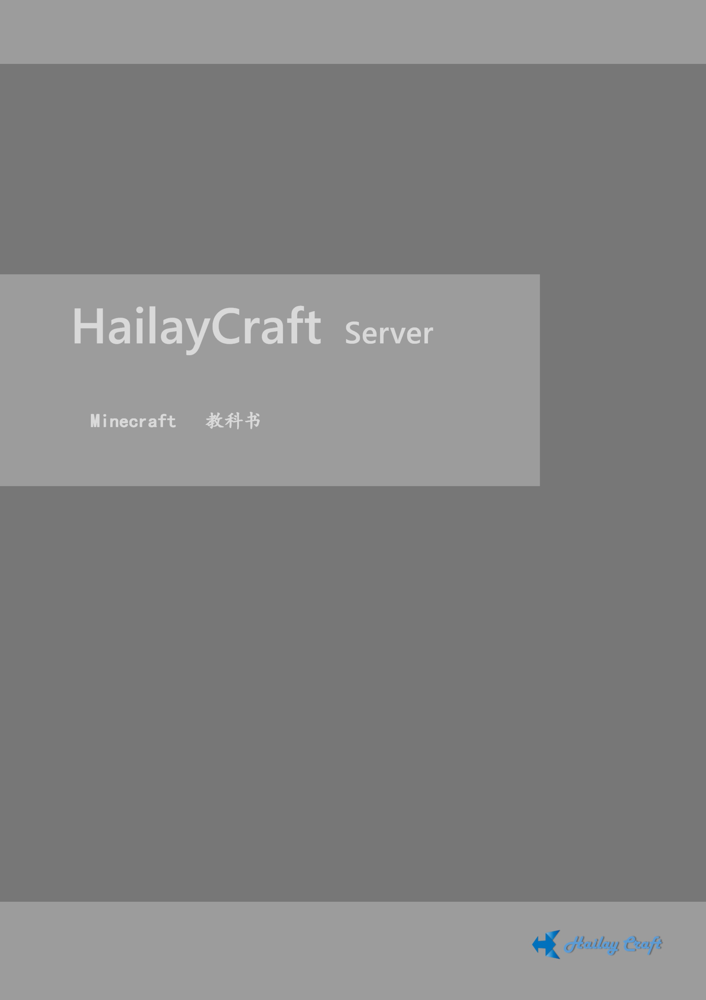

# Minecraft-book 

项目介绍：
这是一个关于Minecraft知识总结的项目。我们会在这里，以出版物的水准总结Minecraft的相关知识，给予读者全景式的Minecraft学习体验体验。我们将在这里Minecraft绝大部分的知识，让初学者能从零开始学习知识,也能让老玩家也能从这里学到能进一步提高的知识。同时,总结的知识也可以作为各种Minecraft习题的出题依据,出题又可以作为各种服务器的入服知识检测。 

我们将在各大论坛发布我们的书，让更多人了解评价

项目首页： <https://github.com/Milk-MC/Minecraft-book>

我们的网站：<http://pub.milkmc.net> (暂时没有建好 )

OneNote：Hailay的笔记本“Minecraft”中的“Minecraft-Book”

# [预览（点击）](http://book.windmill-town.club/)

# 目前的编辑者

Hailay Grasscraft strickczq fxit? ?

欢迎各位来共同编辑教材~联系方式：Q群：[737744130](http://shang.qq.com/wpa/qunwpa?idkey=d36adb27045affe1e7a68bda61f72f46ab8dff6ee6bd5906b61659dc8ab95df9)

* <http://get.ftqq.com/6914.get>互联网出版套路出版
* <https://www.jianshu.com/p/7c77e23c6cef>简书
