[<返回](https://github.com/Hailaycraft/Minecraft-Learning-note/)

# 资料搜集

***

# 教程/菜鸟手册

https://minecraft-zh.gamepedia.com/%E6%95%99%E7%A8%8B/%E8%8F%9C%E9%B8%9F%E6%89%8B%E5%86%8C

## 目录

- [1控制](https://minecraft-zh.gamepedia.com/%E6%95%99%E7%A8%8B/%E8%8F%9C%E9%B8%9F%E6%89%8B%E5%86%8C#.E6.8E.A7.E5.88.B6)
- 2概述
  - [2.1第一天](https://minecraft-zh.gamepedia.com/%E6%95%99%E7%A8%8B/%E8%8F%9C%E9%B8%9F%E6%89%8B%E5%86%8C#.E7.AC.AC.E4.B8.80.E5.A4.A9)
  - [2.2饥饿度与生命值](https://minecraft-zh.gamepedia.com/%E6%95%99%E7%A8%8B/%E8%8F%9C%E9%B8%9F%E6%89%8B%E5%86%8C#.E9.A5.A5.E9.A5.BF.E5.BA.A6.E4.B8.8E.E7.94.9F.E5.91.BD.E5.80.BC)
- 3详细指导
  - [3.1开始游戏](https://minecraft-zh.gamepedia.com/%E6%95%99%E7%A8%8B/%E8%8F%9C%E9%B8%9F%E6%89%8B%E5%86%8C#.E5.BC.80.E5.A7.8B.E6.B8.B8.E6.88.8F)
  - [3.2各种难度不一的起点](https://minecraft-zh.gamepedia.com/%E6%95%99%E7%A8%8B/%E8%8F%9C%E9%B8%9F%E6%89%8B%E5%86%8C#.E5.90.84.E7.A7.8D.E9.9A.BE.E5.BA.A6.E4.B8.8D.E4.B8.80.E7.9A.84.E8.B5.B7.E7.82.B9)
  - [3.3收集木头](https://minecraft-zh.gamepedia.com/%E6%95%99%E7%A8%8B/%E8%8F%9C%E9%B8%9F%E6%89%8B%E5%86%8C#.E6.94.B6.E9.9B.86.E6.9C.A8.E5.A4.B4)
  - 3.4制作工作台
    - [3.4.1关于合成区域](https://minecraft-zh.gamepedia.com/%E6%95%99%E7%A8%8B/%E8%8F%9C%E9%B8%9F%E6%89%8B%E5%86%8C#.E5.85.B3.E4.BA.8E.E5.90.88.E6.88.90.E5.8C.BA.E5.9F.9F)
  - [3.5做一个镐](https://minecraft-zh.gamepedia.com/%E6%95%99%E7%A8%8B/%E8%8F%9C%E9%B8%9F%E6%89%8B%E5%86%8C#.E5.81.9A.E4.B8.80.E4.B8.AA.E9.95.90)
  - [3.6石器时代](https://minecraft-zh.gamepedia.com/%E6%95%99%E7%A8%8B/%E8%8F%9C%E9%B8%9F%E6%89%8B%E5%86%8C#.E7.9F.B3.E5.99.A8.E6.97.B6.E4.BB.A3)
  - [3.7收集更多资源](https://minecraft-zh.gamepedia.com/%E6%95%99%E7%A8%8B/%E8%8F%9C%E9%B8%9F%E6%89%8B%E5%86%8C#.E6.94.B6.E9.9B.86.E6.9B.B4.E5.A4.9A.E8.B5.84.E6.BA.90)
  - [3.8关于挖掘](https://minecraft-zh.gamepedia.com/%E6%95%99%E7%A8%8B/%E8%8F%9C%E9%B8%9F%E6%89%8B%E5%86%8C#.E5.85.B3.E4.BA.8E.E6.8C.96.E6.8E.98)
  - [3.9动物](https://minecraft-zh.gamepedia.com/%E6%95%99%E7%A8%8B/%E8%8F%9C%E9%B8%9F%E6%89%8B%E5%86%8C#.E5.8A.A8.E7.89.A9)
  - [3.10在灯光前取暖](https://minecraft-zh.gamepedia.com/%E6%95%99%E7%A8%8B/%E8%8F%9C%E9%B8%9F%E6%89%8B%E5%86%8C#.E5.9C.A8.E7.81.AF.E5.85.89.E5.89.8D.E5.8F.96.E6.9A.96)
  - [3.11建造住处](https://minecraft-zh.gamepedia.com/%E6%95%99%E7%A8%8B/%E8%8F%9C%E9%B8%9F%E6%89%8B%E5%86%8C#.E5.BB.BA.E9.80.A0.E4.BD.8F.E5.A4.84)
  - [3.12迎接黄昏](https://minecraft-zh.gamepedia.com/%E6%95%99%E7%A8%8B/%E8%8F%9C%E9%B8%9F%E6%89%8B%E5%86%8C#.E8.BF.8E.E6.8E.A5.E9.BB.84.E6.98.8F)
  - [3.13等待天明](https://minecraft-zh.gamepedia.com/%E6%95%99%E7%A8%8B/%E8%8F%9C%E9%B8%9F%E6%89%8B%E5%86%8C#.E7.AD.89.E5.BE.85.E5.A4.A9.E6.98.8E)
  - 3.14紧急避难
    - [3.14.1避难柱](https://minecraft-zh.gamepedia.com/%E6%95%99%E7%A8%8B/%E8%8F%9C%E9%B8%9F%E6%89%8B%E5%86%8C#.E9.81.BF.E9.9A.BE.E6.9F.B1)
    - [3.14.2躲在树顶](https://minecraft-zh.gamepedia.com/%E6%95%99%E7%A8%8B/%E8%8F%9C%E9%B8%9F%E6%89%8B%E5%86%8C#.E8.BA.B2.E5.9C.A8.E6.A0.91.E9.A1.B6)
    - [3.14.3躲在“茧”里](https://minecraft-zh.gamepedia.com/%E6%95%99%E7%A8%8B/%E8%8F%9C%E9%B8%9F%E6%89%8B%E5%86%8C#.E8.BA.B2.E5.9C.A8.E2.80.9C.E8.8C.A7.E2.80.9D.E9.87.8C)
    - [3.14.4人造洞穴](https://minecraft-zh.gamepedia.com/%E6%95%99%E7%A8%8B/%E8%8F%9C%E9%B8%9F%E6%89%8B%E5%86%8C#.E4.BA.BA.E9.80.A0.E6.B4.9E.E7.A9.B4)
    - [3.14.5改造现成洞穴](https://minecraft-zh.gamepedia.com/%E6%95%99%E7%A8%8B/%E8%8F%9C%E9%B8%9F%E6%89%8B%E5%86%8C#.E6.94.B9.E9.80.A0.E7.8E.B0.E6.88.90.E6.B4.9E.E7.A9.B4)
    - [3.14.6出海](https://minecraft-zh.gamepedia.com/%E6%95%99%E7%A8%8B/%E8%8F%9C%E9%B8%9F%E6%89%8B%E5%86%8C#.E5.87.BA.E6.B5.B7)
    - [3.14.7违反重要原则](https://minecraft-zh.gamepedia.com/%E6%95%99%E7%A8%8B/%E8%8F%9C%E9%B8%9F%E6%89%8B%E5%86%8C#.E8.BF.9D.E5.8F.8D.E9.87.8D.E8.A6.81.E5.8E.9F.E5.88.99)
    - [3.14.8改变游戏规则！](https://minecraft-zh.gamepedia.com/%E6%95%99%E7%A8%8B/%E8%8F%9C%E9%B8%9F%E6%89%8B%E5%86%8C#.E6.94.B9.E5.8F.98.E6.B8.B8.E6.88.8F.E8.A7.84.E5.88.99.EF.BC.81)
  - [3.15总结](https://minecraft-zh.gamepedia.com/%E6%95%99%E7%A8%8B/%E8%8F%9C%E9%B8%9F%E6%89%8B%E5%86%8C#.E6.80.BB.E7.BB.93)
- 4第一天之后
  - [4.1清晨](https://minecraft-zh.gamepedia.com/%E6%95%99%E7%A8%8B/%E8%8F%9C%E9%B8%9F%E6%89%8B%E5%86%8C#.E6.B8.85.E6.99.A8)
  - [4.2家园的安全](https://minecraft-zh.gamepedia.com/%E6%95%99%E7%A8%8B/%E8%8F%9C%E9%B8%9F%E6%89%8B%E5%86%8C#.E5.AE.B6.E5.9B.AD.E7.9A.84.E5.AE.89.E5.85.A8)
  - 4.3采矿
    - [4.3.1找到并探索洞穴](https://minecraft-zh.gamepedia.com/%E6%95%99%E7%A8%8B/%E8%8F%9C%E9%B8%9F%E6%89%8B%E5%86%8C#.E6.89.BE.E5.88.B0.E5.B9.B6.E6.8E.A2.E7.B4.A2.E6.B4.9E.E7.A9.B4)
    - [4.3.2矿石与矿物](https://minecraft-zh.gamepedia.com/%E6%95%99%E7%A8%8B/%E8%8F%9C%E9%B8%9F%E6%89%8B%E5%86%8C#.E7.9F.BF.E7.9F.B3.E4.B8.8E.E7.9F.BF.E7.89.A9)
  - [4.4需要做的事情的清单](https://minecraft-zh.gamepedia.com/%E6%95%99%E7%A8%8B/%E8%8F%9C%E9%B8%9F%E6%89%8B%E5%86%8C#.E9.9C.80.E8.A6.81.E5.81.9A.E7.9A.84.E4.BA.8B.E6.83.85.E7.9A.84.E6.B8.85.E5.8D.95)
- [5教学影片链接](https://minecraft-zh.gamepedia.com/%E6%95%99%E7%A8%8B/%E8%8F%9C%E9%B8%9F%E6%89%8B%E5%86%8C#.E6.95.99.E5.AD.A6.E5.BD.B1.E7.89.87.E9.93.BE.E6.8E.A5)

如果你不知道如何开始你的Minecraft之旅，新手指南是一个绝佳的开始！你将会学到在生存模式下如何度过你的第一晚。以下有两种形式的指南：直抵目标的概述与一步步递进的详细指导。两者的目标完全相同，因此你可以选择其中一种来阅读。本教程是以Minecraft1.12，普通难度为标准来写的。

## 控制

若你在游戏进行的时候浏览这个页面，你可以按Esc来暂停游戏，这使得你有足够的时间赶在天黑前收集足够的资源并建起你的第一个家，还能保证在你离开电脑的时候不被怪物偷袭。

但在你正式开始游戏之前，你应该了解一下控制这个游戏的方式。详细的控制说明可以参考[控制](https://minecraft-zh.gamepedia.com/%E6%8E%A7%E5%88%B6)页面，但下面我们会一步步的教你适应游戏的简单操作。

**以下是有关角色移动的默认预设按键:**

- W键，向前移动；
- S键，向后移动；
- A键，向左移动；
- D键，向右移动；
- Space键，跳跃（在深水中，长按Space键可以使角色上浮）；
- ⇧ Shift键，潜行（在方块边缘行走时，按住⇧ Shift键行走在可以避免从方块边缘掉落，且能够在梯子上保持位置不下滑）；
- Ctrl键，疾跑（连按两次W键，也能达到相同的效果。推荐更改这个键，在跑酷时，经常会出现⇧ Shift键和Ctrl键一起使用的情况，而在Windows8之前的Windows系统中，这是切换输入法的快捷键，输入法一旦切换便会严重影响跑酷）。
- 然而，这些都只是游戏的预设按键。目前，所有的按键都能够通过选项菜单（Esc键弹出菜单）中的“控制”作修改。

**你还要学习其他一些操作：**

- 移动鼠标可以改变视角方向。
- **按住**鼠标左键可以破坏屏幕中心准心所指的方块。破坏完成后，它们会变成掉落在地的[物品](https://minecraft-zh.gamepedia.com/%E7%89%A9%E5%93%81%EF%BC%88%E5%AE%9E%E4%BD%93%EF%BC%89)的形式（没有使用正确工具采集的方块及特别的方块除外，如果[作弊](https://minecraft-zh.gamepedia.com/%E5%91%BD%E4%BB%A4)使其禁止掉落亦是如此）。
- 靠近它们便能将它们收集入背包中。**这将是你在这个世界收集资源的主要方式。**
- 按**鼠标右键**可放置你在快速物品栏所选择的方块，或者使用所选择的实用物品或工具（比如按住鼠标右键可以吃食物、拉弓等）。
- 滚动鼠标滚轮可以循环选择物品快速栏中的物品，也可以用大键盘上的数字键1~9来选择。
- 按E可以打开[物品栏](https://minecraft-zh.gamepedia.com/%E7%89%A9%E5%93%81%E6%A0%8F)。
- 按Q可以丢出在鼠标选中的物品。

**列举一些用于物品栏的操作技巧：**

- 在背包界面中，左键物品，可以将该物品栏内的物品全部移至鼠标指针上；再次点击可以放下全部的物品。
- 在背包界面中，右键物品，可以将该物品栏中的物品的一半移至鼠标指针上（数量为奇数时，较多的一半在指针上）；再次点击只会放下一个物品。

1. 当指针上有物品时，左键按住任意物品栏（包括快捷栏），然后拖动，指针上的物品会平均分到所有移到的空的或有相同物品的物品栏上。
2. 当指针上有物品时，右键按住任意物品栏（包括快捷栏），然后拖动，指针上的物品会分到所有空的或有相同物品的物品栏上，且所有的物品栏只会分到一个物品。

- 在背包界面中，当物品较为分散时，双击左键可以将指定的物品快速集中在鼠标指针上，并且最多集中一组物品。
- 在背包界面中，按住⇧ Shift后左键物品栏（不包括快捷栏），可以快速的将该物品栏内的物品移至快捷栏中；反之可以快速把物品移至物品栏（不包括快捷栏）中，**并且以箱子、装备栏等优先。**在游戏界面中，这种方法只对装备有效，并且可以快速穿上物品。
- 在背包界面中，按住Ctrl后，按Q可以快速将鼠标指针所在的物品栏中的物品全部丢弃。在游戏界面中则会全部丢弃选中的物品。（单击物品栏后，将鼠标指针移至背包界面外也可以做到同样的效果）

**以下是对于游戏窗口的控制按钮：**

- F1可以隐藏或显示GUI。
- F2可以截取包括HUD界面（若没有被隐藏）在内的游戏画面并储存于"`.minecraft\screenshots`"资料夹内。
- F3打开[调试屏幕](https://minecraft-zh.gamepedia.com/%E8%B0%83%E8%AF%95%E5%B1%8F%E5%B9%95)，可以看到角色所处坐标、所处生物群系、内存使用量等。
- F3+H当你的鼠标滑到工具或装备上时，可以显示工具或装备的耐久值和详细资料。
- F3+⇧ Shift可以显示（或隐藏）完整的调试信息和资源分配饼状图。
- F3+F+⇧ Shift会提高渲染距离。
- F3+F会降低渲染距离。降低渲染距离可减少卡顿的现象，但也会使你看不见远处的怪物或者其他危险。四种不同程度的渲染距离如下：

1. **高**：你可以看到的最大距离，在平地上你可以看到半径为128个方块内的地表。

2. **中等**：你可以看到约64个方块半径的地表。

3. **低**：你只能看到半径为32个方块的地表，而且你的视野边缘会出现迷雾。这可能会妨碍你确定时间，因为你在这个渲染距离下将无法看到太阳。

4. 很低

   ：同等于中雾，你只能看到半径为16个方块的地表。这将可能让游戏变得更加困难，但能最大程度地减少卡顿现象。

   - 注意：当你到达地下深处时，你的视野可能会被[虚空](https://minecraft-zh.gamepedia.com/%E8%99%9A%E7%A9%BA)雾阻挡，这点并不受渲染距离设置的影响。
   - 在1.7及以上，在设置页面中调整渲染距离以 chunk 计算，范围在 1~16 chunk 之间，chunk 数越大，渲染距离越大。

- F5可以轮流切换第一、第三、第二人称视角。
- F11开启全屏模式。

## 概述

‌由于 Minecraft 是一个沙盘游戏，因此它没有硬性规定的游戏玩法（但有一个可自愿达成的进度系统）。在创造模式下，你有无限的资源，可以飞行，而且几乎不会死。而在生存模式中，你将需要食物与庇护所以发展。本指南会教你依靠一些常见的方法度过第一天。

在你创建你的第一个生存世界前，建议你可以先以创造模式创建一个世界，并到处飞行。你可以借此熟悉不同生物群系的特征，昼夜的主要区别，生物（包括被动型生物、中立性生物以及攻击性生物）的相貌，以及其他常识。另一种有用的做法是，可以在创造模式物品栏看看一些基础方块（矿石、石头、木头等）的样子。但研究太深可能会让你对数量庞大的各式方块与物品感到困惑，所以请谨慎行事。

### 第一天

当你进入一个新的世界的时候，时间将会是清晨。和现实一样，Minecraft里的太阳也是东升西落的，而云永远向北飘。你可以用通过太阳的位置来判断时间和方向。

在第一个晚上降临之前，你要充分利用白天的10分钟收集资源，并建造一间小屋。首先，你需要收集少量的[木头](https://minecraft-zh.gamepedia.com/%E6%9C%A8%E5%A4%B4)，并用木头[制作](https://minecraft-zh.gamepedia.com/%E5%90%88%E6%88%90)工具以加快[采集](https://minecraft-zh.gamepedia.com/%E6%8C%96%E6%8E%98)的速度；随后，利用[木镐](https://minecraft-zh.gamepedia.com/%E9%95%90)收集[圆石](https://minecraft-zh.gamepedia.com/%E5%9C%86%E7%9F%B3)并制作一整套更好的工具。一旦你拥有了石质工具，不要使用木制的，因为木制工具消耗大量木头，也浪费更多时间在破坏方块上。

若可能，收集[煤炭](https://minecraft-zh.gamepedia.com/%E7%85%A4%E7%82%AD)或[木炭](https://minecraft-zh.gamepedia.com/%E6%9C%A8%E7%82%AD)来制作[火把](https://minecraft-zh.gamepedia.com/%E7%81%AB%E6%8A%8A)是很重要的（尽管缺少火把并不会导致致命的后果）。如果运气不错发现[羊](https://minecraft-zh.gamepedia.com/%E7%BE%8A)的话，你可以打死它或用剪刀右键点一下它，然后你就会获得羊毛。你可以用获得的羊毛制作[床](https://minecraft-zh.gamepedia.com/%E5%BA%8A)，床将能使你快速跳过夜晚来到第二天的早上，同时会将你的重生点设置在[床](https://minecraft-zh.gamepedia.com/%E5%BA%8A)边。

一路上尽量收集掉落在地上的[物品](https://minecraft-zh.gamepedia.com/%E7%89%A9%E5%93%81)（特别是[鸡蛋](https://minecraft-zh.gamepedia.com/%E9%B8%A1%E8%9B%8B)、小麦[种子](https://minecraft-zh.gamepedia.com/%E5%B0%8F%E9%BA%A6%E7%A7%8D%E5%AD%90)以及怪物的[掉落物](https://minecraft-zh.gamepedia.com/%E6%8E%89%E8%90%BD%E7%89%A9)），它们可能会在以后用得上。

到了晚上，主要的威胁来自于四处游荡的怪物们。作为新手，第一天晚上不要尝试与怪物搏斗，因为你缺少一把好的[武器](https://minecraft-zh.gamepedia.com/%E6%AD%A6%E5%99%A8)以及一套[盔甲](https://minecraft-zh.gamepedia.com/%E7%9B%94%E7%94%B2)。

### 饥饿度与生命值

当你建好你的住所并成功度过第一晚后，紧接而来的问题便是不断下降的[饥饿值](https://minecraft-zh.gamepedia.com/%E9%A5%A5%E9%A5%BF)。当饥饿值低于18 （ × 9）时候，你将不能持续回复[生命值](https://minecraft-zh.gamepedia.com/%E7%94%9F%E5%91%BD)；当饥饿值低于6 （）的时候，你将不能[疾跑](https://minecraft-zh.gamepedia.com/%E7%96%BE%E8%B7%91)；当饥饿值为0 （）的时候，你的生命值将持续减少，并在一般难度下减至半颗心，在困难难度下，饥饿甚至可以杀死你。包括走动、破坏方块在内的很多动作将会减少你的饥饿度，但比起下面几种消耗饥饿度前面的方式几乎是微不足道的：

- **回复生命值**：回复因任何伤害造成的损伤将耗费大量的饥饿度，因此请尽量避免从3格或以上的[高度](https://minecraft-zh.gamepedia.com/%E9%AB%98%E5%BA%A6)摔下来、溺水以及在打斗中受到伤害。
- **与怪物搏斗**：攻击怪物，甚至是被怪物攻击都会直接减少大量的饥饿度，因此请谨慎决定是否要展开一次搏斗。
- **疾跑**：虽然疾跑能够让角色在短时间内移动较长的距离，但是长时间疾跑将耗费大量的饥饿度，因此在没有必要的情况下请不要长时间地进行疾跑。
- **跳跃**：跳上1格高的地方显然是十分常见且必要的，但是这也会耗费不少饥饿度（当疾跑时跳跃耗费的饥饿度是普通跳跃所需饥饿度的4倍），因此请减少跳跃的次数并不要进行无意义的跳跃。

**死亡**

- 当[生命值](https://minecraft-zh.gamepedia.com/%E7%94%9F%E5%91%BD%E5%80%BC)减少至0（）时，角色将会死亡。
- 若在 Minecraft 中死亡，你身上的所有物品将会散落在你的死亡处附近，你会在重生点附近重生。
- 和其他物品一样，掉落在地的物品若没有被及时地捡起来，且区块已加载，它们将会在5分钟后消失（所以如果你在离重生点很远的地方死亡，你仍可以先准备好装备再出发，因为你死亡的区块还未被加载）。
- 如果你选择在离出生点很远的地方建造你的家，最好可以做一张床来记录重生点，以防止死亡后无法找到重生点。
  - 使用"`/gamerule keepInventory true`"命令可以关闭死亡物品掉落，但是这属于[作弊](https://minecraft-zh.gamepedia.com/%E4%BD%9C%E5%BC%8A)。
  - 在1.11版本后，饥饿度比以前减的更少。例如：你跑了100个方块，在1.11之前，会减少约8格的饥饿度。但是，1.11后则是1格的饥饿度。

## 详细指导

### 开始游戏

当你进入游戏时，最好可以首先在你的[出生点](https://minecraft-zh.gamepedia.com/%E7%94%9F%E6%88%90)做个记号。比如建造一个高大的柱子；或干脆按F3打开[调试屏幕](https://minecraft-zh.gamepedia.com/%E8%B0%83%E8%AF%95%E5%B1%8F%E5%B9%95)，记录下当前所处的坐标。死亡后的重生将会在这个位置周围20格以内。

### 各种难度不一的起点

- 如果你的出生点周围是一大片沙地，那么你很有可能出生在沙漠[生物群系](https://minecraft-zh.gamepedia.com/%E7%94%9F%E7%89%A9%E7%BE%A4%E7%B3%BB)中。如果你看到出生点有很多彩色粘土块和红沙，那么你有可能出生在平顶山。当你记录完出生点后，最好马上寻找一个高地来寻找绿地或树木，随后前去获取木头。若四周是一望无际的沙漠，那么就随便挑一个方向前进，直到找到树木为止。当然，在1.9后，如果你愿意的话，可以破坏枯死的灌木来获取木棍。
- 如果你出生在一个没有树木的小岛上（甚至是在海底），周围是一望无际的水，那么你出生在了海洋生物群系中。这将会是一个十分困难的起点，如果你不愿意删除存档并重新创建另一个世界，可以跳下水，持续朝一个方向前进并按住space来保持浮在水面上，直到你找到大陆。
- 如果你的出生点周围是一大片深粉色的地面，这意味着你出生在蘑菇岛生物群系上，而且你前几天的生存将会变得十分简单：因为怪物不会在蘑菇岛生物群系内生成（但仍有可能从其他生物群系进入）。若你拿着[碗](https://minecraft-zh.gamepedia.com/%E7%A2%97)对着[哞菇](https://minecraft-zh.gamepedia.com/%E5%93%9E%E8%8F%87)（一种红色且身上长满蘑菇的牛状生物）点击鼠标右键，你还能获得能够补充大量饥饿值的[蘑菇煲](https://minecraft-zh.gamepedia.com/%E8%98%91%E8%8F%87%E7%85%B2)。（但由于这个生物群系中没有树木，你仍然需要到其他生物群系中寻找树木来制作碗）
- 如果你的出生点周围有现成的房子或农场，这意味着你出生在了[村庄](https://minecraft-zh.gamepedia.com/%E6%9D%91%E5%BA%84)旁边，这也会给你带来不少好处：村庄内的房屋会给你度过夜晚的好地方；村庄周围生成的[铁傀儡](https://minecraft-zh.gamepedia.com/%E9%93%81%E5%82%80%E5%84%A1)会攻击大部分的怪物；村庄的农场会立即解决你对食物的需求；[村民](https://minecraft-zh.gamepedia.com/%E6%9D%91%E6%B0%91)们可以和你进行物品交易；用来支撑火把的黑色[羊毛](https://minecraft-zh.gamepedia.com/%E7%BE%8A%E6%AF%9B)也可以被利用作为床的原料。但是小型村庄不会生成铁傀儡，而且夜晚很可能出现[僵尸围城](https://minecraft-zh.gamepedia.com/%E5%83%B5%E5%B0%B8%E5%9B%B4%E5%9F%8E)，所以晚上不要在村庄闲逛。
- 如果你的出生点周围有十分高大、长满[藤蔓](https://minecraft-zh.gamepedia.com/%E8%97%A4%E8%94%93)的树木，那你很有可能出生在了丛林生物群系中。这是一个安家的好地方：周围大量的树木能给你足够的木头来建造房子，而且这还是唯一生成[可可豆](https://minecraft-zh.gamepedia.com/%E5%8F%AF%E5%8F%AF%E8%B1%86)、[西瓜](https://minecraft-zh.gamepedia.com/%E8%A5%BF%E7%93%9C)、[豹猫](https://minecraft-zh.gamepedia.com/%E8%B1%B9%E7%8C%AB)和[丛林神庙](https://minecraft-zh.gamepedia.com/%E4%B8%9B%E6%9E%97%E7%A5%9E%E5%BA%99)的生物群系。
- 如果你出生点边上有大量白色雪地，或者雪地上有深色树木，那么你可能出生在冰原生物群系。在这里有高大的云杉木，但是水会结冰，对后来[耕种](https://minecraft-zh.gamepedia.com/%E8%80%95%E7%A7%8D)有很大影响（不过你可以在水上放方块）。而且这里还会有一定几率生成[狼](https://minecraft-zh.gamepedia.com/%E7%8B%BC)，你可以用骨头驯服他们。这里生存难度比较大。
- 如果你的出生点周围有很多陡峭的山脉，地形崎岖，那么你很可能出生在山脉生物群系里。这片区域适合挖洞穴做房子，并且这里的地下有[绿宝石矿石](https://minecraft-zh.gamepedia.com/%E7%BB%BF%E5%AE%9D%E7%9F%B3%E7%9F%BF%E7%9F%B3)。但是这个生物群系有[怪物蛋](https://minecraft-zh.gamepedia.com/%E6%80%AA%E7%89%A9%E8%9B%8B)，所以在挖矿时请小心。
- 如果你的出生点周围的树和草地颜色较深并且树上有藤蔓挂着，而且还有黑色的水，那么你很可能出生在沼泽生物群系中。这个生物群系有天然生成的[睡莲](https://minecraft-zh.gamepedia.com/%E7%9D%A1%E8%8E%B2)、[藤蔓](https://minecraft-zh.gamepedia.com/%E8%97%A4%E8%94%93)。这里有[沼泽小屋](https://minecraft-zh.gamepedia.com/%E7%BB%93%E6%9E%84)，对后期的[酿造](https://minecraft-zh.gamepedia.com/%E9%85%BF%E9%80%A0)系统非常有帮助。这里也是唯一能大量生成[史莱姆](https://minecraft-zh.gamepedia.com/%E5%8F%B2%E8%8E%B1%E5%A7%86)的生物群系。
- 如果你的出生点周围有大量的比一般橡木颜色较深且有3~4个方块粗的树木，而且还有巨型蘑菇，那么你很可能出生在黑森林生物群系中。这个生物群系不管白天黑夜都会刷怪，如果你喜欢富有挑战性的群系的话，就来这吧。
- 如果你的出生点周围是一大片橙色的地面，那么你出生在平顶山生物群系，这里只有各种[粘土](https://minecraft-zh.gamepedia.com/%E7%B2%98%E5%9C%9F)和红沙（[沙子](https://minecraft-zh.gamepedia.com/%E6%B2%99%E5%AD%90)的一种），除了平顶山高原F（平顶山的一个变种）有少量树外，是没有任何树木的贫瘠之地，所以请尽快离开这个生物群系。
- 除此之外在Minecraft里还有很多其它生物群系。你可以在[生物群系](https://minecraft-zh.gamepedia.com/%E7%94%9F%E7%89%A9%E7%BE%A4%E7%B3%BB)页面找到关于生物群系的详细资料。

### 收集木头

进入游戏，首先你要四处走走，然后寻找树木。要珍惜每一秒的时间，游戏第一天至关重要。

选一棵比较低矮的树木，走到树干旁边（必要时可以先敲开树叶）并将准星对准树干，**长按**鼠标左键直到它被破坏并变成掉落在地的物品。捡起这个物品后，你将获得你的第一个[木头](https://minecraft-zh.gamepedia.com/%E6%9C%A8%E5%A4%B4)。持续破坏树干直到整棵树的木头都被破坏并收集。虽然你现在可以到其他树那里收集更多的木头，但是先制作工作台并做出一些工具来提高采集效率会更好。如果树木较高，你可以不要首先采集底下第一层的木头，先采集第二，第三层的木头，然后站进树，踩着第一层木头，就可以采集到比普通高出1-2格的木头，最后把垫脚的第一格采集。

木头在你游戏生存和建造都有着很大的用处。所以无论如何，你必须获取大量的木头。

### 制作工作台

合成是Minecraft的核心。虽然有少量的物品可以从[物品栏](https://minecraft-zh.gamepedia.com/%E7%89%A9%E5%93%81%E6%A0%8F)制作，但大部分的[工具](https://minecraft-zh.gamepedia.com/%E5%B7%A5%E5%85%B7)和[物品](https://minecraft-zh.gamepedia.com/%E7%89%A9%E5%93%81)都要通过[工作台](https://minecraft-zh.gamepedia.com/%E5%B7%A5%E4%BD%9C%E5%8F%B0)制作。 现在通过物品栏制作一个工作台出来。首先身上要有一块木头，然后打开[物品栏](https://minecraft-zh.gamepedia.com/%E7%89%A9%E5%93%81%E6%A0%8F)(默认按键为E): 把木头放在物品栏中2×2大小的合成区中。一块木头可做出四块木板。

[4](https://minecraft-zh.gamepedia.com/%E6%9C%A8%E6%9D%BF)

鼠标左键点击成品区的四块木板，将其放在物品栏中，这便完成了一次合成。点击刚刚做出的四块木板，按鼠标右键可一次放置一块。四块分开放在2X2的合成区，如下图：

将工作台放到你的快速物品栏中。 按Esc或E离开物品栏，走到你觉得适合放工作台的地方，用鼠标滚轮或数字键选取工作台，准星指着你要放的地方按鼠标右键放置（而不是放置在你脚下）。如果你想把它移到其他地方，直接按住鼠标左键把工作台敲下来就可以带走了。

#### 关于合成区域

物品栏仅供2×2的合成空间，而工作台则提供3×3的合成空间。任何你能在2x2大小的合成区域合成的物品（如物品栏里的那个）都能在3x3大小的区域里合成（如在工作台上），但是大部分合成（比如对工具的合成）必须在3x3大小的合成区域里完成。

### 做一个镐

为了收集[石头](https://minecraft-zh.gamepedia.com/%E7%9F%B3%E5%A4%B4)和[煤矿石](https://minecraft-zh.gamepedia.com/%E7%85%A4%E7%9F%BF%E7%9F%B3)——游戏中比较重要的资源之一，你需要一把[镐](https://minecraft-zh.gamepedia.com/%E9%95%90)。 你的第一个镐将是木头做的，不是很耐用，但在收集到圆石之前，制作木镐是你唯一的选择。 你需要5个木板来做出一把木镐。鼠标右键点击你放置在地上的工作台会打开你的物品栏与3X3的制作区。 做木镐之前要先将两个木板垂直放置，以做出4个木棍。

[4](https://minecraft-zh.gamepedia.com/%E6%9C%A8%E6%A3%8D)

拿起木棍并清空合成区，如下图所示摆放木板和木棍来制作一把木镐：

你可能注意到做一个镐就是把材料摆得像镐的样子。其他的[物品](https://minecraft-zh.gamepedia.com/%E7%89%A9%E5%93%81)也是用类似的方式去制作。

### 石器时代

拿到木制[镐](https://minecraft-zh.gamepedia.com/%E9%95%90)后就可以收集[圆石](https://minecraft-zh.gamepedia.com/%E5%9C%86%E7%9F%B3)。用[镐](https://minecraft-zh.gamepedia.com/%E9%95%90)挖掘[石头](https://minecraft-zh.gamepedia.com/%E7%9F%B3%E5%A4%B4)会得到[圆石](https://minecraft-zh.gamepedia.com/%E5%9C%86%E7%9F%B3)。[石头](https://minecraft-zh.gamepedia.com/%E7%9F%B3%E5%A4%B4)在地表很常见，如果没看到的话往[泥土](https://minecraft-zh.gamepedia.com/%E6%B3%A5%E5%9C%9F)地下挖也会看得到。收集大约18个左右的[圆石](https://minecraft-zh.gamepedia.com/%E5%9C%86%E7%9F%B3)。现在你可以用[木棍](https://minecraft-zh.gamepedia.com/%E6%9C%A8%E6%A3%8D)及[圆石](https://minecraft-zh.gamepedia.com/%E5%9C%86%E7%9F%B3)做一些石制[工具](https://minecraft-zh.gamepedia.com/%E5%B7%A5%E5%85%B7)，例如石镐、石斧、石剑、石锹。用石制工具能比木制工具或空手更快采集物品。例如石斧可以更快地取得[木头](https://minecraft-zh.gamepedia.com/%E6%9C%A8%E5%A4%B4)。石制工具通常也有更高的耐久度。而旧的木制工具，可以让它们再发挥一下光和热——在熔炉中它们可作为燃料使用。

[剑](https://minecraft-zh.gamepedia.com/%E5%89%91)可以用来更有效地攻击生物（怪物及动物）。

石制[镐](https://minecraft-zh.gamepedia.com/%E9%95%90)比木制镐更加耐用，而且采集的速度也更快。你可以用镐来采集[石头](https://minecraft-zh.gamepedia.com/%E7%9F%B3%E5%A4%B4)或其他石质的方块。

[锹](https://minecraft-zh.gamepedia.com/%E9%94%B9)主要用来采集[泥土](https://minecraft-zh.gamepedia.com/%E6%B3%A5%E5%9C%9F)（[草方块](https://minecraft-zh.gamepedia.com/%E8%8D%89%E6%96%B9%E5%9D%97)）、[沙子](https://minecraft-zh.gamepedia.com/%E6%B2%99%E5%AD%90)、[粘土](https://minecraft-zh.gamepedia.com/%E7%B2%98%E5%9C%9F)和[沙砾](https://minecraft-zh.gamepedia.com/%E6%B2%99%E7%A0%BE)，而且也是在积雪覆盖的生物群系中采集[雪](https://minecraft-zh.gamepedia.com/%E9%9B%AA)的唯一方式。

[斧](https://minecraft-zh.gamepedia.com/%E6%96%A7)用来高效地采集[木头](https://minecraft-zh.gamepedia.com/%E6%9C%A8%E5%A4%B4)以及其他木质方块，以及攻击生命较高的动物。杀伤力比剑要高，但速度比剑要低。

### 收集更多资源

现在，你需要拿起你刚制作的石斧去收集更多的木头。最好不要把收集到的木头全部都做成木板，它们以后还会有其他用途。尽管不同木头看上去有不同的外表，而且它们不能互相堆叠，但除了丛林木外，它们的作用是完全一样的。

- 木头的燃烧时间只有 15 秒，制成木板则有 15×4（60） 秒的燃烧时间（将4个木板都放入燃料栏），制成木炭则有 80 秒燃烧时间。

[3](https://minecraft-zh.gamepedia.com/%E6%9C%A8%E5%A4%B4)
[3](https://minecraft-zh.gamepedia.com/%E6%9C%A8%E6%9D%BF)
[3](https://minecraft-zh.gamepedia.com/%E7%85%A4%E7%82%AD#.E6.9C.A8.E7.82.AD)

当一棵树的所有木头被砍伐后，树上的[树叶](https://minecraft-zh.gamepedia.com/%E6%A0%91%E5%8F%B6)会开始慢慢枯萎（消失）。无论是树叶自行枯萎还是使用剪刀外的方式破坏树叶都不会掉落树叶本身，而是有大约5%的几率掉落[树苗](https://minecraft-zh.gamepedia.com/%E6%A0%91%E8%8B%97)（丛林树为2.5%），橡树和深色橡树的树叶甚至还有大约0.5%的几率掉落[苹果](https://minecraft-zh.gamepedia.com/%E8%8B%B9%E6%9E%9C)。

泥土

煤矿石

煤炭

火把

木炭

木板

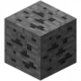

除此之外，你可能会发现镶嵌有土黄色斑点的石头，那是[铁矿石](https://minecraft-zh.gamepedia.com/%E9%93%81%E7%9F%BF%E7%9F%B3)。虽然你目前不太需要用到[铁锭](https://minecraft-zh.gamepedia.com/%E9%93%81%E9%94%AD)，但是最好事先用**石制或以上**的镐来收集它们。

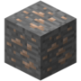

洞穴

峡谷

熔岩

### 关于挖掘

在Minecraft中很重要的一条原则是：

当你站在方块上并破坏它时，你会往下掉一格。万一下方是怪物出没的[洞穴](https://minecraft-zh.gamepedia.com/%E6%B4%9E%E7%A9%B4)、深不见底的[峡谷](https://minecraft-zh.gamepedia.com/%E7%BB%93%E6%9E%84#.E5.B3.A1.E8.B0.B7)，甚至是[熔岩](https://minecraft-zh.gamepedia.com/%E7%86%94%E5%B2%A9)池，你将从中受到伤害并将自己处于一个很危险的境地。

- 万一你掉入熔岩池，熔岩将会对你造成大量伤害并使你身上着火，而且不能避免因身上起火而造成的伤害死亡。但是要尽量游出并远离熔岩湖。这么做的好处是当你万一死亡后你的物品将不会因掉入熔岩中而消失，仍然可以在重生后挽救回来。如果你有带水桶上身，跌进岩浆时可以按空格键游上来。之后，把水桶放在岩浆上。

另一条重要原则是：

同样地，往上挖掘也可能会掉下怪物，或是掉下[沙砾](https://minecraft-zh.gamepedia.com/%E6%B2%99%E7%A0%BE)、[沙子](https://minecraft-zh.gamepedia.com/%E6%B2%99%E5%AD%90)压住你而导致窒息。如果挖到[水](https://minecraft-zh.gamepedia.com/%E6%B0%B4)或熔岩，它们可能会将你淹没。相对而言，向上挖掘的危险性要小于垂直向下挖掘，而且若你在沿途铺设[梯子](https://minecraft-zh.gamepedia.com/%E6%A2%AF%E5%AD%90)，它将阻挡水、熔岩的流动和沙砾、沙子的掉落。当然，在砍树时向上挖是谈不上危险的。

### 动物

如果你遇到[猪](https://minecraft-zh.gamepedia.com/%E7%8C%AA)、[牛](https://minecraft-zh.gamepedia.com/%E7%89%9B)或[鸡](https://minecraft-zh.gamepedia.com/%E9%B8%A1)，这是个收集食物的好机会。用剑杀掉其中一种可以获得[生肉](https://minecraft-zh.gamepedia.com/%E9%A3%9F%E7%89%A9)。杀死[羊](https://minecraft-zh.gamepedia.com/%E7%BE%8A)将可以从它们身上获取[羊毛](https://minecraft-zh.gamepedia.com/%E7%BE%8A%E6%AF%9B)，在1.8及以上版本中杀死羊会掉落羊肉。除非必要，否则先不要吃生肉：烤熟的肉不但比生肉可以回复更多[饥饿值](https://minecraft-zh.gamepedia.com/%E9%A5%A5%E9%A5%BF)，食用[生鸡肉](https://minecraft-zh.gamepedia.com/%E7%94%9F%E9%B8%A1%E8%82%89)还有可能导致你[食物中毒](https://minecraft-zh.gamepedia.com/%E9%A5%A5%E9%A5%BF#.E9.A3.9F.E7.89.A9.E4.B8.AD.E6.AF.92)。

注意：最好留下至少2只动物，你日后可以将它们圈养并进行[繁殖](https://minecraft-zh.gamepedia.com/%E7%B9%81%E6%AE%96)。不过，自然条件下，动物会刷新在草方块上。

如果碰巧遇到了[马](https://minecraft-zh.gamepedia.com/%E9%A9%AC)、[狼](https://minecraft-zh.gamepedia.com/%E7%8B%BC)或[豹猫](https://minecraft-zh.gamepedia.com/%E8%B1%B9%E7%8C%AB)，千万不要急着杀它们：它们不会掉落任何肉类，狼甚至会为此攻击你；相反，它们可以被驯服并为你效力。现在的你没有驯服它们所需的资源，因此记录好你发现这些动物的位置并在准备充分后再来。

### 在灯光前取暖

当临近下午之际，你需要开始准备你的住所了。

一个合格的住所除了要有四周的“围墙”之外，还需要有足够的光照，否则怪物甚至可能会趁你离开家的时候在你家生成。一种廉价而永久的照明方式便是[火把](https://minecraft-zh.gamepedia.com/%E7%81%AB%E6%8A%8A)。

火把需要用[木棍](https://minecraft-zh.gamepedia.com/%E6%9C%A8%E6%A3%8D)和[煤炭](https://minecraft-zh.gamepedia.com/%E7%85%A4%E7%82%AD)或[木炭](https://minecraft-zh.gamepedia.com/%E6%9C%A8%E7%82%AD)合成。如果你先前没有发现任何煤炭，那么你需要一个[熔炉](https://minecraft-zh.gamepedia.com/%E7%86%94%E7%82%89)，并在熔炉中用[木头](https://minecraft-zh.gamepedia.com/%E6%9C%A8%E5%A4%B4)烧制木炭。同时，通过熔炉你还可以烹饪你的生肉，让它们变得更美味可口。

熔炉可以在工作台上用8个圆石围成一圈合成，如下图：

和工作台一样，熔炉需要点击鼠标右键放到地上后才能使用。如果你已经采集到了[煤炭](https://minecraft-zh.gamepedia.com/%E7%85%A4%E7%82%AD)，那么你可以跳过对[木炭](https://minecraft-zh.gamepedia.com/%E6%9C%A8%E7%82%AD)的烧制步骤；否则，请鼠标右键点击熔炉，按照下面的方法进行烧制：

- 2个[木棍](https://minecraft-zh.gamepedia.com/%E6%9C%A8%E6%A3%8D)能[烧炼](https://minecraft-zh.gamepedia.com/%E7%83%A7%E7%82%BC)1个物品，2个[木头](https://minecraft-zh.gamepedia.com/%E6%9C%A8%E5%A4%B4)或[木板](https://minecraft-zh.gamepedia.com/%E6%9C%A8%E6%9D%BF)能烧炼3个物品，而1个[煤炭](https://minecraft-zh.gamepedia.com/%E7%85%A4%E7%82%AD)或[木炭](https://minecraft-zh.gamepedia.com/%E6%9C%A8%E7%82%AD)可以烧炼8个物品，一块煤炭块可以烧炼80个物品，一桶岩浆可以烧炼100个物品。

除此之外，没用的木制工具也可以作为燃料烧炼，1个木制工具能烧炼1个物品。

- 燃料的消耗是依据时间流逝进行的。也就是说若你用1个煤炭或木炭烧炼3个物品将会浪费掉剩余能烧炼的5个物品的热值。
- 由于单位木头和木板能燃烧的物品数量是相同的，而1个木头可以合成4个木板，因此用木板烧炼性价比要比用木头进行烧炼高。
- 当你只拥有木头的时候，将木头全部合成木棍并用木棍烧炼将能获得4个物品/木头的性价比；将木头全部合成木板并用木板烧炼将能获得6个物品/木头的性价比；而将1个木头合成4个木板、用木板烧制6个木头获得木炭后再用木炭烧制物品可以获得48个物品/7木头的性价比（平均6.86个物品/木头）。显然使用最后的烧炼方式能获得最大性价比。

在进行烧炼的时候，你无需保持熔炉界面打开，按E或Esc可以关闭熔炉界面，烧炼将持续进行。

烧制约6个[木炭](https://minecraft-zh.gamepedia.com/%E6%9C%A8%E7%82%AD)，或使用[煤炭](https://minecraft-zh.gamepedia.com/%E7%85%A4%E7%82%AD)按照下面的方法合成[火把](https://minecraft-zh.gamepedia.com/%E7%81%AB%E6%8A%8A)。

[4](https://minecraft-zh.gamepedia.com/%E7%81%AB%E6%8A%8A)

现在，你已经准备好点亮你的住所了。

### 建造住处

作为你迎接第一个晚上的地方，你的第一个住处并不需要很大，也不需要华丽的装潢。随便找一个空旷的地方（或是清理出一块地），用之前收集到的[木板](https://minecraft-zh.gamepedia.com/%E6%9C%A8%E6%9D%BF)（或当木板不够时使用其他方块代替）围成一个约5格长、5格宽、3格高(5×5×3)的小木屋，将之前放下的工作台和熔炉搬到小木屋里，再插上几根火把，便成为了一个安全而基础功能完备的住处。

完成5×5×3的小木屋仅需要耗费57个木板。你会发现这个小木屋没有出入口，但这并不会影响你在小木屋里的行动。若你有剩余的木板，可以考虑做一个门：

[3](https://minecraft-zh.gamepedia.com/%E9%97%A8)

门是有方向的，这个方向取决于你放置它时相对它的方向。你可以在一面墙壁上开一个1格宽2格高的小洞，然后选中门放置在这个洞的**地面**。

假如你没法在日落之前收集足够的资源并建造一个简易的住处，可以参考本页[紧急避难](https://minecraft-zh.gamepedia.com/%E6%95%99%E7%A8%8B/%E8%8F%9C%E9%B8%9F%E6%89%8B%E5%86%8C#.E7.B4.A7.E6.80.A5.E9.81.BF.E9.9A.BE)的做法安全地度过夜晚。

- 使用栅栏门是个不错的方法

比起木板门，两个栅栏门摆放成和木板门同样的方式，不但可以阻止僵尸入侵（僵尸无法破坏栅栏门），并且可以利用栅栏门的空隙(或干脆打开下面的栅栏门，但只在没有[小僵尸](https://minecraft-zh.gamepedia.com/%E5%B0%8F%E5%83%B5%E5%B0%B8)的情况下），来清理围绕在家门口的怪物。

### 迎接黄昏

在夜晚到来之前，你可以考虑完成这些工作：

首先，如果你获得了生肉，可以将生肉放入熔炉内进行烹饪。食用熟肉将会大量回复你的饥饿值并填补日间活动造成的饥饿。

其次，若你之前找到了[羊](https://minecraft-zh.gamepedia.com/%E7%BE%8A)并从羊的身上获取了[羊毛](https://minecraft-zh.gamepedia.com/%E7%BE%8A%E6%AF%9B)，你将可以制作一张[床](https://minecraft-zh.gamepedia.com/%E5%BA%8A)来跳过漫长的夜晚并记录你的重生点，让你在万一死亡的时候能够返回刚建好的这个家。**注意**：[1.12](https://minecraft-zh.gamepedia.com/17w15a)[后](https://minecraft-zh.gamepedia.com/1.12)合成床的羊毛的颜色必须是相同的。而且，羊毛的颜色会影响床的颜色。

由于床是两格长的，因此选中床后指向地面上准备放的**“床脚”**的位置，点击鼠标右键将其放置。床的朝向仍与你相对其的位置有关。

注意：

- 床只能在放置在两个[非透明方块](https://minecraft-zh.gamepedia.com/%E9%80%8F%E6%98%8E%E5%BA%A6)方块上面。
- 床上和与床同高的床边都必须至少留1格空间，防止睡觉或从床上起来的时候窒息。
- 在床边重生的时候，床必须没有被破坏且必须满足上述条件，否则会收到“床已遗失或被阻挡”的提示并在世界的出生点附近重生。

若你仍有多余的物品，可以制作[箱子](https://minecraft-zh.gamepedia.com/%E7%AE%B1%E5%AD%90)来保存你身上的物品，这可以让你有更充足的物品栏空间来收集其他东西，并可以将暂时没用或贵重的物品寄存以防死亡的时候丢失。

使用8个木板并在工作台的合成区域将它们围成一圈，便能制作箱子：

同样的，将箱子放在地上才能够使用它。一个箱子能够提供27格的容量，两个箱子水平相邻摆放将能合并成一个大箱子并提供54格的容量。

但是到目前为止，在Minecraft中仍不能实现3个或以上的箱子水平相邻摆放。

- 注意：如果箱子上方被[不透明方块](https://minecraft-zh.gamepedia.com/%E9%80%8F%E6%98%8E%E5%BA%A6)阻挡，它将无法被打开。

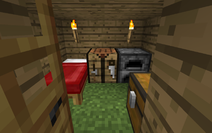

### 等待天明

如果你有床而且希望使用它来跳过夜晚的话，最好一入夜后就马上使用，否则在你周围生成的怪物有可能会让你无法入眠（即使怪物被墙阻隔）。

如果你没有床，或者希望继续往地下收集资源（当然不能直接往脚下挖）、改造你的房屋甚至是拿起剑在外面和怪物搏斗，一定要注意安全。鉴于现在的你可能对Minecraft中所有的[怪物](https://minecraft-zh.gamepedia.com/%E7%94%9F%E7%89%A9)不熟悉，因此最好不要将自己处于任何危险中。

- 如果你希望使用床来设置重生点，你必须保证时间是晚上而且周围没有怪物而让你能顺利上床，但是无需等待完整的睡眠：只需按右键上床后马上点击“起床”按钮起来，便完成了重生点的设置。

### 紧急避难

如果运气不太好，没有找到羊毛来制作床，或者是没有及时找到或采集树木和其他可以用来建造住所保卫自己的东西，可以考虑采取如下措施来让你安全的度过第一天晚上：

#### 避难柱

在地面就地采集约20个[泥土](https://minecraft-zh.gamepedia.com/%E6%B3%A5%E5%9C%9F)、[沙子](https://minecraft-zh.gamepedia.com/%E6%B2%99%E5%AD%90)或其他任何容易破坏的方块，然后建立一个高柱：视角对着地面，选择采集到的方块，按space跳跃并在到达最高点时向脚下放置方块。重复这么做直到你距离地面约15格高（在这个高度，大部分怪物无法伤到你，但要留心可以攀爬的[蜘蛛](https://minecraft-zh.gamepedia.com/%E8%9C%98%E8%9B%9B)（甚至是罕见的[蜘蛛骑士](https://minecraft-zh.gamepedia.com/%E8%9C%98%E8%9B%9B%E9%AA%91%E5%A3%AB)）和在正式版1.6及以后拥有32格搜索半径的[僵尸](https://minecraft-zh.gamepedia.com/%E5%83%B5%E5%B0%B8)）。接下来，你可以用剩下的方块（会受重力影响的方块如[沙子](https://minecraft-zh.gamepedia.com/%E6%B2%99%E5%AD%90)、[沙砾](https://minecraft-zh.gamepedia.com/%E6%B2%99%E7%A0%BE)除外）来在柱子的顶部扩展出一个3x3的平台，以防止蜘蛛爬上并攻击到你。现在，这个柱子已经是你的一个安全的避难所了。

- 当你在一个平台上向外扩展方块时，可以按住⇧ Shift来防止你从方块边缘掉落。
- 如之前提到的原因，因此若你尝试在沙漠中建造避难柱，最好额外采集20个沙子，并在物品栏的2x2合成区域中填满来合成[砂岩](https://minecraft-zh.gamepedia.com/%E7%A0%82%E5%B2%A9)，它将不会受重力影响而掉落。

#### 躲在树顶

如果你找到了一棵高大的[丛林树](https://minecraft-zh.gamepedia.com/%E6%A0%91%E6%9C%A8#.E4.B8.9B.E6.9E.97.E6.A0.91)、[大橡树](https://minecraft-zh.gamepedia.com/%E6%A0%91%E6%9C%A8#.E6.A9.A1.E6.A0.91)或[云杉](https://minecraft-zh.gamepedia.com/%E6%A0%91%E6%9C%A8#.E4.BA.91.E6.9D.89)，你可以收集周围你的泥土，通过向自己脚下放置方块（详见本页[避难柱](https://minecraft-zh.gamepedia.com/%E6%95%99%E7%A8%8B/%E8%8F%9C%E9%B8%9F%E6%89%8B%E5%86%8C#.E9.81.BF.E9.9A.BE.E6.9F.B1)一章的做法）的方法让你到达树顶，这将给你提供一个宽大而安全的避难所。

- 不要破坏树顶的[木头](https://minecraft-zh.gamepedia.com/%E6%9C%A8%E5%A4%B4)，否则[树叶](https://minecraft-zh.gamepedia.com/%E6%A0%91%E5%8F%B6)的枯萎可能会使你踩空而摔下。

#### 躲在“茧”里

收集13个方块，随便找一个地方并往你四周搭建3格高的墙壁，最后在你头顶处放置一个方块。这个“茧”能够使你躲避绝大多数怪物的追捕并安全地度过夜晚。

- 假如[末影人](https://minecraft-zh.gamepedia.com/%E6%9C%AB%E5%BD%B1%E4%BA%BA)过来拿走你作为“茧”的方块，千万不要把准星对准它（特别是它的眼睛），或者攻击来激怒它，因为末影人是具有较高攻击力和生命值的中立性生物，而且会因为你看着它使其对你具有攻击性。

#### 人造洞穴

找一个较为平整的垂直平面（如悬崖），使用工具在上面挖掘一个至少3格深的洞穴。若可能的话，尽可能将洞穴挖到8格深，并用挖下来的方块将洞口堵住。

如果你的洞穴足够深（8格或以上），那么你可以在封住的洞口上开一个1x1的小窗来观察外面的情况以及确定时间。但若你的洞穴不够深的话，最好在天亮之前都不要在洞口开一个永久的小窗，而是隔一段时间挖开一个小洞来确认时间后马上封上，否则[骷髅](https://minecraft-zh.gamepedia.com/%E9%AA%B7%E9%AB%85)射出的箭可能会伤到你。

#### 改造现成洞穴

如果你找到了一个[洞穴](https://minecraft-zh.gamepedia.com/%E6%B4%9E%E7%A9%B4)并在洞口没有发现怪物的存在，那么你可以小心地进入这个洞穴，并在靠近洞口的地方用周围的方块如[圆石](https://minecraft-zh.gamepedia.com/%E5%9C%86%E7%9F%B3)或[泥土](https://minecraft-zh.gamepedia.com/%E6%B3%A5%E5%9C%9F)将通往洞穴深处的通道堵死（特别是将头顶和脚下的洞封死——如果你不希望有怪物通过那个洞掉进来或自己掉进脚下的洞中受到伤害甚至是迷路的话）。最后如本页[人造洞穴](https://minecraft-zh.gamepedia.com/%E6%95%99%E7%A8%8B/%E8%8F%9C%E9%B8%9F%E6%89%8B%E5%86%8C#.E4.BA.BA.E9.80.A0.E6.B4.9E.E7.A9.B4)的做法，封住洞口并确认时间。

#### 出海

由于怪物不能在[水](https://minecraft-zh.gamepedia.com/%E6%B0%B4)中生成，因此即使到了晚上，远离陆地的海面也是一个安全的地方。

如果你的出生点接近大海，你可以按照下图在工作台上用5个[木板](https://minecraft-zh.gamepedia.com/%E6%9C%A8%E6%9D%BF)制作一个[船](https://minecraft-zh.gamepedia.com/%E8%88%B9)，选中船后按右键放置在水面上并按右键登上船。

通过方向键控制船移动并到达一个远离陆地的地方。这样你将不会受到任何来自怪物的威胁。

建议出海前事先准备多于3个船，因为船很容易因碰到方块或水面的[鱿鱼](https://minecraft-zh.gamepedia.com/%E9%B1%BF%E9%B1%BC)而损坏（消失），并掉落3个[橡木木板](https://minecraft-zh.gamepedia.com/%E6%9C%A8%E6%9D%BF)和2个木棍。 目前的船不会因为碰到方块或鱿鱼而损坏([1.9](https://minecraft-zh.gamepedia.com/15w41a)[+](https://minecraft-zh.gamepedia.com/1.9))。在携带版中，船必须由5个木板，一个木锹合成。

主机版中，船没有桨。

#### 违反重要原则

虽然垂直向下挖掘正如前文那样被描述得很可怕，但在紧急情况下这么做也无可厚非（何况我们只违反一点点……）。

垂直向下挖掘3格，然后用不受重力方块封住顶部。这样你就在一个1x1x2的“绝对安全”的空间内。

你可以在这里掐表度过晚上（约10分钟），并随时可以拓宽这个空间来放下诸如工作台和熔炉来继续你的工作。

#### 改变游戏规则！

如果你处于一个绝望的境地（比如有一大群怪物在围殴你或是你的饥饿值为0），你可以随时按Esc暂停游戏并将游戏[难度](https://minecraft-zh.gamepedia.com/%E9%9A%BE%E5%BA%A6)设置为“和平”。这将阻止任何怪物的生成并强制让它们消失，而且你的生命值还将会以每秒半颗心的速度恢复，同时你的饥饿值不会消耗。但如果你锁定了难度……祝你好运。

### 总结

总之新手们在第一天需要做这些事:

1. 进入世界砍树，获得木头，把木头转化为木板并合成[工作台](https://minecraft-zh.gamepedia.com/%E5%B7%A5%E4%BD%9C%E5%8F%B0)。
2. 再砍一些木头，做一把镐，挖一些圆石，做一套更好的工具。
3. 用木板建一个庇护所（建议5×5×3大小），用[煤炭](https://minecraft-zh.gamepedia.com/%E7%85%A4%E7%82%AD)或[木炭](https://minecraft-zh.gamepedia.com/%E6%9C%A8%E7%82%AD)做一些[火把](https://minecraft-zh.gamepedia.com/%E7%81%AB%E6%8A%8A)。
4. 有[床](https://minecraft-zh.gamepedia.com/%E5%BA%8A)的话睡觉，没床就在屋子里等待天明。

## 第一天之后

这里有个[第二天](https://minecraft-zh.gamepedia.com/%E6%95%99%E7%A8%8B/%E7%AC%AC%E4%BA%8C%E5%A4%A9)的教学可供参考。另外，下面会列出一些比较常用的提示：

### 清晨

无论如何，你已经到达了第二天的清晨。若天气晴好，[僵尸](https://minecraft-zh.gamepedia.com/%E5%83%B5%E5%B0%B8)和[骷髅](https://minecraft-zh.gamepedia.com/%E9%AA%B7%E9%AB%85)会在阳光下燃烧，并最终因此会烧死。但不要大意：即使它们被燃烧，仍然会尝试攻击你，甚至着火的僵尸会将身上的火传给你、骷髅会尝试躲到树下等暗处（或者是水里）避免烧伤并向你发射弓箭；[蜘蛛](https://minecraft-zh.gamepedia.com/%E8%9C%98%E8%9B%9B)和[爬行者](https://minecraft-zh.gamepedia.com/%E7%88%AC%E8%A1%8C%E8%80%85)不会在阳光下燃烧并始终存在你的房子周围。

因此若你想在清晨出门，你最好先举起你的剑，打开门后立即冲出并远离房子（因为[爬行者](https://minecraft-zh.gamepedia.com/%E7%88%AC%E8%A1%8C%E8%80%85)有可能已经在门边等候你并且在你开门的时候爆炸摧毁你的家）。

若在门外见到蜘蛛，不要惊慌：除非它们早在晚上便“盯上了你”或你尝试去攻击它，在亮度较高的地方它们会丧失攻击性并不会主动攻击你。而若见到了爬行者，最好等以后有[弓](https://minecraft-zh.gamepedia.com/%E5%BC%93)与[箭](https://minecraft-zh.gamepedia.com/%E7%AE%AD)或足够优秀的技术再打它们的主意，否则它们的[爆炸](https://minecraft-zh.gamepedia.com/%E7%88%86%E7%82%B8)可能会破坏地面并置你于死地。当然，你也可以拿着剑，疯狂的挥舞，让它远离你，从而不会产生爆炸。但在[1.9](https://minecraft-zh.gamepedia.com/15w34a)[以上](https://minecraft-zh.gamepedia.com/1.9)的版本，则不建议这么做，因为武器有一定的冷却时间，在冷却未完成时攻击会减少剑对怪物的伤害，你无法迅速杀死它们。

万一外面下起雨（在寒冷环境中是下雪，或在沙漠中仅仅是阴天），僵尸和骷髅将不会燃烧（一燃烧起来就被浇灭），因此在这时候出门的你必须对付来自他们的威胁。虽然僵尸相对容易对付，但是在正式版[1.6](https://minecraft-zh.gamepedia.com/%E7%89%88%E6%9C%AC%E8%AE%B0%E5%BD%95/%E9%A2%84%E8%A7%88%E7%89%88%E6%9C%AC/table#_13w23b)[后](https://minecraft-zh.gamepedia.com/1.6.1)它们拥有更大的敌对搜索半径，而且在处于危险的时候会在周围召唤更多的僵尸。而对付骷髅则有很大挑战性：它们会用弓箭对你远程攻击，因此最好还是离它们远远的。

恭喜你：你已经度过了Minecraft中的第一天。此后的生存将会变得相对简单，你可以继续完成第一天教程内还没来得及完成的部分、按照下面的教程继续发展或凭自己的喜好继续进行游戏。

### 家园的安全

第一天做的住所可能会很小，但现在你有时间来进行改造并打造出一个更好的家。你可以做的有很多，比如扩大房子并制作一个后门、使用[玻璃](https://minecraft-zh.gamepedia.com/%E7%8E%BB%E7%92%83)或[玻璃板](https://minecraft-zh.gamepedia.com/%E7%8E%BB%E7%92%83%E6%9D%BF)来制作窗户、使用[栅栏](https://minecraft-zh.gamepedia.com/%E6%A0%85%E6%A0%8F)围起你的家来抵御怪物的入侵，甚至是制作一套防御怪物的陷阱。如果用栅栏围起来，你可以在栅栏里的范围放上台阶，因为怪物不会在台阶上生成。

### 采矿

采矿是Minecraft中一个重要的环节。因此你要到地底下探险并搜寻[煤炭](https://minecraft-zh.gamepedia.com/%E7%85%A4%E7%82%AD)、[铁锭](https://minecraft-zh.gamepedia.com/%E9%93%81%E9%94%AD)以及其他[矿石](https://minecraft-zh.gamepedia.com/%E7%9F%BF%E7%9F%B3)。虽然你能从[采矿技术](https://minecraft-zh.gamepedia.com/%E6%95%99%E7%A8%8B/%E9%87%87%E7%9F%BF%E6%8A%80%E6%9C%AF)页中找到更详尽的采矿技巧，但这里会介绍一些最基本的采矿方式。

#### 找到并探索洞穴

如果你的第一天就是在一个[天然洞穴](https://minecraft-zh.gamepedia.com/%E6%B4%9E%E7%A9%B4)中度过的话，可以跳过这节的学习。否则你最好首先找到一个洞穴来开始你的采矿之旅。
最简单的寻找方式就是在整个地图四处行走来寻找天然形成的洞穴入口。
在Minecraft中有十分多的地下洞穴，因此在家周围找到这样一个洞穴是不成问题的。
虽然在峭壁（山脉）[生物群系](https://minecraft-zh.gamepedia.com/%E7%94%9F%E7%89%A9%E7%BE%A4%E7%B3%BB)（Extreme Hills以及其他三种变种）中你会找到很多的洞穴，但是最好不要从那里开始探索，因为在[海平面上（Y≥64）](https://minecraft-zh.gamepedia.com/%E6%B5%B7%E6%8B%94%E9%AB%98%E5%BA%A6)只有[煤矿石](https://minecraft-zh.gamepedia.com/%E7%85%A4%E7%9F%BF%E7%9F%B3)会生成，而且如果在低层数（Y低于48的情况下），将会每个16x32x16的小区块生成一块怪物蛋的“矿脉”。
若要找到[铁矿石](https://minecraft-zh.gamepedia.com/%E9%93%81%E7%9F%BF%E7%9F%B3)及其它更好的矿石，你要到一个直通地底的洞穴中然后一路探索——有的洞穴很快就走到尽头了，但更多的洞穴会指引你到一个非常大的洞穴系统中。
此外，挖开沿途的[沙子](https://minecraft-zh.gamepedia.com/%E6%B2%99%E5%AD%90)或[沙砾](https://minecraft-zh.gamepedia.com/%E6%B2%99%E7%A0%BE)可能会显露隐藏在下面的洞穴。
如果找一整天都没有找到现成的洞穴入口的话，你最好回到你的住所中，补充路上耗费的资源并睡上一觉。
这时如果你发现地表之外的地方传来类似风吹过洞穴的音效或敌对生物的叫声，尝试向声音来源的方向挖掘，你可能会找到一个埋藏在地底的没有入口的洞穴。
探索洞穴是十分直截了当的：沿途上插火把来点亮洞穴(建议插在右边，返回时可找回路)、当你找到矿石的时候挖走它们、攻击迎面而来的敌对生物。
需要注意的是，使用[水流](https://minecraft-zh.gamepedia.com/%E6%B0%B4)来安全地下降到一段大落差（并游回去来抵达上方）是十分管用的。
探索洞穴的时候最好在沿途做一些容易辨认的标记，以便探索完毕后能够不迷路地安全返回。

#### 矿石与矿物[ | ]

有一些矿物只有在地底深处才能找得到，而且对于游戏的进行来说十分重要。虽然在第一天一般只找得到煤矿石和铁矿石，但是全面了解Minecraft中所有的矿物也是有意义的。

| *矿物图表* | 煤                                                           | 铁                                                           | 红石                                                         | 金                                                           | 青金石                                                       | 钻石                                                         | 绿宝石                                                       | 下界石英                                                     |
| ---------- | ------------------------------------------------------------ | ------------------------------------------------------------ | ------------------------------------------------------------ | ------------------------------------------------------------ | ------------------------------------------------------------ | ------------------------------------------------------------ | ------------------------------------------------------------ | ------------------------------------------------------------ |
| 矿石       | [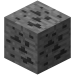](https://minecraft-zh.gamepedia.com/File:Coal_Ore.png) | [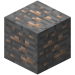](https://minecraft-zh.gamepedia.com/File:Iron_Ore.png) | [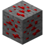](https://minecraft-zh.gamepedia.com/File:Redstone_Ore.png) |  |  |  | [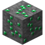](https://minecraft-zh.gamepedia.com/File:Emerald_Ore.png) | [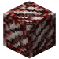](https://minecraft-zh.gamepedia.com/File:Nether_Quartz_Ore.png) |
| 矿物       |  |  |  |  |  |  |  |  |
| 矿物块     | [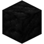](https://minecraft-zh.gamepedia.com/File:Block_of_Coal.png) |  | [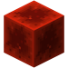](https://minecraft-zh.gamepedia.com/File:Block_of_Redstone.png) |  | [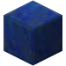](https://minecraft-zh.gamepedia.com/File:Lapis_Lazuli_Block.png) |  |  | [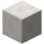](https://minecraft-zh.gamepedia.com/File:Block_of_Quartz.png) |

[煤](https://minecraft-zh.gamepedia.com/%E7%85%A4)是Minecraft中普遍而又重要的矿物，它可以制作[火把](https://minecraft-zh.gamepedia.com/%E7%81%AB%E6%8A%8A)和在熔炉中烧炼物品。

[煤矿石](https://minecraft-zh.gamepedia.com/%E7%85%A4%E7%9F%BF%E7%9F%B3)可以使用木镐或更高级别的镐才能够采集，采集煤矿石可以获得经验。

尽管木炭能够从木头中获得并能够代替煤炭，但是木头还需要用来做其他事情，因此收集并储备大量煤炭是有必要的。

当你开始采矿生涯后，你将会发现很多的煤炭，同时你也将用掉很多。

[铁锭](https://minecraft-zh.gamepedia.com/%E9%93%81%E9%94%AD)可以称之为Minecraft中最重要而且用途最多的矿物。铁锭可以用来制作高质量的工具、盔甲及其大量的其他用途。因此，收集铁锭可谓是多多益善。

[铁矿石](https://minecraft-zh.gamepedia.com/%E9%93%81%E7%9F%BF%E7%9F%B3)需要石镐或更高级别的镐才能够采集，而且采集铁矿石将不会掉落现成的铁锭，因此你需要将铁矿石放入熔炉中并冶炼才能够获得能够使用的铁锭。

当你拥有铁锭的时候，首先用来制作一个铁镐，一把铁[剑](https://minecraft-zh.gamepedia.com/%E5%89%91)和一个[桶](https://minecraft-zh.gamepedia.com/%E6%A1%B6)（并装满水），然后再用来制作一套铁制[盔甲](https://minecraft-zh.gamepedia.com/%E7%9B%94%E7%94%B2)（这将会消耗24个铁锭）。如果你还有更多的铁锭，可以用来制作其他工具。（铁制工具全套+铁制盔甲=35个铁锭）

[金锭](https://minecraft-zh.gamepedia.com/%E9%87%91%E9%94%AD)、[青金石](https://minecraft-zh.gamepedia.com/%E9%9D%92%E9%87%91%E7%9F%B3)和[红石](https://minecraft-zh.gamepedia.com/%E7%BA%A2%E7%9F%B3)较为稀有。

[青金石矿石](https://minecraft-zh.gamepedia.com/%E9%9D%92%E9%87%91%E7%9F%B3%E7%9F%BF%E7%9F%B3)需要石制或更高级的镐采集，而[金矿石](https://minecraft-zh.gamepedia.com/%E9%87%91%E7%9F%BF%E7%9F%B3)和[红石矿石](https://minecraft-zh.gamepedia.com/%E7%BA%A2%E7%9F%B3%E7%9F%BF%E7%9F%B3)需要铁制或更高级的镐才能采集。

在开始的时候你并不太需要用到这些矿石，因此找到它们的时候并不需要急着采集。而且，它们只有在洞穴更深处才能够找得到。

金锭可以做工具、盔甲、[金苹果](https://minecraft-zh.gamepedia.com/%E9%87%91%E8%8B%B9%E6%9E%9C)、[钟](https://minecraft-zh.gamepedia.com/%E9%92%9F)、[充能铁轨](https://minecraft-zh.gamepedia.com/%E5%85%85%E8%83%BD%E9%93%81%E8%BD%A8)等。在1.8以后，青金石不仅仅是染料，可以用来附魔。红石可以在红石电路中发挥极大的作用。

[钻石](https://minecraft-zh.gamepedia.com/%E9%92%BB%E7%9F%B3)是一种十分稀有的矿物，也几乎是Minecraft中最珍贵的资源。钻石可以用来制作耐用而且效率高的工具，以及坚固的盔甲。

[钻石矿石](https://minecraft-zh.gamepedia.com/%E9%92%BB%E7%9F%B3%E7%9F%BF%E7%9F%B3)只能在世界的底部（12层及以下）才能找得到，并且只能用铁质或更高级的工具采集。由于更低的高度会碰上不可以挖掘的[基岩](https://minecraft-zh.gamepedia.com/%E5%9F%BA%E5%B2%A9)和非常危险的[熔岩湖](https://minecraft-zh.gamepedia.com/%E7%86%94%E5%B2%A9)，因此在11层处进行[挖矿](https://minecraft-zh.gamepedia.com/%E6%8C%96%E7%9F%BF)是最安全的。知道自己高度的最好方法是通过按F3打开[调试屏幕](https://minecraft-zh.gamepedia.com/%E8%B0%83%E8%AF%95%E5%B1%8F%E5%B9%95)并获知当前在Y轴上的坐标。

[绿宝石](https://minecraft-zh.gamepedia.com/%E7%BB%BF%E5%AE%9D%E7%9F%B3)通常获取于或用于与村民的交易中。

[绿宝石矿石](https://minecraft-zh.gamepedia.com/%E7%BB%BF%E5%AE%9D%E7%9F%B3%E7%9F%BF%E7%9F%B3)极其稀少（甚至比钻石矿石更稀少），只有零星的绿宝石矿石能在峭壁（山脉）[生物群系](https://minecraft-zh.gamepedia.com/%E7%94%9F%E7%89%A9%E7%BE%A4%E7%B3%BB)中找得到。它们与金矿石出现的位置相仿，并且只能用铁质或更高级的工具采集。

目前绿宝石不能用于制作工具，所以与村民交易和信标成了它少数的使用手段。

[下界石英](https://minecraft-zh.gamepedia.com/%E4%B8%8B%E7%95%8C%E7%9F%B3%E8%8B%B1)从下界获取，挖掘它可以获得大量经验，也可用于装饰、制作阳光传感器、红石电路等。

### 需要做的事情的清单

这里列出一份你将来需要或希望做的事情的表格以供快速查阅。

**挖矿**

- 收集[铁锭](https://minecraft-zh.gamepedia.com/%E9%93%81%E9%94%AD)用来制作[剑](https://minecraft-zh.gamepedia.com/%E5%89%91)、[桶](https://minecraft-zh.gamepedia.com/%E6%A1%B6)、[盔甲](https://minecraft-zh.gamepedia.com/%E7%9B%94%E7%94%B2)和其它工具。
- 如果还没有[床](https://minecraft-zh.gamepedia.com/%E5%BA%8A)的话，收集[羊毛](https://minecraft-zh.gamepedia.com/%E7%BE%8A%E6%AF%9B)来制作一张。
- 收集并储备更多的[木头](https://minecraft-zh.gamepedia.com/%E6%9C%A8%E5%A4%B4)、[煤炭](https://minecraft-zh.gamepedia.com/%E7%85%A4%E7%82%AD)和[铁](https://minecraft-zh.gamepedia.com/%E9%93%81)以用于将来的合成。
- 到达地底深处寻找高级的矿物，并最终找到[钻石](https://minecraft-zh.gamepedia.com/%E9%92%BB%E7%9F%B3)。

**种植**

- 收集[树苗](https://minecraft-zh.gamepedia.com/%E6%A0%91%E8%8B%97)，并在家附近方便的地方[种植](https://minecraft-zh.gamepedia.com/%E6%95%99%E7%A8%8B/%E6%A0%91%E6%9C%A8%E7%A7%8D%E6%A4%8D)树木。
- 经营一个[小麦农场](https://minecraft-zh.gamepedia.com/%E6%95%99%E7%A8%8B/%E5%B0%8F%E9%BA%A6%E7%A7%8D%E6%A4%8D)。将来你也可以种植其他作物如[胡萝卜](https://minecraft-zh.gamepedia.com/%E8%83%A1%E8%90%9D%E5%8D%9C)、[马铃薯](https://minecraft-zh.gamepedia.com/%E9%A9%AC%E9%93%83%E8%96%AF)、[南瓜](https://minecraft-zh.gamepedia.com/%E5%8D%97%E7%93%9C)、[西瓜](https://minecraft-zh.gamepedia.com/%E8%A5%BF%E7%93%9C)和1.9更新的甜菜。
- 收集[甘蔗](https://minecraft-zh.gamepedia.com/%E7%94%98%E8%94%97)来制作地图和书（另外需要[铁锭](https://minecraft-zh.gamepedia.com/%E9%93%81%E9%94%AD)和[红石](https://minecraft-zh.gamepedia.com/%E7%BA%A2%E7%9F%B3)来制作地图和[皮革](https://minecraft-zh.gamepedia.com/%E7%9A%AE%E9%9D%A9)来制作书）。不要将收集到的[甘蔗](https://minecraft-zh.gamepedia.com/%E7%94%98%E8%94%97)全部用来合成，而是至少留下一半用于[种植](https://minecraft-zh.gamepedia.com/%E6%95%99%E7%A8%8B/%E7%94%98%E8%94%97%E7%A7%8D%E6%A4%8D)。

**养殖**

- 引诱动物并将它们圈养起来——用它们喜欢的食物来引诱它们跟着你走并喂它们来繁殖。

- [牛](https://minecraft-zh.gamepedia.com/%E7%89%9B)（[哞菇](https://minecraft-zh.gamepedia.com/%E5%93%9E%E8%8F%87)）和[羊](https://minecraft-zh.gamepedia.com/%E7%BE%8A)吃[小麦](https://minecraft-zh.gamepedia.com/%E5%B0%8F%E9%BA%A6)，[猪](https://minecraft-zh.gamepedia.com/%E7%8C%AA)和[兔子](https://minecraft-zh.gamepedia.com/%E5%85%94%E5%AD%90)吃胡萝卜，[鸡](https://minecraft-zh.gamepedia.com/%E9%B8%A1)吃[小麦种子](https://minecraft-zh.gamepedia.com/%E5%B0%8F%E9%BA%A6%E7%A7%8D%E5%AD%90)（鸡也能通过向地上砸[鸡蛋](https://minecraft-zh.gamepedia.com/%E9%B8%A1%E8%9B%8B)来孵化）。

- 除了肉之外，鸡能提供[羽毛](https://minecraft-zh.gamepedia.com/%E7%BE%BD%E6%AF%9B)来制作箭，可以给猪戴上鞍进行骑乘（[方法](https://minecraft-zh.gamepedia.com/%E7%8C%AA#.E9.AA.91.E4.B9.98)），牛能给你提供[皮革](https://minecraft-zh.gamepedia.com/%E7%9A%AE%E9%9D%A9)来制作[书](https://minecraft-zh.gamepedia.com/%E4%B9%A6)、[书架](https://minecraft-zh.gamepedia.com/%E4%B9%A6%E6%9E%B6)及其他东西，兔子会稀有的掉落[兔子脚](https://minecraft-zh.gamepedia.com/%E5%85%94%E5%AD%90%E8%84%9A)，用于[酿造](https://minecraft-zh.gamepedia.com/%E9%85%BF%E9%80%A0)。

- 驯养一些动物。这些动物只能在特定的

  生物群系

  中才能找到，而且需要特定的方式才能驯服。下面是目前Minecraft中能够驯服的几种动物：

  - 猫：猫由[豹猫](https://minecraft-zh.gamepedia.com/%E8%B1%B9%E7%8C%AB)驯服后变成。豹猫只在丛林生物群系中出没，需要[生鱼](https://minecraft-zh.gamepedia.com/%E7%94%9F%E9%B1%BC)驯服。虽然某些情况下猫会很烦人，但是它们拥有驱赶[爬行者](https://minecraft-zh.gamepedia.com/%E7%88%AC%E8%A1%8C%E8%80%85)的独一无二能力。驯服后的猫食用生鱼后可以进行繁殖。
  - 狗：狗由狼驯服后变成。狼只在森林或针叶林生物群系中出没，需要[骨头](https://minecraft-zh.gamepedia.com/%E9%AA%A8%E5%A4%B4)驯服。狗可以帮助你攻击除了爬行者外的怪物。给狗食用肉（包括[腐肉](https://minecraft-zh.gamepedia.com/%E8%85%90%E8%82%89)）可以使它们回复生命值并在生命值满的时候进行繁殖（繁殖出小狗，自然也是驯服的）。
  - [马](https://minecraft-zh.gamepedia.com/%E9%A9%AC)：马只在草原生物群系中出没。马无需任何食物便能被驯服，但给马喂[糖](https://minecraft-zh.gamepedia.com/%E7%B3%96)、[小麦](https://minecraft-zh.gamepedia.com/%E5%B0%8F%E9%BA%A6)或[面包](https://minecraft-zh.gamepedia.com/%E9%9D%A2%E5%8C%85)等能够增大每次驯服尝试成功的几率。即使马已经被驯服，你也需要一个[鞍](https://minecraft-zh.gamepedia.com/%E9%9E%8D)才能够控制（切记：别让马下水，那样你会被甩下来）。马的繁殖相对困难，材料获取难度更大：只有使用[金苹果](https://minecraft-zh.gamepedia.com/%E9%87%91%E8%8B%B9%E6%9E%9C)或[金胡萝卜](https://minecraft-zh.gamepedia.com/%E9%87%91%E8%83%A1%E8%90%9D%E5%8D%9C)才能使马繁殖。

**狩猎**

- 狩猎[僵尸](https://minecraft-zh.gamepedia.com/%E5%83%B5%E5%B0%B8)来获得[“狗粮”](https://minecraft-zh.gamepedia.com/%E7%8B%BC#.E6.8A.A4.E7.90.86.E5.92.8C.E5.96.82.E5.85.BB)，以及获得较为罕见的[胡萝卜](https://minecraft-zh.gamepedia.com/%E8%83%A1%E8%90%9D%E5%8D%9C)和[马铃薯](https://minecraft-zh.gamepedia.com/%E9%A9%AC%E9%93%83%E8%96%AF)。
- 狩猎[骷髅](https://minecraft-zh.gamepedia.com/%E9%AA%B7%E9%AB%85)来获得[骨头](https://minecraft-zh.gamepedia.com/%E9%AA%A8%E5%A4%B4)和[箭](https://minecraft-zh.gamepedia.com/%E7%AE%AD)，有时还会获得耐久度不满的[弓](https://minecraft-zh.gamepedia.com/%E5%BC%93)。
- 狩猎[蜘蛛](https://minecraft-zh.gamepedia.com/%E8%9C%98%E8%9B%9B)来获得[线](https://minecraft-zh.gamepedia.com/%E7%BA%BF)——你需要用线来制作[弓](https://minecraft-zh.gamepedia.com/%E5%BC%93)、[钓鱼竿](https://minecraft-zh.gamepedia.com/%E9%92%93%E9%B1%BC%E7%AB%BF)和[拴绳](https://minecraft-zh.gamepedia.com/%E6%8B%B4%E7%BB%B3)。
- 狩猎[爬行者](https://minecraft-zh.gamepedia.com/%E7%88%AC%E8%A1%8C%E8%80%85)来获得[火药](https://minecraft-zh.gamepedia.com/%E7%81%AB%E8%8D%AF)，用于酿造喷溅药水和制造[TNT](https://minecraft-zh.gamepedia.com/TNT)、[火焰弹](https://minecraft-zh.gamepedia.com/%E7%81%AB%E7%84%B0%E5%BC%B9)、[烟花火箭](https://minecraft-zh.gamepedia.com/%E7%83%9F%E8%8A%B1%E7%81%AB%E7%AE%AD)等物品。

**探索**

- 探索[建筑物](https://minecraft-zh.gamepedia.com/%E7%BB%93%E6%9E%84#.E5.BB.BA.E7.AD.91.E7.89.A9)，寻找[生物群系](https://minecraft-zh.gamepedia.com/%E7%94%9F%E7%89%A9%E7%BE%A4%E7%B3%BB)。

- 建造一个更大、更高级的家。它最好可以附有：前[门](https://minecraft-zh.gamepedia.com/%E9%97%A8)和后门、[玻璃](https://minecraft-zh.gamepedia.com/%E7%8E%BB%E7%92%83)窗户、储藏室以及放置[附魔台](https://minecraft-zh.gamepedia.com/%E9%99%84%E9%AD%94%E5%8F%B0)和[书架](https://minecraft-zh.gamepedia.com/%E4%B9%A6%E6%9E%B6)的空间。

- 钓鱼可以钓到鱼也可能钓到

  鞍

  和

  命名牌

  ，以及皮革、线和其他琐碎的东西。（但是千万不要吃

  河豚

  ！）

  - （在正式版1.7前，被雨淋着的水面拥有双倍的钓到鱼的几率；而在1.7后，雨天钓鱼不会有这个效果。）
  - 在小池中钓鱼是可行的，但那并不十分有效；而人工开一个大湖也是十分困难的事情。因此，对于新手来说有两个比较可行的选择：
  - 开船进入海洋或大型的湖泊钓鱼。尽量远离陆地：如果你距离最近的陆地不足30格距离，那么钓鱼的时候你还得对付游泳过来的僵尸。
  - 在任何大型河流、海洋或湖泊的上方建起一个钓鱼塔。并不需要十分完整地建筑——哪怕是站在一条柱子的顶部也是不错的（在树顶钓鱼也是个不错的选择）。最好加一个地面围栏以及屋顶——这样即使是在[雷暴](https://minecraft-zh.gamepedia.com/%E9%9B%B7%E6%9A%B4)的晚上你也能安心地钓鱼。

## 教学影片链接

- [Most efficient First day tutorial 1.6.2 (tnthost)](https://www.youtube.com/watch?v=-wLgFgjtoKA)
- [The First Day in Minecraft 1.0.0 (SecretRevelation)](http://www.youtube.com/watch?v=w576AQXnF0c&feature=g-upl&context=G2829094AUAAAAAAAHAA)
- [The First Day (Beginners' Essentials) (Minecraft Tutorial)](http://www.youtube.com/watch?v=uJZDwjf_tRs)
- [Minecraft The First 10 Minutes (Minecraft Tutorial)](http://www.youtube.com/watch?v=movidld1fPw)
- [Your First Shelter in Minecraft (Tutorial Machinima)](http://www.youtube.com/watch?v=ylVtj-1Ccgg&feature=channel)
- [Minecraft: Building a Starting House (Minecraft Tutorial)](http://www.youtube.com/watch?v=qss4uy6C_g0&feature=fvw)
- [Minecraft Efficient Farm (Minecraft Tutorial)](http://www.youtube.com/watch?v=y9r_qaU_YFI)
- [Getting Used To The Minecraft Crafting List 101](http://minecraftmembers.com/info/minecraft-crafting-list/)
- [basic First day tutorial (Macdeezy1996)](http://www.youtube.com/watch?v=OgkzFRbTmnU)

# 教程/第二天

< [教程](https://minecraft-zh.gamepedia.com/%E6%95%99%E7%A8%8B)

本指南是给度过[第一天](https://minecraft-zh.gamepedia.com/%E6%95%99%E7%A8%8B/%E8%8F%9C%E9%B8%9F%E6%89%8B%E5%86%8C)的新手们，提供更进一步的资讯。

右边是一张第二天时的房子。

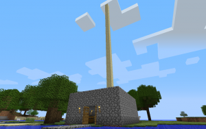

## 目录

 [[隐藏]()] 

- [1简介：第二天](https://minecraft-zh.gamepedia.com/%E6%95%99%E7%A8%8B/%E7%AC%AC%E4%BA%8C%E5%A4%A9#.E7.AE.80.E4.BB.8B.EF.BC.9A.E7.AC.AC.E4.BA.8C.E5.A4.A9)
- [2继续挖矿](https://minecraft-zh.gamepedia.com/%E6%95%99%E7%A8%8B/%E7%AC%AC%E4%BA%8C%E5%A4%A9#.E7.BB.A7.E7.BB.AD.E6.8C.96.E7.9F.BF)
- [3建造](https://minecraft-zh.gamepedia.com/%E6%95%99%E7%A8%8B/%E7%AC%AC%E4%BA%8C%E5%A4%A9#.E5.BB.BA.E9.80.A0)
- [4基础物品合成](https://minecraft-zh.gamepedia.com/%E6%95%99%E7%A8%8B/%E7%AC%AC%E4%BA%8C%E5%A4%A9#.E5.9F.BA.E7.A1.80.E7.89.A9.E5.93.81.E5.90.88.E6.88.90)
- [5提示](https://minecraft-zh.gamepedia.com/%E6%95%99%E7%A8%8B/%E7%AC%AC%E4%BA%8C%E5%A4%A9#.E6.8F.90.E7.A4.BA)

## 简介：第二天

如果你有读过[新手入门/菜鸟手册](https://minecraft-zh.gamepedia.com/%E6%96%B0%E6%89%8B%E5%85%A5%E9%97%A8/%E8%8F%9C%E9%B8%9F%E6%89%8B%E5%86%8C)，你应该有至少一个简陋的庇护所、石器、还有熟肉等食物。在此将教你如何完善你的基地。

## 继续挖矿

所有发展的基础就是挖矿。首先用木镐采集一些石头，当你挖[石头](https://minecraft-zh.gamepedia.com/%E7%9F%B3%E5%A4%B4)后会掉出[圆石](https://minecraft-zh.gamepedia.com/%E5%9C%86%E7%9F%B3)，这就是你盖房子的材料。它的爆炸抗性为30，但遇上[爬行者](https://minecraft-zh.gamepedia.com/%E7%88%AC%E8%A1%8C%E8%80%85)的爆炸还是会被炸出一个洞（至少比泥土做的半间都毁了好很多）。石制的工具会比木头制的耐用，也更快速，使用次数为132次。做把石镐并收集30-80块圆石。

初期挖矿能采集到的重要资源应该是煤矿跟铁矿。煤矿是很经济的熔炉燃料，一颗煤矿可以炼制8个物品，刚好用来把[铁矿石](https://minecraft-zh.gamepedia.com/%E9%93%81%E7%9F%BF%E7%9F%B3)炼制成[铁锭](https://minecraft-zh.gamepedia.com/%E9%93%81%E9%94%AD)，铁有很广泛的用途，例如工具、防具、[铁轨](https://minecraft-zh.gamepedia.com/%E9%93%81%E8%BD%A8)、[矿车](https://minecraft-zh.gamepedia.com/%E7%9F%BF%E8%BD%A6)、[桶](https://minecraft-zh.gamepedia.com/%E6%A1%B6)、[打火石](https://minecraft-zh.gamepedia.com/%E6%89%93%E7%81%AB%E7%9F%B3)。还有[金矿石](https://minecraft-zh.gamepedia.com/%E9%87%91%E7%9F%BF%E7%9F%B3)与[红石](https://minecraft-zh.gamepedia.com/%E7%BA%A2%E7%9F%B3%E7%9F%BF%E7%9F%B3)，接着是[绿宝石](https://minecraft-zh.gamepedia.com/%E7%BB%BF%E5%AE%9D%E7%9F%B3)，这三种矿产较稀有，而且位于地底深处，可以做出更多工具。详见[合成](https://minecraft-zh.gamepedia.com/%E5%90%88%E6%88%90)。[钻石](https://minecraft-zh.gamepedia.com/%E9%92%BB%E7%9F%B3)是最稀有的矿物，可以用它来做钻石工具（制作方法一如其他工具），其耐用度最高，可使用次数可达1562次。[黑曜石](https://minecraft-zh.gamepedia.com/%E9%BB%91%E6%9B%9C%E7%9F%B3)只能用钻石镐挖取，可用来做[传送门](https://minecraft-zh.gamepedia.com/%E4%BC%A0%E9%80%81%E9%97%A8)通往[下界](https://minecraft-zh.gamepedia.com/%E4%B8%8B%E7%95%8C)。但到了后期会觉得采集回的东西比需要的多很多。这时就该大兴土木，盖一些你想盖的建筑。

## 建造

挖了一些圆石后，应该就中午了。做一个面积5×4高度3的石墙，你可以用圆石或是木板做屋顶，以防止蜘蛛爬墙进来。也留个高度2的门作为出入口。

## 基础物品合成

- **门**

用木板在工作台做扇门，可以把两扇门并排做成双开门。门口有2x2大小，但是一次还是只能开关一扇门。可以使用红石电路做的机关去使两扇门连动。 当然，你也可以选择用方块堵住，但这并不是一个好方法。

| 做扇门：                                                     |
| ------------------------------------------------------------ |
| [3](https://minecraft-zh.gamepedia.com/%E9%97%A8) |

- **石剑**

做为初期的武器，它的伤害是5（），而空手打击只有1（）。所以可以更容易把怪物杀死。

| 做一把石剑：                                                 |
| ------------------------------------------------------------ |
|  |

- **箱子**

东西总不能一直放在身上，万一死了就糗大了。一个箱子有9×3共27格的空间供放置各种物品，可以将两个箱子并排成一个大的储藏箱（54格）。注意，箱子上方如果有不透明方块就会打不开（箱子是透明方块，所以竖着叠放也不会导致打不开下面的箱子）。

| 做一个箱子：                                                 |
| ------------------------------------------------------------ |
|  |

- **剪刀**

在Beta 1.7版本新增的工具，用来剪羊毛与树叶，按右键剪羊毛，按左键剪树叶。在之前只要用空手把羊杀死就可以掉出1-3块羊毛，现在杀死羊只可以得到一个羊毛。用剪刀不会伤害到羊，可剪出1-3个羊毛。

| 做一把剪刀：                                                 |
| ------------------------------------------------------------ |
|  |

- **床**

可以用羊毛跟木板做张床，把它放在房子里，但不要放在靠墙的位置，因为床的周围两个的范围内若不安全，就会有怪物叫你起床。可以把两张床并排做双人床（床接在一起全部都算一张床，不管你接了多少张），以摆设来讲还蛮好看的。 床的功用当然是让你在昏昏欲睡后瞬间度过漫长的夜晚。

| 做张床：                                                     |
| ------------------------------------------------------------ |
|  |
| 注意：合成床的木板可以是任何种类的，但羊毛必须是同一种颜色的。羊毛的颜色将影响床的颜色。 |

## 提示

- 不知道怎么用工作台制作物品吗？请参考[合成](https://minecraft-zh.gamepedia.com/%E5%90%88%E6%88%90)，也包括[食物](https://minecraft-zh.gamepedia.com/%E9%A3%9F%E7%89%A9)。
- 生命值很低的话可以杀猪取猪排或是钓鱼（见[钓鱼竿](https://minecraft-zh.gamepedia.com/%E9%92%93%E9%B1%BC%E7%AB%BF)），猪排容易取得，吃了可增加，如果拿去用熔炉烤熟，熟肉会增加。不然也可以把难度改成和平，会在每秒回2（）。
- 找不到煤就烧个木炭吧，用途完全相同。
- 床无法使用？请确保是晚上，再来睡觉。如果一直被怪物叫醒，请检查床两格范围内的安全。
- **请不要用空手去挖矿**（矿石看起来是有不同颜色斑点的石头），一来浪费时间，二来又不会掉下任何东西。也须注意除了煤矿跟铁矿还有青金石以外的矿产都要用铁镐或钻石镐才能挖，请看[矿石](https://minecraft-zh.gamepedia.com/%E7%9F%BF%E7%9F%B3)。

# 教程/第三天

< [教程](https://minecraft-zh.gamepedia.com/%E6%95%99%E7%A8%8B)

|      | **该文章需要整理以符合样式标准。**如果您可以，请帮我们[优化文章样式](https://minecraft-zh.gamepedia.com/index.php?title=%E6%95%99%E7%A8%8B/%E7%AC%AC%E4%B8%89%E5%A4%A9&action=edit)来让它符合样式要求。 |
| ---- | ------------------------------------------------------------ |
|      |                                                              |

生存和发展！

## 目录

 [[隐藏]()] 

- 1简介
  - [1.1第三天](https://minecraft-zh.gamepedia.com/%E6%95%99%E7%A8%8B/%E7%AC%AC%E4%B8%89%E5%A4%A9#.E7.AC.AC.E4.B8.89.E5.A4.A9)
  - [1.2完整游戏体验的一些建议](https://minecraft-zh.gamepedia.com/%E6%95%99%E7%A8%8B/%E7%AC%AC%E4%B8%89%E5%A4%A9#.E5.AE.8C.E6.95.B4.E6.B8.B8.E6.88.8F.E4.BD.93.E9.AA.8C.E7.9A.84.E4.B8.80.E4.BA.9B.E5.BB.BA.E8.AE.AE)
- 2收集资源 - 为了工具和自身安全
  - [2.1探险前的准备工作](https://minecraft-zh.gamepedia.com/%E6%95%99%E7%A8%8B/%E7%AC%AC%E4%B8%89%E5%A4%A9#.E6.8E.A2.E9.99.A9.E5.89.8D.E7.9A.84.E5.87.86.E5.A4.87.E5.B7.A5.E4.BD.9C)
  - [2.2搜寻地标](https://minecraft-zh.gamepedia.com/%E6%95%99%E7%A8%8B/%E7%AC%AC%E4%B8%89%E5%A4%A9#.E6.90.9C.E5.AF.BB.E5.9C.B0.E6.A0.87)
  - [2.3迈达斯的点金手——发财致富之道](https://minecraft-zh.gamepedia.com/%E6%95%99%E7%A8%8B/%E7%AC%AC%E4%B8%89%E5%A4%A9#.E8.BF.88.E8.BE.BE.E6.96.AF.E7.9A.84.E7.82.B9.E9.87.91.E6.89.8B.E2.80.94.E2.80.94.E5.8F.91.E8.B4.A2.E8.87.B4.E5.AF.8C.E4.B9.8B.E9.81.93)
- 3扩建你的小屋——造一个城中之城
  - [3.1让你的家更安全](https://minecraft-zh.gamepedia.com/%E6%95%99%E7%A8%8B/%E7%AC%AC%E4%B8%89%E5%A4%A9#.E8.AE.A9.E4.BD.A0.E7.9A.84.E5.AE.B6.E6.9B.B4.E5.AE.89.E5.85.A8)
  - [3.2为将来的计划作准备](https://minecraft-zh.gamepedia.com/%E6%95%99%E7%A8%8B/%E7%AC%AC%E4%B8%89%E5%A4%A9#.E4.B8.BA.E5.B0.86.E6.9D.A5.E7.9A.84.E8.AE.A1.E5.88.92.E4.BD.9C.E5.87.86.E5.A4.87)
- [4总结](https://minecraft-zh.gamepedia.com/%E6%95%99%E7%A8%8B/%E7%AC%AC%E4%B8%89%E5%A4%A9#.E6.80.BB.E7.BB.93)

## 简介

注意，本教程适用于**普通**难度下的生存模式，1.11版本。

第一天，你建造了自己的小屋，收集了一些基本物资。第二天你鼓起勇气从自己的避难所里伸出头来向外探险，和[爬行者](https://minecraft-zh.gamepedia.com/%E7%88%AC%E8%A1%8C%E8%80%85)大战三百回合，得到了更多的资源，改善了自己的家。

那第三天做些什么好呢？

### 第三天

如今你已经拥有一个安全的家。也获取了一些资源，当然你也明白，靠这些撑不了多久。你同样不敢肯定自己的小屋是否已经足够安全。现在，是时候把你的房子造的更高更坚固了（比方说来个屋顶什么的）。你可以展开一场探险，发现个[洞穴](https://minecraft-zh.gamepedia.com/%E6%B4%9E%E7%A9%B4)或[地牢](https://minecraft-zh.gamepedia.com/%E5%9C%B0%E7%89%A2)，跟里面的怪物拼个你死我活，甚至找到一些[矿石](https://minecraft-zh.gamepedia.com/%E7%9F%BF%E7%9F%B3)来制作一些更耐用的东西。要是你不喜欢往地底下钻，探索一下[主世界](https://minecraft-zh.gamepedia.com/%E4%B8%BB%E4%B8%96%E7%95%8C)也无妨。

**注：**这 (Minecraft)是个开放，通常也是很个性化的游戏，要怎么做全由你决定。在你冒险刚起步的阶段，数不清的游戏方式等着你发现，所以尝试着做任何你喜欢的事，然后再慢慢发现你最热衷的活动。

### 完整游戏体验的一些建议

不过要是你仍然需要一些常见的游玩方向，试着建造/合成。将下表内容作为一些目标来帮助你慢慢了解以至享受这整个沙盘世界

- 着手建立一个[麦田](https://minecraft-zh.gamepedia.com/%E8%80%95%E7%A7%8D)，保证自己不会挨饿，并且收集一些[马铃薯](https://minecraft-zh.gamepedia.com/%E5%9C%9F%E8%B1%86)等稀有作物。

- 挖一个直通地底基岩的矿坑，囤积各种各样的矿石。

- 把所有的工具不断升级，直到全套[钻石](https://minecraft-zh.gamepedia.com/%E9%92%BB%E7%9F%B3)工具。

- 制作盔甲，升级到全身钻石装。别忘了把它们穿上！

- 收集一些[黑曜石](https://minecraft-zh.gamepedia.com/%E9%BB%91%E6%9B%9C%E7%9F%B3)，准备以后建立一个下界传送门。

- 出远门找一些其他的食物种子，为你的农场增添各种各样的食物。

- 环游主世界，发现不同的[村庄](https://minecraft-zh.gamepedia.com/%E6%9D%91%E5%BA%84)、[要塞](https://minecraft-zh.gamepedia.com/%E8%A6%81%E5%A1%9E)、[生物群系](https://minecraft-zh.gamepedia.com/%E7%94%9F%E7%89%A9%E7%BE%A4%E7%B3%BB)，和全世界的怪物一决高下。

- 旅行途中别忘了收集材料，为形形色色的合成物品作准备。

- 回家，扩大你的矿场规模。搜寻[地牢](https://minecraft-zh.gamepedia.com/%E5%9C%B0%E7%89%A2)、矿洞或是[废弃矿井](https://minecraft-zh.gamepedia.com/%E5%BA%9F%E5%BC%83%E7%9F%BF%E4%BA%95)。

- 找一个末地传送门，前往[末路之地](https://minecraft-zh.gamepedia.com/%E6%9C%AB%E8%B7%AF%E4%B9%8B%E5%9C%B0)。

- 造一个刷怪陷阱，收集各种资源（火药，线，箭矢等等）。

- 建设一个堡垒吧！体验当国王的感觉！

这是一个可以大概指引你体验各种活动的列表，尽情享受这个过程吧！

## 收集资源 - 为了工具和自身安全

资源不光是指组成这个世界的各种方块。资源是那些帮助你捱过第一晚，抵御怪物入侵的那些方块。资源是帮助你生存，发展，采矿，合成的那些方块。资源是一切。它们不单为你提供[工具](https://minecraft-zh.gamepedia.com/%E5%B7%A5%E5%85%B7)，也保障了你的安全。所以，确保你**永远不会**面临资源用罄的窘境——不分昼夜的耕种，不停的发现更稀有的或是那些不可再生的资源。像[地牢](https://minecraft-zh.gamepedia.com/%E5%9C%B0%E7%89%A2)里的宝物，珍稀的金属（[铁矿石](https://minecraft-zh.gamepedia.com/%E9%93%81%E7%9F%BF%E7%9F%B3)，[金矿石](https://minecraft-zh.gamepedia.com/%E9%87%91%E7%9F%BF%E7%9F%B3)等等）。

所以，做好准备吧。

### 探险前的准备工作

打算开始探险之前，下列物品是你应该先准备好的：

- [床](https://minecraft-zh.gamepedia.com/%E5%BA%8A)：必备，你可以随时迅速的在山坡上挖个洞然后封起来，有了它，这就是你的一个临时避难所。
- [武器](https://minecraft-zh.gamepedia.com/%E6%AD%A6%E5%99%A8)：防身用，也可以拿来宰杀动物取得资源。（万一遇上怪物还可以击退）
- [工具](https://minecraft-zh.gamepedia.com/%E5%B7%A5%E5%85%B7)：凡是[镐](https://minecraft-zh.gamepedia.com/%E9%95%90)、[锹](https://minecraft-zh.gamepedia.com/%E9%94%B9)等都应该带着，最好制作两把备用。
- [食物](https://minecraft-zh.gamepedia.com/%E9%A3%9F%E7%89%A9)：以防你的[饥饿](https://minecraft-zh.gamepedia.com/%E9%A5%A5%E9%A5%BF)值下降。
- [火把](https://minecraft-zh.gamepedia.com/%E7%81%AB%E6%8A%8A)：防止怪物在暗处生成。
- 把任何不必要或珍贵的东西放进[箱子](https://minecraft-zh.gamepedia.com/%E7%AE%B1%E5%AD%90)。（万一死了也不至于损失惨重）

可选：

- [钟](https://minecraft-zh.gamepedia.com/%E9%92%9F)：用[金锭](https://minecraft-zh.gamepedia.com/%E9%87%91%E9%94%AD)和[红石](https://minecraft-zh.gamepedia.com/%E7%BA%A2%E7%9F%B3)合成。可以随时随地确认当前的时间。
- [指南针](https://minecraft-zh.gamepedia.com/%E6%8C%87%E5%8D%97%E9%92%88)：用[铁锭](https://minecraft-zh.gamepedia.com/%E9%93%81%E9%94%AD)和[红石](https://minecraft-zh.gamepedia.com/%E7%BA%A2%E7%9F%B3)合成。迷路时靠它找回家的路。（注意：指南针永远指向你的重生点，但如果你的房子和重生点离得太远，指南针就没用处了）
- [地图](https://minecraft-zh.gamepedia.com/%E5%9C%B0%E5%9B%BE%EF%BC%88%E7%89%A9%E5%93%81%EF%BC%89)：用[纸](https://minecraft-zh.gamepedia.com/%E7%BA%B8)和指南针合成。离家不远的话，地图比指南针更好用。
- TNT:可以作为应急工具。（*注意：这个东西在无关紧要的时候千万不要点燃*）

### 搜寻地标

为了不浪费宝贵的白天，趁着太阳还没下山的时候多找些独特的地标、方块，和其他的一些东西。比如说：

- 一大堆[生物](https://minecraft-zh.gamepedia.com/%E7%94%9F%E7%89%A9)掉落的物品：这也就意味着附近极有可能有个洞穴入口，[熔岩](https://minecraft-zh.gamepedia.com/%E7%86%94%E5%B2%A9)池，或是[地牢](https://minecraft-zh.gamepedia.com/%E5%9C%B0%E7%89%A2)。如果掉落的物品是[羊毛](https://minecraft-zh.gamepedia.com/%E7%BE%8A%E6%AF%9B)的话，则说明有[狼群](https://minecraft-zh.gamepedia.com/%E7%8B%BC)在四周出没。

- [苔石](https://minecraft-zh.gamepedia.com/%E8%8B%94%E7%9F%B3)，[圆石](https://minecraft-zh.gamepedia.com/%E5%9C%86%E7%9F%B3)，或是[箱子](https://minecraft-zh.gamepedia.com/%E7%AE%B1%E5%AD%90)：这三样东西是[地牢](https://minecraft-zh.gamepedia.com/%E5%9C%B0%E7%89%A2)的重要标志。不过小心，那里虽然有宝物，同时也有一个[刷怪箱](https://minecraft-zh.gamepedia.com/%E5%88%B7%E6%80%AA%E7%AE%B1)在边上。圆石也可能意味着附近有熔岩，不过熔岩本身也是种多用途的资源。

- 山：山里通常都有矿洞，而矿洞里通常有着大量资源。甚至可能还藏有一条通向矿洞网络的小径。同样也要小心，黑暗里极有可能潜藏着攻击性的生物。

- [火](https://minecraft-zh.gamepedia.com/%E7%81%AB)：火可能是一个燃烧中的怪物（见上文）或是别的可燃物。而自然引起的火只有可能来自于[闪电](https://minecraft-zh.gamepedia.com/%E9%97%AA%E7%94%B5)或是[熔岩](https://minecraft-zh.gamepedia.com/%E7%86%94%E5%B2%A9)。因此，如果当时没有暴风雨而你身边又恰好带着桶的话就去看看。或者在茂密的森林带中发现一片明显的空地也可能源于同样的原因。这些迹象常常被误解成是传说中的[Herobrine](https://minecraft-zh.gamepedia.com/Herobrine)造成的，但那只是个传说。

- 沙滩: 在沙滩附近能找到[水](https://minecraft-zh.gamepedia.com/%E6%B0%B4)，[沙子](https://minecraft-zh.gamepedia.com/%E6%B2%99%E5%AD%90)，[粘土块](https://minecraft-zh.gamepedia.com/%E7%B2%98%E5%9C%9F%E5%9D%97)，有时还有[仙人掌](https://minecraft-zh.gamepedia.com/%E4%BB%99%E4%BA%BA%E6%8E%8C)。需要这些材料的话，去沙滩找找看。（沙漠里的仙人掌更多些）

- 广场地形，乃至于干涸的盆地。它们通常标志着一个上方没有封闭的地牢。

- 飘浮的方块：有时你会在天空中看见一堆[泥土](https://minecraft-zh.gamepedia.com/%E6%B3%A5%E5%9C%9F)或是石头悬空存在，这种情况在季节性森林或雨林地带尤为常见。

- 湖：一片水域在你身上着火时就是你的救命稻草。有时你也可以把它看作一片区域的中心地标。

- 刷怪箱：主世界的地牢中，你可以发现僵尸（50%的几率），骷髅（25%的几率），蜘蛛（25%的几率）三种刷怪箱。你还可以在废弃矿井中找到洞穴蜘蛛刷怪箱，在要塞中找到蠹虫刷怪箱。前三者周围会有苔石，洞穴蜘蛛刷怪箱附近则布满许多蜘蛛网，蠹虫刷怪箱在末地传送门旁边。

- 足够幸运的话，或许你还能发现一个[村庄](https://minecraft-zh.gamepedia.com/%E6%9D%91%E5%BA%84)，你可以在那儿获得数不胜数的资源，熔岩，熔炉，铁块，各种木质材料等等，还有免费的房子和小麦。

只要用心去发现，还有许许多多独特的地标等着你去探索。

### 迈达斯的点金手——发财致富之道

要是找到一片合适的场地的话，放开手脚去挖吧！不断向下发掘，价值不菲的资源在向你招手，黄金、[红石](https://minecraft-zh.gamepedia.com/%E7%BA%A2%E7%9F%B3)还有珍贵的[钻石](https://minecraft-zh.gamepedia.com/%E9%92%BB%E7%9F%B3)。用这些材料合成崭新的工具，全副武装，继续挖！

## 扩建你的小屋——造一个城中之城

第一个夜晚，你可能已经造了一个小房子，蜷缩在里面等待清晨的曙光；又或者发了疯似的赤手空拳挑战爬行者。唔，暂且假设你已经造了一个又小又矮的避难所好了。伸出头去看看那些爬行者，万一其中一个跋山涉水突破了你外围的防线，穿过了你看似坚固的围墙，进入了你的小黑屋，然后，ssss...Boom！！！！

还是给你的房子来一次大装修吧。

### 让你的家更安全

用泥土和木头造个房子方便简单又快捷，但它很不安全。一旦有了条件，必须用石材重建它！（除非你把房子造在天上，觉得没啥必要再去折腾它了）圆石就是个不错的选择。要是圆石不太够的话，找些熔岩弄个造石机，或者，继续挖。首先重建你的围墙，然后是屋顶。这些起码比较经得住爬行者的一次爆炸。

然后，想办法造一个安全屋，很简单，造在地底下，放个床就成。当然还有一个塞满食物的箱子，一把弓和一些弓箭（没弓的话剑也凑合），还有一扇门。这么一来： 1）你可以在睡梦中度过夜晚，几乎可以无视那些怪物。 2）时刻保持身体健康。 3）轻松干掉那些入侵的怪物。

还有，记得加厚房屋，除非你喜欢爬行者和其它怪物源源不断的涌进来！

这些主要是为了防范一个爬行者一下子炸掉你的半边房子，然后你就只能眼睁睁看着数不胜数的怪物涌进来了。

### 为将来的计划作准备

开始计划前总是要先看看现在是什么时辰，如果是早上的话，小心点，除非你的整个基地都建造在地下，不然你还是得冒着被怪物攻击的危险跑到房子外头继续你的扩建计划。因为清晨的太阳还不能完全杀死那些僵尸，更何况还有爬行者这种不惧阳光的坏蛋。

接下来，规划下一步的扩建。用泥土？用石头？总之要准备好接下来需要的材料。

或者，把那些方块忘了吧，尽情的往下挖（切记不要直着向下挖），说不定珍贵的矿石就在脚下。

## 总结

第三天的夕阳缓缓落下，现在的你拥有了一个更加坚固的家，要么就是用各种材料塞满了口袋。总之，现在是时候上床睡觉，和那些烦人的怪物说再见了。或者跑出去来个惊险刺激的黑夜生存大冒险也都随你的便。随着月亮慢慢爬上天空，我们的新手教程也到此为止。要是想知道更多的话，就去看看MinecraftWiki的其他部分吧。

# 教程/饥饿管理

< [教程](https://minecraft-zh.gamepedia.com/%E6%95%99%E7%A8%8B)

主条目：[饥饿](https://minecraft-zh.gamepedia.com/%E9%A5%A5%E9%A5%BF)

饥饿是Minecraft里一个让你必须经常吃食物以生存的系统。饥饿由生命值右边的一条图案表示。当饥饿全部或部分清空时将有负面效果出现。当饥饿少于9个“火腿”时，生命将会停止恢复；当饥饿少于3个“火腿”时，你就会无法[疾跑](https://minecraft-zh.gamepedia.com/%E7%96%BE%E8%B7%91)；当饥饿完全清空后，你的生命将持续下降直到一个特定的值(在困难模式里将会是0，这会导致你饿死)。本教程将会教你如何保持饥饿值为满。请注意：在1.11后，饥饿值的消耗会显著减少。

## 目录

 [[隐藏]()] 

- 1食物
  - [1.1 营养价值](https://minecraft-zh.gamepedia.com/%E6%95%99%E7%A8%8B/%E9%A5%A5%E9%A5%BF%E7%AE%A1%E7%90%86#.C2.A0.E8.90.A5.E5.85.BB.E4.BB.B7.E5.80.BC)
  - [1.2曲奇](https://minecraft-zh.gamepedia.com/%E6%95%99%E7%A8%8B/%E9%A5%A5%E9%A5%BF%E7%AE%A1%E7%90%86#.E6.9B.B2.E5.A5.87)
  - [1.3牛肉/猪排](https://minecraft-zh.gamepedia.com/%E6%95%99%E7%A8%8B/%E9%A5%A5%E9%A5%BF%E7%AE%A1%E7%90%86#.E7.89.9B.E8.82.89.2F.E7.8C.AA.E6.8E.92)
  - [1.4鸡肉](https://minecraft-zh.gamepedia.com/%E6%95%99%E7%A8%8B/%E9%A5%A5%E9%A5%BF%E7%AE%A1%E7%90%86#.E9.B8.A1.E8.82.89)
  - [1.5苹果](https://minecraft-zh.gamepedia.com/%E6%95%99%E7%A8%8B/%E9%A5%A5%E9%A5%BF%E7%AE%A1%E7%90%86#.E8.8B.B9.E6.9E.9C)
  - [1.6金苹果](https://minecraft-zh.gamepedia.com/%E6%95%99%E7%A8%8B/%E9%A5%A5%E9%A5%BF%E7%AE%A1%E7%90%86#.E9.87.91.E8.8B.B9.E6.9E.9C)
  - [1.7面包](https://minecraft-zh.gamepedia.com/%E6%95%99%E7%A8%8B/%E9%A5%A5%E9%A5%BF%E7%AE%A1%E7%90%86#.E9.9D.A2.E5.8C.85)
  - [1.8蛋糕](https://minecraft-zh.gamepedia.com/%E6%95%99%E7%A8%8B/%E9%A5%A5%E9%A5%BF%E7%AE%A1%E7%90%86#.E8.9B.8B.E7.B3.95)
  - [1.9鱼](https://minecraft-zh.gamepedia.com/%E6%95%99%E7%A8%8B/%E9%A5%A5%E9%A5%BF%E7%AE%A1%E7%90%86#.E9.B1.BC)
  - [1.10蘑菇煲](https://minecraft-zh.gamepedia.com/%E6%95%99%E7%A8%8B/%E9%A5%A5%E9%A5%BF%E7%AE%A1%E7%90%86#.E8.98.91.E8.8F.87.E7.85.B2)
  - [1.11西瓜](https://minecraft-zh.gamepedia.com/%E6%95%99%E7%A8%8B/%E9%A5%A5%E9%A5%BF%E7%AE%A1%E7%90%86#.E8.A5.BF.E7.93.9C)
  - [1.12南瓜派](https://minecraft-zh.gamepedia.com/%E6%95%99%E7%A8%8B/%E9%A5%A5%E9%A5%BF%E7%AE%A1%E7%90%86#.E5.8D.97.E7.93.9C.E6.B4.BE)
  - [1.13胡萝卜](https://minecraft-zh.gamepedia.com/%E6%95%99%E7%A8%8B/%E9%A5%A5%E9%A5%BF%E7%AE%A1%E7%90%86#.E8.83.A1.E8.90.9D.E5.8D.9C)
  - [1.14马铃薯](https://minecraft-zh.gamepedia.com/%E6%95%99%E7%A8%8B/%E9%A5%A5%E9%A5%BF%E7%AE%A1%E7%90%86#.E9.A9.AC.E9.93.83.E8.96.AF)
- [2牛奶](https://minecraft-zh.gamepedia.com/%E6%95%99%E7%A8%8B/%E9%A5%A5%E9%A5%BF%E7%AE%A1%E7%90%86#.E7.89.9B.E5.A5.B6)
- 3有毒或有负面效果的食物
  - [3.1腐肉](https://minecraft-zh.gamepedia.com/%E6%95%99%E7%A8%8B/%E9%A5%A5%E9%A5%BF%E7%AE%A1%E7%90%86#.E8.85.90.E8.82.89)
  - [3.2蜘蛛眼](https://minecraft-zh.gamepedia.com/%E6%95%99%E7%A8%8B/%E9%A5%A5%E9%A5%BF%E7%AE%A1%E7%90%86#.E8.9C.98.E8.9B.9B.E7.9C.BC)
  - [3.3毒马铃薯](https://minecraft-zh.gamepedia.com/%E6%95%99%E7%A8%8B/%E9%A5%A5%E9%A5%BF%E7%AE%A1%E7%90%86#.E6.AF.92.E9.A9.AC.E9.93.83.E8.96.AF)
  - [3.4河豚](https://minecraft-zh.gamepedia.com/%E6%95%99%E7%A8%8B/%E9%A5%A5%E9%A5%BF%E7%AE%A1%E7%90%86#.E6.B2.B3.E8.B1.9A)

## 食物

食物是一种特殊的，可以被长按鼠标右键来食用的[物品](https://minecraft-zh.gamepedia.com/%E7%89%A9%E5%93%81)。食物可以恢复饥饿值，不同的食物可以恢复不同数目的饥饿值。 一些特殊的食物拥有特殊效果。获得食物的方法有：[合成](https://minecraft-zh.gamepedia.com/%E5%90%88%E6%88%90)、种植、[交易](https://minecraft-zh.gamepedia.com/%E4%BA%A4%E6%98%93)与击杀怪物。

###  营养价值

营养价值是回复饱和度与饥饿值的比值，高营养价值的食物应当在饥饿度比较满时食用。

| 营养价值 | 无毒食物                                                     | （可能）有毒食物                                             |
| -------- | ------------------------------------------------------------ | ------------------------------------------------------------ |
| 2.4      |  |                                                              |
| 1.6      |  |  |
| 1.44     |  |                                                              |
| 1.2      |  |                                                              |
| 0.9      |  |                                                              |
| 0.6      |  |  |
| 0.2      |  |  |

### [曲奇](https://minecraft-zh.gamepedia.com/%E6%9B%B2%E5%A5%87)

 *恢复 *

它们是较难制作（需要少见的[可可豆](https://minecraft-zh.gamepedia.com/%E5%8F%AF%E5%8F%AF%E8%B1%86)，只能在丛林生物群系被发现）的食物物品。每次制作会造出8块曲奇，是一种比较有效的食品。吃掉曲奇能恢复一格饱和度。曲奇的优点有原料利用效率高和持续保持饥饿度在18点（九个）以上以便生命值回复两点。因为在1.3.1以后的版本里[可可豆](https://minecraft-zh.gamepedia.com/%E5%8F%AF%E5%8F%AF%E8%B1%86)可以被发现并被种植在丛林木四周，这使得曲奇变得更加廉价。在1.8之后，可以直接通过与农民[交易](https://minecraft-zh.gamepedia.com/%E4%BA%A4%E6%98%93)获得曲奇（尽管需要花费一些[绿宝石](https://minecraft-zh.gamepedia.com/%E7%BB%BF%E5%AE%9D%E7%9F%B3)）。但曲奇也有较难携带、食用效率低等缺点。

### [牛肉](https://minecraft-zh.gamepedia.com/%E7%94%9F%E7%89%9B%E8%82%89)/[猪排](https://minecraft-zh.gamepedia.com/%E7%94%9F%E7%8C%AA%E6%8E%92)

*/(生的) 恢复  • /(熟的) 恢复 *

牛肉和猪排都适合在最初的几天吃。他们从猪和牛的身上掉落(生的)，当他们被放进[熔炉](https://minecraft-zh.gamepedia.com/%E7%86%94%E7%82%89)它们将变熟。 用[打火石](https://minecraft-zh.gamepedia.com/%E6%89%93%E7%81%AB%E7%9F%B3)在动物脚下点火烧死它或使用附有火焰附加魔咒的剑也可以直接获得熟肉，节省燃料。由于动物刷出很少，建议你在游戏的最初几天养殖他们。其中熟猪排可以通过与屠夫交易获得。

### [鸡肉](https://minecraft-zh.gamepedia.com/%E7%94%9F%E9%B8%A1%E8%82%89)

*(生的) 恢复  •* 
(熟的) 恢复 

这是可以通过杀死[鸡](https://minecraft-zh.gamepedia.com/%E9%B8%A1)来获得的其中一种肉类。鸡肉是相当容易得到的，这是因为鸡并非稀有生物同时它可以利用蛋来生成。如果需要一次大量获取，可以和屠夫交易得到。

### [苹果](https://minecraft-zh.gamepedia.com/%E7%BA%A2%E8%8B%B9%E6%9E%9C)

 恢复  (红色)

苹果是一种罕见的食物，在橡树树叶腐烂或被破坏时得到。苹果可以堆叠，便于携带，利用树农场可以更容易地获取。生存模式的最初还没有农场的几天里，苹果是一种伴随伐木而出现的可靠食物来源。农民也会[售卖](https://minecraft-zh.gamepedia.com/%E4%BA%A4%E6%98%93)苹果。

### [金苹果](https://minecraft-zh.gamepedia.com/%E9%87%91%E8%8B%B9%E6%9E%9C)

 *恢复 *

最容易获得金苹果的方法，是将八个[金锭](https://minecraft-zh.gamepedia.com/%E9%87%91%E9%94%AD)与[苹果](https://minecraft-zh.gamepedia.com/%E8%8B%B9%E6%9E%9C)合成为金苹果。还有一种较不稳定的方法是找[地牢](https://minecraft-zh.gamepedia.com/%E5%9C%B0%E7%89%A2)。地牢中的[箱子](https://minecraft-zh.gamepedia.com/%E7%AE%B1%E5%AD%90)会有随机的物品，如果你有好的运气的话，或许其中就会有金苹果，甚至是无法合成的[附魔金苹果](https://minecraft-zh.gamepedia.com/%E9%99%84%E9%AD%94%E9%87%91%E8%8B%B9%E6%9E%9C)。一颗[金苹果](https://minecraft-zh.gamepedia.com/%E9%87%91%E8%8B%B9%E6%9E%9C)将在5秒内加快你的生命回复速度（不管你的饥饿条是否为满），并且在两分钟内提供4（）作伤害吸收，而附魔金苹果将在20秒内加快你的生命回复速度（不管你的饥饿条是否为满），并且提供16（）作伤害吸收，以及5分钟的防火和抗性提升（除了掉入[虚空](https://minecraft-zh.gamepedia.com/%E8%99%9A%E7%A9%BA)外，减少20%所有伤害）。普通金苹果可以用在当你急需回复生命值时少量回复生命值，而[附魔金苹果](https://minecraft-zh.gamepedia.com/%E9%99%84%E9%AD%94%E9%87%91%E8%8B%B9%E6%9E%9C)可以用于战斗中改变局势，所以请慎用。

### [面包](https://minecraft-zh.gamepedia.com/%E9%9D%A2%E5%8C%85)

 *恢复 *

面包是游戏中最为实用的食物，而且也是其中能够大量重复制造的食物之一。要制作面包，需要先种植[小麦种子](https://minecraft-zh.gamepedia.com/%E5%B0%8F%E9%BA%A6%E7%A7%8D%E5%AD%90)，要取得小麦种子就需要破坏草。再将小麦种子种在[耕地](https://minecraft-zh.gamepedia.com/%E8%80%95%E5%9C%B0)上，待小麦完全长成就能取得[小麦](https://minecraft-zh.gamepedia.com/%E5%B0%8F%E9%BA%A6)。游戏中只要4个面包就可以填满所有饥饿值。但种植小麦有不好的地方，就是开始时的生长速度较慢，如果没有[骨粉](https://minecraft-zh.gamepedia.com/%E9%AA%A8%E7%B2%89)的帮助，它需要几天才完全长成。一个比较快速的方法就是从农民那里[购买](https://minecraft-zh.gamepedia.com/%E4%BA%A4%E6%98%93)它，但是你必须保证有足够的绿宝石。

### [蛋糕](https://minecraft-zh.gamepedia.com/%E8%9B%8B%E7%B3%95)

 恢复  (每次吃下1片，共7片)

蛋糕是唯一吃之前要放置的食物。然而，蛋糕的制作难度要比其它食物高很多，需要三桶[牛奶](https://minecraft-zh.gamepedia.com/%E7%89%9B%E5%A5%B6)、 两份[糖](https://minecraft-zh.gamepedia.com/%E7%B3%96)、三份[小麦](https://minecraft-zh.gamepedia.com/%E5%B0%8F%E9%BA%A6)、 和一个[鸡蛋](https://minecraft-zh.gamepedia.com/%E9%B8%A1%E8%9B%8B)。（一个较快的方法就是从农民那里[购买](https://minecraft-zh.gamepedia.com/%E4%BA%A4%E6%98%93)。）蛋糕并不能堆叠。 推荐你把蛋糕放在你经常经过的地方以便快速回复。

### [鱼](https://minecraft-zh.gamepedia.com/%E7%94%9F%E9%B1%BC)

(生的) 恢复  • 
(熟的) 恢复 

如果你住的地方有湖泊或[海洋](https://minecraft-zh.gamepedia.com/%E6%B5%B7%E6%B4%8B)，钓鱼就是最好的方法来取得食物，煮熟的鱼可以恢复2.5个饥饿值。制作[钓鱼竿](https://minecraft-zh.gamepedia.com/%E9%92%93%E9%B1%BC%E7%AB%BF)后（钓鱼竿需要[线](https://minecraft-zh.gamepedia.com/%E7%BA%BF)和[木棍](https://minecraft-zh.gamepedia.com/%E6%9C%A8%E6%A3%8D)），在4格深的湖泊或可以无限量的鱼供应。这些鱼池可以自行制造出来，挖走泥土再填满水。但是，要钓大量的鱼是非常慢的。

### [蘑菇煲](https://minecraft-zh.gamepedia.com/%E8%98%91%E8%8F%87%E7%85%B2)

 恢复 

[蘑菇煲](https://minecraft-zh.gamepedia.com/%E8%98%91%E8%8F%87%E7%85%B2)是一种实惠的、有效延缓饥饿的食物。在初期相当难以获得，但一旦获得了，就很容易通过农场生产。跟鸡肉/羊肉一样，它可以回复三格饥饿值，但比牛肉/猪排更加容易获得。为了收获蘑菇，明智的做法是建立蘑菇农场。蘑菇煲是四种不可堆叠的食物之一(跟蛋糕、兔肉煲、甜菜汤一样) ，因此蘑菇煲需要占据相当的道具栏空间。 跟普遍的想法相反, 你不需要用[工作台](https://minecraft-zh.gamepedia.com/%E5%B7%A5%E4%BD%9C%E5%8F%B0)生产蘑菇煲; 你只需要依靠道具栏内2X2的合成栏就能生产。但也因为如此，正确的携带方式是：带着蘑菇和碗，需要吃的时候再制作，因为蘑菇可以堆叠，虽然需要占三格(两色蘑菇和碗)。 蘑菇煲也可以用[碗](https://minecraft-zh.gamepedia.com/%E7%A2%97)从[哞菇](https://minecraft-zh.gamepedia.com/%E5%93%9E%E8%8F%87)身上“挤”出来。

### [西瓜](https://minecraft-zh.gamepedia.com/%E8%A5%BF%E7%93%9C)

 恢复 

[西瓜种子](https://minecraft-zh.gamepedia.com/%E8%A5%BF%E7%93%9C%E7%A7%8D%E5%AD%90)很难获得，它们只能在废弃矿井的箱子里找到，或在丛林生物群系中找到。但是一旦你开始种植它并形成一个农场，[西瓜片](https://minecraft-zh.gamepedia.com/%E8%A5%BF%E7%93%9C%E7%89%87)就可以成为一个相当实用的食物资源，它的成长速度非常快。西瓜农场可以获得大量的西瓜片，每个西瓜片可以恢复恢复2点饥饿值和1.2点饱和度。西瓜片是可堆叠的，破坏每个西瓜可以掉落3~7个西瓜片。但值得注意的是，西瓜在食用时会非常消耗时间，这在战斗时会耽误时间，有可能导致死亡。

### [南瓜派](https://minecraft-zh.gamepedia.com/%E5%8D%97%E7%93%9C%E6%B4%BE)

 恢复 

[南瓜派](https://minecraft-zh.gamepedia.com/%E5%8D%97%E7%93%9C%E6%B4%BE)的合成需要糖，南瓜，鸡蛋。因此想要大量获得，必须要一个良好的甘蔗，南瓜和鸡蛋的来源。如果你在村庄的附近，也可以通过与农民[交易](https://minecraft-zh.gamepedia.com/%E4%BA%A4%E6%98%93)获得。

### [胡萝卜](https://minecraft-zh.gamepedia.com/%E8%83%A1%E8%90%9D%E5%8D%9C)

 恢复 （1.8后恢复）

[胡萝卜](https://minecraft-zh.gamepedia.com/%E8%83%A1%E8%90%9D%E5%8D%9C)在村庄出现，也是[僵尸](https://minecraft-zh.gamepedia.com/%E5%83%B5%E5%B0%B8)的稀有掉落物，一个胡萝卜能补充2格饥饿值（1.8后为1.5格饥饿值）。

### [马铃薯](https://minecraft-zh.gamepedia.com/%E9%A9%AC%E9%93%83%E8%96%AF)

 恢复 ，熟马铃薯恢复（1.8后恢复），毒马铃薯恢复 

[马铃薯](https://minecraft-zh.gamepedia.com/%E9%A9%AC%E9%93%83%E8%96%AF)在村庄出现，也是僵尸的稀有掉落物，一个马铃薯只能补充0.5格饥饿值，因此最好烤熟了再吃。

**以上的西瓜、胡萝卜和马铃薯是较稀有食物，建议拥有菜种后不要急着食用，大规模种植可以一劳永逸，它们比小麦制作的面包和曲奇更有效。而马铃薯因为要烤制，西瓜补充速度慢，而胡萝卜对比之下更加实用。**

## [牛奶](https://minecraft-zh.gamepedia.com/%E7%89%9B%E5%A5%B6)

牛奶可以用[桶](https://minecraft-zh.gamepedia.com/%E6%A1%B6)右击[牛](https://minecraft-zh.gamepedia.com/%E7%89%9B)来取得，它并不可以恢复任何的饥饿值，但它可以清除所有状态，包括正面状态。

## 有毒或有负面效果的食物

除紧急情况外，你必须避免食用以下的食物:

### [腐肉](https://minecraft-zh.gamepedia.com/%E8%85%90%E8%82%89)

[腐肉](https://minecraft-zh.gamepedia.com/%E8%85%90%E8%82%89)可通过杀死[僵尸](https://minecraft-zh.gamepedia.com/%E5%83%B5%E5%B0%B8)得到。腐肉有80%概率会导致食物中毒(获得饥饿效果持续30秒)，因此最好只在紧急情况下食用。因为食物中毒效果不会累加，你可以一次吃很多腐肉来避免饥饿值掉得太多。也可以伴着牛奶食用腐肉来消除中毒效果。腐肉最好用来喂养你的[狼](https://minecraft-zh.gamepedia.com/%E7%8B%BC)，因为它们不会因吃腐肉来引起食物中毒。在没有牛奶的情况下，食用后最好不要移动，否则因饥饿状态下扣除后的饱和度将会比原先还要低，得不偿失。

### [蜘蛛眼](https://minecraft-zh.gamepedia.com/%E8%9C%98%E8%9B%9B%E7%9C%BC)

蜘蛛眼会使你中毒并最终扣减生命值4（）。蜘蛛眼最好用于[酿造](https://minecraft-zh.gamepedia.com/%E9%85%BF%E9%80%A0)剧毒药水、虚弱药水和伤害药水。

### [毒马铃薯](https://minecraft-zh.gamepedia.com/%E6%AF%92%E9%A9%AC%E9%93%83%E8%96%AF)

毒马铃薯会使你有几率地中毒并每秒钟扣减生命值4（）。

### [河豚](https://minecraft-zh.gamepedia.com/%E6%B2%B3%E8%B1%9A)

河豚不仅会使你中毒60秒并扣减生命值至只剩1（），还有15秒的反胃和饥饿效果。河豚最好用于[酿造](https://minecraft-zh.gamepedia.com/%E9%85%BF%E9%80%A0)水肺药水。

 

# 第一章

启动器的介绍与选择，java安装

l  官方启动器

l  第三方启动器

l 中国版

## 第一节     官方启动器（国际版）

第二节   中国版

第三节   第三方启动器

# 第二章

游戏版本的介绍与选择

17、18各版本的特点

# 第三章

文件系统介绍

l  forge-mod安装\little------loader

l  光影

l  材质包

# 教程/不该做的事

< [教程](https://minecraft-zh.gamepedia.com/%E6%95%99%E7%A8%8B)

Minecraft社区已经研发了一些非官方的游戏标准，能够帮助任何Minecraft新玩家来掌握游戏。数以百万计的用户在某些方面效率低或死的不值。因此，做了下面这个列表来说明你不应该做或不应该忘记的事情，从而使游戏体验尽可能愉快。然而，在Minecraft里犯错误是学习方法的重要一步。在某种程度上，本教程是一个Minecraft里经常犯的错误列表。

这些规则只是保证你安全。如果你对于遵守或执行这些规则中的任意一条觉得烦了，那你就应该勇于打破这些规则并按自己的方式去玩。加油！

## 目录

 [隐藏] 

·       [1可能致命的行为](https://minecraft-zh.gamepedia.com/%E6%95%99%E7%A8%8B/%E4%B8%8D%E8%AF%A5%E5%81%9A%E7%9A%84%E4%BA%8B#.E5.8F.AF.E8.83.BD.E8.87.B4.E5.91.BD.E7.9A.84.E8.A1.8C.E4.B8.BA)

o  [11对于玩家自身](https://minecraft-zh.gamepedia.com/%E6%95%99%E7%A8%8B/%E4%B8%8D%E8%AF%A5%E5%81%9A%E7%9A%84%E4%BA%8B#.E5.AF.B9.E4.BA.8E.E7.8E.A9.E5.AE.B6.E8.87.AA.E8.BA.AB)

§  [111避免在生存的第一天疾跑和跳跃](https://minecraft-zh.gamepedia.com/%E6%95%99%E7%A8%8B/%E4%B8%8D%E8%AF%A5%E5%81%9A%E7%9A%84%E4%BA%8B#.E9.81.BF.E5.85.8D.E5.9C.A8.E7.94.9F.E5.AD.98.E7.9A.84.E7.AC.AC.E4.B8.80.E5.A4.A9.E7.96.BE.E8.B7.91.E5.92.8C.E8.B7.B3.E8.B7.83)

§  [112食物中毒](https://minecraft-zh.gamepedia.com/%E6%95%99%E7%A8%8B/%E4%B8%8D%E8%AF%A5%E5%81%9A%E7%9A%84%E4%BA%8B#.E9.A3.9F.E7.89.A9.E4.B8.AD.E6.AF.92)

§  [113不要吃河豚](https://minecraft-zh.gamepedia.com/%E6%95%99%E7%A8%8B/%E4%B8%8D%E8%AF%A5%E5%81%9A%E7%9A%84%E4%BA%8B#.E4.B8.8D.E8.A6.81.E5.90.83.E6.B2.B3.E8.B1.9A)

§  [114没记住庇护所的位置就不要远离它去冒险](https://minecraft-zh.gamepedia.com/%E6%95%99%E7%A8%8B/%E4%B8%8D%E8%AF%A5%E5%81%9A%E7%9A%84%E4%BA%8B#.E6.B2.A1.E8.AE.B0.E4.BD.8F.E5.BA.87.E6.8A.A4.E6.89.80.E7.9A.84.E4.BD.8D.E7.BD.AE.E5.B0.B1.E4.B8.8D.E8.A6.81.E8.BF.9C.E7.A6.BB.E5.AE.83.E5.8E.BB.E5.86.92.E9.99.A9)

§  [115绝不要试图在下界或末路之地睡觉](https://minecraft-zh.gamepedia.com/%E6%95%99%E7%A8%8B/%E4%B8%8D%E8%AF%A5%E5%81%9A%E7%9A%84%E4%BA%8B#.E7.BB.9D.E4.B8.8D.E8.A6.81.E8.AF.95.E5.9B.BE.E5.9C.A8.E4.B8.8B.E7.95.8C.E6.88.96.E6.9C.AB.E8.B7.AF.E4.B9.8B.E5.9C.B0.E7.9D.A1.E8.A7.89)

§  [116不要在床的上方和旁边用方块围上](https://minecraft-zh.gamepedia.com/%E6%95%99%E7%A8%8B/%E4%B8%8D%E8%AF%A5%E5%81%9A%E7%9A%84%E4%BA%8B#.E4.B8.8D.E8.A6.81.E5.9C.A8.E5.BA.8A.E7.9A.84.E4.B8.8A.E6.96.B9.E5.92.8C.E6.97.81.E8.BE.B9.E7.94.A8.E6.96.B9.E5.9D.97.E5.9B.B4.E4.B8.8A)

§  [117不要手里拿着一桶熔岩到处乱跑](https://minecraft-zh.gamepedia.com/%E6%95%99%E7%A8%8B/%E4%B8%8D%E8%AF%A5%E5%81%9A%E7%9A%84%E4%BA%8B#.E4.B8.8D.E8.A6.81.E6.89.8B.E9.87.8C.E6.8B.BF.E7.9D.80.E4.B8.80.E6.A1.B6.E7.86.94.E5.B2.A9.E5.88.B0.E5.A4.84.E4.B9.B1.E8.B7.91)

§  [118任何时候都别忘了带着一桶水](https://minecraft-zh.gamepedia.com/%E6%95%99%E7%A8%8B/%E4%B8%8D%E8%AF%A5%E5%81%9A%E7%9A%84%E4%BA%8B#.E4.BB.BB.E4.BD.95.E6.97.B6.E5.80.99.E9.83.BD.E5.88.AB.E5.BF.98.E4.BA.86.E5.B8.A6.E7.9D.80.E4.B8.80.E6.A1.B6.E6.B0.B4)

§  [119不要从高高的悬崖或山上跳下](https://minecraft-zh.gamepedia.com/%E6%95%99%E7%A8%8B/%E4%B8%8D%E8%AF%A5%E5%81%9A%E7%9A%84%E4%BA%8B#.E4.B8.8D.E8.A6.81.E4.BB.8E.E9.AB.98.E9.AB.98.E7.9A.84.E6.82.AC.E5.B4.96.E6.88.96.E5.B1.B1.E4.B8.8A.E8.B7.B3.E4.B8.8B)

§  [1110不要吃有毒的食物](https://minecraft-zh.gamepedia.com/%E6%95%99%E7%A8%8B/%E4%B8%8D%E8%AF%A5%E5%81%9A%E7%9A%84%E4%BA%8B#.E4.B8.8D.E8.A6.81.E5.90.83.E6.9C.89.E6.AF.92.E7.9A.84.E9.A3.9F.E7.89.A9)

§  [1111不要竖直向上射箭](https://minecraft-zh.gamepedia.com/%E6%95%99%E7%A8%8B/%E4%B8%8D%E8%AF%A5%E5%81%9A%E7%9A%84%E4%BA%8B#.E4.B8.8D.E8.A6.81.E7.AB.96.E7.9B.B4.E5.90.91.E4.B8.8A.E5.B0.84.E7.AE.AD)

§  [1112用火不要大意](https://minecraft-zh.gamepedia.com/%E6%95%99%E7%A8%8B/%E4%B8%8D%E8%AF%A5%E5%81%9A%E7%9A%84%E4%BA%8B#.E7.94.A8.E7.81.AB.E4.B8.8D.E8.A6.81.E5.A4.A7.E6.84.8F)

o  [12当挖掘或采矿时](https://minecraft-zh.gamepedia.com/%E6%95%99%E7%A8%8B/%E4%B8%8D%E8%AF%A5%E5%81%9A%E7%9A%84%E4%BA%8B#.E5.BD.93.E6.8C.96.E6.8E.98.E6.88.96.E9.87.87.E7.9F.BF.E6.97.B6)

§  [121绝不要直着向脚下挖](https://minecraft-zh.gamepedia.com/%E6%95%99%E7%A8%8B/%E4%B8%8D%E8%AF%A5%E5%81%9A%E7%9A%84%E4%BA%8B#.E7.BB.9D.E4.B8.8D.E8.A6.81.E7.9B.B4.E7.9D.80.E5.90.91.E8.84.9A.E4.B8.8B.E6.8C.96)

§  [122绝不要直着向头上挖](https://minecraft-zh.gamepedia.com/%E6%95%99%E7%A8%8B/%E4%B8%8D%E8%AF%A5%E5%81%9A%E7%9A%84%E4%BA%8B#.E7.BB.9D.E4.B8.8D.E8.A6.81.E7.9B.B4.E7.9D.80.E5.90.91.E5.A4.B4.E4.B8.8A.E6.8C.96)

§  [123沙漠神殿](https://minecraft-zh.gamepedia.com/%E6%95%99%E7%A8%8B/%E4%B8%8D%E8%AF%A5%E5%81%9A%E7%9A%84%E4%BA%8B#.E6.B2.99.E6.BC.A0.E7.A5.9E.E6.AE.BF)

§  [124在生存模式中不要在水下挖掘](https://minecraft-zh.gamepedia.com/%E6%95%99%E7%A8%8B/%E4%B8%8D%E8%AF%A5%E5%81%9A%E7%9A%84%E4%BA%8B#.E5.9C.A8.E7.94.9F.E5.AD.98.E6.A8.A1.E5.BC.8F.E4.B8.AD.E4.B8.8D.E8.A6.81.E5.9C.A8.E6.B0.B4.E4.B8.8B.E6.8C.96.E6.8E.98)

§  [125在TNT附近时不要大意](https://minecraft-zh.gamepedia.com/%E6%95%99%E7%A8%8B/%E4%B8%8D%E8%AF%A5%E5%81%9A%E7%9A%84%E4%BA%8B#.E5.9C.A8TNT.E9.99.84.E8.BF.91.E6.97.B6.E4.B8.8D.E8.A6.81.E5.A4.A7.E6.84.8F)

§  [126在深层地下采矿时不要忘了带足够的方块](https://minecraft-zh.gamepedia.com/%E6%95%99%E7%A8%8B/%E4%B8%8D%E8%AF%A5%E5%81%9A%E7%9A%84%E4%BA%8B#.E5.9C.A8.E6.B7.B1.E5.B1.82.E5.9C.B0.E4.B8.8B.E9.87.87.E7.9F.BF.E6.97.B6.E4.B8.8D.E8.A6.81.E5.BF.98.E4.BA.86.E5.B8.A6.E8.B6.B3.E5.A4.9F.E7.9A.84.E6.96.B9.E5.9D.97)

§  [127在开采钻石矿石前不要忘了将其隔离](https://minecraft-zh.gamepedia.com/%E6%95%99%E7%A8%8B/%E4%B8%8D%E8%AF%A5%E5%81%9A%E7%9A%84%E4%BA%8B#.E5.9C.A8.E5.BC.80.E9.87.87.E9.92.BB.E7.9F.B3.E7.9F.BF.E7.9F.B3.E5.89.8D.E4.B8.8D.E8.A6.81.E5.BF.98.E4.BA.86.E5.B0.86.E5.85.B6.E9.9A.94.E7.A6.BB)

§  [128不要掉落到虚空](https://minecraft-zh.gamepedia.com/%E6%95%99%E7%A8%8B/%E4%B8%8D%E8%AF%A5%E5%81%9A%E7%9A%84%E4%BA%8B#.E4.B8.8D.E8.A6.81.E6.8E.89.E8.90.BD.E5.88.B0.E8.99.9A.E7.A9.BA)

§  [129在生存模式中不要在基岩上方建造下界传送门](https://minecraft-zh.gamepedia.com/%E6%95%99%E7%A8%8B/%E4%B8%8D%E8%AF%A5%E5%81%9A%E7%9A%84%E4%BA%8B#.E5.9C.A8.E7.94.9F.E5.AD.98.E6.A8.A1.E5.BC.8F.E4.B8.AD.E4.B8.8D.E8.A6.81.E5.9C.A8.E5.9F.BA.E5.B2.A9.E4.B8.8A.E6.96.B9.E5.BB.BA.E9.80.A0.E4.B8.8B.E7.95.8C.E4.BC.A0.E9.80.81.E9.97.A8)

§  [1210不要在沙子里用效率III或更高等级附魔的锹挖地](https://minecraft-zh.gamepedia.com/%E6%95%99%E7%A8%8B/%E4%B8%8D%E8%AF%A5%E5%81%9A%E7%9A%84%E4%BA%8B#.E4.B8.8D.E8.A6.81.E5.9C.A8.E6.B2.99.E5.AD.90.E9.87.8C.E7.94.A8.E6.95.88.E7.8E.87III.E6.88.96.E6.9B.B4.E9.AB.98.E7.AD.89.E7.BA.A7.E9.99.84.E9.AD.94.E7.9A.84.E9.94.B9.E6.8C.96.E5.9C.B0)

§  [1211不要忘了在地下留个火把（或其他方块）当标记](https://minecraft-zh.gamepedia.com/%E6%95%99%E7%A8%8B/%E4%B8%8D%E8%AF%A5%E5%81%9A%E7%9A%84%E4%BA%8B#.E4.B8.8D.E8.A6.81.E5.BF.98.E4.BA.86.E5.9C.A8.E5.9C.B0.E4.B8.8B.E7.95.99.E4.B8.AA.E7.81.AB.E6.8A.8A.EF.BC.88.E6.88.96.E5.85.B6.E4.BB.96.E6.96.B9.E5.9D.97.EF.BC.89.E5.BD.93.E6.A0.87.E8.AE.B0)

o  [13生物](https://minecraft-zh.gamepedia.com/%E6%95%99%E7%A8%8B/%E4%B8%8D%E8%AF%A5%E5%81%9A%E7%9A%84%E4%BA%8B#.E7.94.9F.E7.89.A9)

§  [131不要盯着末影人](https://minecraft-zh.gamepedia.com/%E6%95%99%E7%A8%8B/%E4%B8%8D%E8%AF%A5%E5%81%9A%E7%9A%84%E4%BA%8B#.E4.B8.8D.E8.A6.81.E7.9B.AF.E7.9D.80.E6.9C.AB.E5.BD.B1.E4.BA.BA)

§  [132不要离爬行者太近](https://minecraft-zh.gamepedia.com/%E6%95%99%E7%A8%8B/%E4%B8%8D%E8%AF%A5%E5%81%9A%E7%9A%84%E4%BA%8B#.E4.B8.8D.E8.A6.81.E7.A6.BB.E7.88.AC.E8.A1.8C.E8.80.85.E5.A4.AA.E8.BF.91)

§  [133如果你是新手不要玩困难难度](https://minecraft-zh.gamepedia.com/%E6%95%99%E7%A8%8B/%E4%B8%8D%E8%AF%A5%E5%81%9A%E7%9A%84%E4%BA%8B#.E5.A6.82.E6.9E.9C.E4.BD.A0.E6.98.AF.E6.96.B0.E6.89.8B.E4.B8.8D.E8.A6.81.E7.8E.A9.E5.9B.B0.E9.9A.BE.E9.9A.BE.E5.BA.A6)

§  [134不要试图用弓去杀死僵尸或末影人](https://minecraft-zh.gamepedia.com/%E6%95%99%E7%A8%8B/%E4%B8%8D%E8%AF%A5%E5%81%9A%E7%9A%84%E4%BA%8B#.E4.B8.8D.E8.A6.81.E8.AF.95.E5.9B.BE.E7.94.A8.E5.BC.93.E5.8E.BB.E6.9D.80.E6.AD.BB.E5.83.B5.E5.B0.B8.E6.88.96.E6.9C.AB.E5.BD.B1.E4.BA.BA)

§  [135不要第一晚就在外探险](https://minecraft-zh.gamepedia.com/%E6%95%99%E7%A8%8B/%E4%B8%8D%E8%AF%A5%E5%81%9A%E7%9A%84%E4%BA%8B#.E4.B8.8D.E8.A6.81.E7.AC.AC.E4.B8.80.E6.99.9A.E5.B0.B1.E5.9C.A8.E5.A4.96.E6.8E.A2.E9.99.A9)

§  [136当探索洞穴时不要忘了你的剑](https://minecraft-zh.gamepedia.com/%E6%95%99%E7%A8%8B/%E4%B8%8D%E8%AF%A5%E5%81%9A%E7%9A%84%E4%BA%8B#.E5.BD.93.E6.8E.A2.E7.B4.A2.E6.B4.9E.E7.A9.B4.E6.97.B6.E4.B8.8D.E8.A6.81.E5.BF.98.E4.BA.86.E4.BD.A0.E7.9A.84.E5.89.91)

§  [137不要建造蜘蛛能爬过的墙](https://minecraft-zh.gamepedia.com/%E6%95%99%E7%A8%8B/%E4%B8%8D%E8%AF%A5%E5%81%9A%E7%9A%84%E4%BA%8B#.E4.B8.8D.E8.A6.81.E5.BB.BA.E9.80.A0.E8.9C.98.E8.9B.9B.E8.83.BD.E7.88.AC.E8.BF.87.E7.9A.84.E5.A2.99)

§  [138在矿井里不要大意](https://minecraft-zh.gamepedia.com/%E6%95%99%E7%A8%8B/%E4%B8%8D%E8%AF%A5%E5%81%9A%E7%9A%84%E4%BA%8B#.E5.9C.A8.E7.9F.BF.E4.BA.95.E9.87.8C.E4.B8.8D.E8.A6.81.E5.A4.A7.E6.84.8F)

§  [139不要在庇护所里留空隙](https://minecraft-zh.gamepedia.com/%E6%95%99%E7%A8%8B/%E4%B8%8D%E8%AF%A5%E5%81%9A%E7%9A%84%E4%BA%8B#.E4.B8.8D.E8.A6.81.E5.9C.A8.E5.BA.87.E6.8A.A4.E6.89.80.E9.87.8C.E7.95.99.E7.A9.BA.E9.9A.99)

§  [1310不要在你家门口或附近开建甘蔗园](https://minecraft-zh.gamepedia.com/%E6%95%99%E7%A8%8B/%E4%B8%8D%E8%AF%A5%E5%81%9A%E7%9A%84%E4%BA%8B#.E4.B8.8D.E8.A6.81.E5.9C.A8.E4.BD.A0.E5.AE.B6.E9.97.A8.E5.8F.A3.E6.88.96.E9.99.84.E8.BF.91.E5.BC.80.E5.BB.BA.E7.94.98.E8.94.97.E5.9B.AD)

§  [1311不要攻击铁傀儡（除非是你造的）](https://minecraft-zh.gamepedia.com/%E6%95%99%E7%A8%8B/%E4%B8%8D%E8%AF%A5%E5%81%9A%E7%9A%84%E4%BA%8B#.E4.B8.8D.E8.A6.81.E6.94.BB.E5.87.BB.E9.93.81.E5.82.80.E5.84.A1.EF.BC.88.E9.99.A4.E9.9D.9E.E6.98.AF.E4.BD.A0.E9.80.A0.E7.9A.84.EF.BC.89)

§  [1312不要在困难难度使用木门，除非它被保护了](https://minecraft-zh.gamepedia.com/%E6%95%99%E7%A8%8B/%E4%B8%8D%E8%AF%A5%E5%81%9A%E7%9A%84%E4%BA%8B#.E4.B8.8D.E8.A6.81.E5.9C.A8.E5.9B.B0.E9.9A.BE.E9.9A.BE.E5.BA.A6.E4.BD.BF.E7.94.A8.E6.9C.A8.E9.97.A8.EF.BC.8C.E9.99.A4.E9.9D.9E.E5.AE.83.E8.A2.AB.E4.BF.9D.E6.8A.A4.E4.BA.86)

§  [1313不要用附魔击退的剑攻击骷髅](https://minecraft-zh.gamepedia.com/%E6%95%99%E7%A8%8B/%E4%B8%8D%E8%AF%A5%E5%81%9A%E7%9A%84%E4%BA%8B#.E4.B8.8D.E8.A6.81.E7.94.A8.E9.99.84.E9.AD.94.E5.87.BB.E9.80.80.E7.9A.84.E5.89.91.E6.94.BB.E5.87.BB.E9.AA.B7.E9.AB.85)

§  [1314不要在水中和远程生物作战](https://minecraft-zh.gamepedia.com/%E6%95%99%E7%A8%8B/%E4%B8%8D%E8%AF%A5%E5%81%9A%E7%9A%84%E4%BA%8B#.E4.B8.8D.E8.A6.81.E5.9C.A8.E6.B0.B4.E4.B8.AD.E5.92.8C.E8.BF.9C.E7.A8.8B.E7.94.9F.E7.89.A9.E4.BD.9C.E6.88.98)

§  [1315不要在没有足够的装备时和BOSS作战](https://minecraft-zh.gamepedia.com/%E6%95%99%E7%A8%8B/%E4%B8%8D%E8%AF%A5%E5%81%9A%E7%9A%84%E4%BA%8B#.E4.B8.8D.E8.A6.81.E5.9C.A8.E6.B2.A1.E6.9C.89.E8.B6.B3.E5.A4.9F.E7.9A.84.E8.A3.85.E5.A4.87.E6.97.B6.E5.92.8CBOSS.E4.BD.9C.E6.88.98)

§  [1316尽量不要攻击要塞中的蠹虫，除非你有把握一击毙命](https://minecraft-zh.gamepedia.com/%E6%95%99%E7%A8%8B/%E4%B8%8D%E8%AF%A5%E5%81%9A%E7%9A%84%E4%BA%8B#.E5.B0.BD.E9.87.8F.E4.B8.8D.E8.A6.81.E6.94.BB.E5.87.BB.E8.A6.81.E5.A1.9E.E4.B8.AD.E7.9A.84.E8.A0.B9.E8.99.AB.EF.BC.8C.E9.99.A4.E9.9D.9E.E4.BD.A0.E6.9C.89.E6.8A.8A.E6.8F.A1.E4.B8.80.E5.87.BB.E6.AF.99.E5.91.BD)

§  [1317不要让雪傀儡在床边乱跑](https://minecraft-zh.gamepedia.com/%E6%95%99%E7%A8%8B/%E4%B8%8D%E8%AF%A5%E5%81%9A%E7%9A%84%E4%BA%8B#.E4.B8.8D.E8.A6.81.E8.AE.A9.E9.9B.AA.E5.82.80.E5.84.A1.E5.9C.A8.E5.BA.8A.E8.BE.B9.E4.B9.B1.E8.B7.91)

§  [1318不要炸毁你的盔甲架](https://minecraft-zh.gamepedia.com/%E6%95%99%E7%A8%8B/%E4%B8%8D%E8%AF%A5%E5%81%9A%E7%9A%84%E4%BA%8B#.E4.B8.8D.E8.A6.81.E7.82.B8.E6.AF.81.E4.BD.A0.E7.9A.84.E7.9B.94.E7.94.B2.E6.9E.B6)

§  [1319不要在没有合适的装备时进入海底遗迹探险](https://minecraft-zh.gamepedia.com/%E6%95%99%E7%A8%8B/%E4%B8%8D%E8%AF%A5%E5%81%9A%E7%9A%84%E4%BA%8B#.E4.B8.8D.E8.A6.81.E5.9C.A8.E6.B2.A1.E6.9C.89.E5.90.88.E9.80.82.E7.9A.84.E8.A3.85.E5.A4.87.E6.97.B6.E8.BF.9B.E5.85.A5.E6.B5.B7.E5.BA.95.E9.81.97.E8.BF.B9.E6.8E.A2.E9.99.A9)

§  [1320不要在没有合适的装备时在林地府邸周围乱跑](https://minecraft-zh.gamepedia.com/%E6%95%99%E7%A8%8B/%E4%B8%8D%E8%AF%A5%E5%81%9A%E7%9A%84%E4%BA%8B#.E4.B8.8D.E8.A6.81.E5.9C.A8.E6.B2.A1.E6.9C.89.E5.90.88.E9.80.82.E7.9A.84.E8.A3.85.E5.A4.87.E6.97.B6.E5.9C.A8.E6.9E.97.E5.9C.B0.E5.BA.9C.E9.82.B8.E5.91.A8.E5.9B.B4.E4.B9.B1.E8.B7.91)

§  [13201卫道士](https://minecraft-zh.gamepedia.com/%E6%95%99%E7%A8%8B/%E4%B8%8D%E8%AF%A5%E5%81%9A%E7%9A%84%E4%BA%8B#.E5.8D.AB.E9.81.93.E5.A3.AB)

§  [13202唤魔者](https://minecraft-zh.gamepedia.com/%E6%95%99%E7%A8%8B/%E4%B8%8D%E8%AF%A5%E5%81%9A%E7%9A%84%E4%BA%8B#.E5.94.A4.E9.AD.94.E8.80.85)

§  [1321没有好装备时不要和女巫作战](https://minecraft-zh.gamepedia.com/%E6%95%99%E7%A8%8B/%E4%B8%8D%E8%AF%A5%E5%81%9A%E7%9A%84%E4%BA%8B#.E6.B2.A1.E6.9C.89.E5.A5.BD.E8.A3.85.E5.A4.87.E6.97.B6.E4.B8.8D.E8.A6.81.E5.92.8C.E5.A5.B3.E5.B7.AB.E4.BD.9C.E6.88.98)

§  [1322不要在检查兔子的皮肤前靠近它](https://minecraft-zh.gamepedia.com/%E6%95%99%E7%A8%8B/%E4%B8%8D%E8%AF%A5%E5%81%9A%E7%9A%84%E4%BA%8B#.E4.B8.8D.E8.A6.81.E5.9C.A8.E6.A3.80.E6.9F.A5.E5.85.94.E5.AD.90.E7.9A.84.E7.9A.AE.E8.82.A4.E5.89.8D.E9.9D.A0.E8.BF.91.E5.AE.83)

§  [1323不要攻击村民](https://minecraft-zh.gamepedia.com/%E6%95%99%E7%A8%8B/%E4%B8%8D%E8%AF%A5%E5%81%9A%E7%9A%84%E4%BA%8B#.E4.B8.8D.E8.A6.81.E6.94.BB.E5.87.BB.E6.9D.91.E6.B0.91)

§  [1324不要在村庄附近过夜（除非你玩的是和平难度）](https://minecraft-zh.gamepedia.com/%E6%95%99%E7%A8%8B/%E4%B8%8D%E8%AF%A5%E5%81%9A%E7%9A%84%E4%BA%8B#.E4.B8.8D.E8.A6.81.E5.9C.A8.E6.9D.91.E5.BA.84.E9.99.84.E8.BF.91.E8.BF.87.E5.A4.9C.EF.BC.88.E9.99.A4.E9.9D.9E.E4.BD.A0.E7.8E.A9.E7.9A.84.E6.98.AF.E5.92.8C.E5.B9.B3.E9.9A.BE.E5.BA.A6.EF.BC.89)

§  [1325不要攻击狼](https://minecraft-zh.gamepedia.com/%E6%95%99%E7%A8%8B/%E4%B8%8D%E8%AF%A5%E5%81%9A%E7%9A%84%E4%BA%8B#.E4.B8.8D.E8.A6.81.E6.94.BB.E5.87.BB.E7.8B.BC)

§  [1326不要接近北极熊](https://minecraft-zh.gamepedia.com/%E6%95%99%E7%A8%8B/%E4%B8%8D%E8%AF%A5%E5%81%9A%E7%9A%84%E4%BA%8B#.E4.B8.8D.E8.A6.81.E6.8E.A5.E8.BF.91.E5.8C.97.E6.9E.81.E7.86.8A)

§  [1327不要在游戏的早期攻击末影人](https://minecraft-zh.gamepedia.com/%E6%95%99%E7%A8%8B/%E4%B8%8D%E8%AF%A5%E5%81%9A%E7%9A%84%E4%BA%8B#.E4.B8.8D.E8.A6.81.E5.9C.A8.E6.B8.B8.E6.88.8F.E7.9A.84.E6.97.A9.E6.9C.9F.E6.94.BB.E5.87.BB.E6.9C.AB.E5.BD.B1.E4.BA.BA)

§  [1328不要将负面药水扔的太近](https://minecraft-zh.gamepedia.com/%E6%95%99%E7%A8%8B/%E4%B8%8D%E8%AF%A5%E5%81%9A%E7%9A%84%E4%BA%8B#.E4.B8.8D.E8.A6.81.E5.B0.86.E8.B4.9F.E9.9D.A2.E8.8D.AF.E6.B0.B4.E6.89.94.E7.9A.84.E5.A4.AA.E8.BF.91)

§  [1329不要在水中用剑攻击爬行者](https://minecraft-zh.gamepedia.com/%E6%95%99%E7%A8%8B/%E4%B8%8D%E8%AF%A5%E5%81%9A%E7%9A%84%E4%BA%8B#.E4.B8.8D.E8.A6.81.E5.9C.A8.E6.B0.B4.E4.B8.AD.E7.94.A8.E5.89.91.E6.94.BB.E5.87.BB.E7.88.AC.E8.A1.8C.E8.80.85)

§  [1330不要没在头上戴南瓜时就去末路之地](https://minecraft-zh.gamepedia.com/%E6%95%99%E7%A8%8B/%E4%B8%8D%E8%AF%A5%E5%81%9A%E7%9A%84%E4%BA%8B#.E4.B8.8D.E8.A6.81.E6.B2.A1.E5.9C.A8.E5.A4.B4.E4.B8.8A.E6.88.B4.E5.8D.97.E7.93.9C.E6.97.B6.E5.B0.B1.E5.8E.BB.E6.9C.AB.E8.B7.AF.E4.B9.8B.E5.9C.B0)

§  [1331不要边走边看天](https://minecraft-zh.gamepedia.com/%E6%95%99%E7%A8%8B/%E4%B8%8D%E8%AF%A5%E5%81%9A%E7%9A%84%E4%BA%8B#.E4.B8.8D.E8.A6.81.E8.BE.B9.E8.B5.B0.E8.BE.B9.E7.9C.8B.E5.A4.A9)

§  [1332不要站在你正开采的方块面前](https://minecraft-zh.gamepedia.com/%E6%95%99%E7%A8%8B/%E4%B8%8D%E8%AF%A5%E5%81%9A%E7%9A%84%E4%BA%8B#.E4.B8.8D.E8.A6.81.E7.AB.99.E5.9C.A8.E4.BD.A0.E6.AD.A3.E5.BC.80.E9.87.87.E7.9A.84.E6.96.B9.E5.9D.97.E9.9D.A2.E5.89.8D)

§  [1333不要去玩极限模式除非你清楚自己在做什么](https://minecraft-zh.gamepedia.com/%E6%95%99%E7%A8%8B/%E4%B8%8D%E8%AF%A5%E5%81%9A%E7%9A%84%E4%BA%8B#.E4.B8.8D.E8.A6.81.E5.8E.BB.E7.8E.A9.E6.9E.81.E9.99.90.E6.A8.A1.E5.BC.8F.E9.99.A4.E9.9D.9E.E4.BD.A0.E6.B8.85.E6.A5.9A.E8.87.AA.E5.B7.B1.E5.9C.A8.E5.81.9A.E4.BB.80.E4.B9.88)

§  [1334不要在雷暴天气外出探险](https://minecraft-zh.gamepedia.com/%E6%95%99%E7%A8%8B/%E4%B8%8D%E8%AF%A5%E5%81%9A%E7%9A%84%E4%BA%8B#.E4.B8.8D.E8.A6.81.E5.9C.A8.E9.9B.B7.E6.9A.B4.E5.A4.A9.E6.B0.94.E5.A4.96.E5.87.BA.E6.8E.A2.E9.99.A9)

o  [14关于下界](https://minecraft-zh.gamepedia.com/%E6%95%99%E7%A8%8B/%E4%B8%8D%E8%AF%A5%E5%81%9A%E7%9A%84%E4%BA%8B#.E5.85.B3.E4.BA.8E.E4.B8.8B.E7.95.8C)

§  [141不要在下界闲逛](https://minecraft-zh.gamepedia.com/%E6%95%99%E7%A8%8B/%E4%B8%8D%E8%AF%A5%E5%81%9A%E7%9A%84%E4%BA%8B#.E4.B8.8D.E8.A6.81.E5.9C.A8.E4.B8.8B.E7.95.8C.E9.97.B2.E9.80.9B)

§  [142不要用效率V级在地狱岩钻井](https://minecraft-zh.gamepedia.com/%E6%95%99%E7%A8%8B/%E4%B8%8D%E8%AF%A5%E5%81%9A%E7%9A%84%E4%BA%8B#.E4.B8.8D.E8.A6.81.E7.94.A8.E6.95.88.E7.8E.87V.E7.BA.A7.E5.9C.A8.E5.9C.B0.E7.8B.B1.E5.B2.A9.E9.92.BB.E4.BA.95)

§  [143不要没有抗火药水或附魔金苹果就到下界](https://minecraft-zh.gamepedia.com/%E6%95%99%E7%A8%8B/%E4%B8%8D%E8%AF%A5%E5%81%9A%E7%9A%84%E4%BA%8B#.E4.B8.8D.E8.A6.81.E6.B2.A1.E6.9C.89.E6.8A.97.E7.81.AB.E8.8D.AF.E6.B0.B4.E6.88.96.E9.99.84.E9.AD.94.E9.87.91.E8.8B.B9.E6.9E.9C.E5.B0.B1.E5.88.B0.E4.B8.8B.E7.95.8C)

§  [144不要在下界骑马](https://minecraft-zh.gamepedia.com/%E6%95%99%E7%A8%8B/%E4%B8%8D%E8%AF%A5%E5%81%9A%E7%9A%84%E4%BA%8B#.E4.B8.8D.E8.A6.81.E5.9C.A8.E4.B8.8B.E7.95.8C.E9.AA.91.E9.A9.AC)

§  [145不要没带打火石就去下界](https://minecraft-zh.gamepedia.com/%E6%95%99%E7%A8%8B/%E4%B8%8D%E8%AF%A5%E5%81%9A%E7%9A%84%E4%BA%8B#.E4.B8.8D.E8.A6.81.E6.B2.A1.E5.B8.A6.E6.89.93.E7.81.AB.E7.9F.B3.E5.B0.B1.E5.8E.BB.E4.B8.8B.E7.95.8C)

·       [2浪费资](https://minecraft-zh.gamepedia.com/%E6%95%99%E7%A8%8B/%E4%B8%8D%E8%AF%A5%E5%81%9A%E7%9A%84%E4%BA%8B#.E6.B5.AA.E8.B4.B9.E8.B5.84.E6.BA.90)

o  [21涉及工具和物品](https://minecraft-zh.gamepedia.com/%E6%95%99%E7%A8%8B/%E4%B8%8D%E8%AF%A5%E5%81%9A%E7%9A%84%E4%BA%8B#.E6.B6.89.E5.8F.8A.E5.B7.A5.E5.85.B7.E5.92.8C.E7.89.A9.E5.93.81)

§  [211不要用木头作为燃料来去烧炼物品](https://minecraft-zh.gamepedia.com/%E6%95%99%E7%A8%8B/%E4%B8%8D%E8%AF%A5%E5%81%9A%E7%9A%84%E4%BA%8B#.E4.B8.8D.E8.A6.81.E7.94.A8.E6.9C.A8.E5.A4.B4.E4.BD.9C.E4.B8.BA.E7.87.83.E6.96.99.E6.9D.A5.E6.BA.90.E5.8E.BB.E7.83.A7.E7.82.BC.E7.89.A9.E5.93.81)

§  [212在你没有绝望时不要试着合成兔肉煲](https://minecraft-zh.gamepedia.com/%E6%95%99%E7%A8%8B/%E4%B8%8D%E8%AF%A5%E5%81%9A%E7%9A%84%E4%BA%8B#.E5.9C.A8.E4.BD.A0.E6.B2.A1.E6.9C.89.E7.BB.9D.E6.9C.9B.E6.97.B6.E4.B8.8D.E8.A6.81.E8.AF.95.E7.9D.80.E5.90.88.E6.88.90.E5.85.94.E8.82.89.E7.85.B2)

§  [213不要喝基础药水](https://minecraft-zh.gamepedia.com/%E6%95%99%E7%A8%8B/%E4%B8%8D%E8%AF%A5%E5%81%9A%E7%9A%84%E4%BA%8B#.E4.B8.8D.E8.A6.81.E5.96.9D.E5.9F.BA.E7.A1.80.E8.8D.AF.E6.B0.B4)

§  [214不要合成太多的单一物品而造成空间浪费](https://minecraft-zh.gamepedia.com/%E6%95%99%E7%A8%8B/%E4%B8%8D%E8%AF%A5%E5%81%9A%E7%9A%84%E4%BA%8B#.E4.B8.8D.E8.A6.81.E5.90.88.E6.88.90.E5.A4.AA.E5.A4.9A.E7.9A.84.E5.8D.95.E4.B8.80.E7.89.A9.E5.93.81.E8.80.8C.E9.80.A0.E6.88.90.E7.A9.BA.E9.97.B4.E6.B5.AA.E8.B4.B9)

§  [215不要用低级装备开采有价值的方块](https://minecraft-zh.gamepedia.com/%E6%95%99%E7%A8%8B/%E4%B8%8D%E8%AF%A5%E5%81%9A%E7%9A%84%E4%BA%8B#.E4.B8.8D.E8.A6.81.E7.94.A8.E4.BD.8E.E7.BA.A7.E8.A3.85.E5.A4.87.E5.BC.80.E9.87.87.E6.9C.89.E4.BB.B7.E5.80.BC.E7.9A.84.E6.96.B9.E5.9D.97)

§  [216不要在低价值的工作上浪费有价值的装备](https://minecraft-zh.gamepedia.com/%E6%95%99%E7%A8%8B/%E4%B8%8D%E8%AF%A5%E5%81%9A%E7%9A%84%E4%BA%8B#.E4.B8.8D.E8.A6.81.E5.9C.A8.E4.BD.8E.E4.BB.B7.E5.80.BC.E7.9A.84.E5.B7.A5.E4.BD.9C.E4.B8.8A.E6.B5.AA.E8.B4.B9.E6.9C.89.E4.BB.B7.E5.80.BC.E7.9A.84.E8.A3.85.E5.A4.87)

§  [217不要用非武器工具去伤害生物](https://minecraft-zh.gamepedia.com/%E6%95%99%E7%A8%8B/%E4%B8%8D%E8%AF%A5%E5%81%9A%E7%9A%84%E4%BA%8B#.E4.B8.8D.E8.A6.81.E7.94.A8.E9.9D.9E.E6.AD.A6.E5.99.A8.E5.B7.A5.E5.85.B7.E5.8E.BB.E4.BC.A4.E5.AE.B3.E7.94.9F.E7.89.A9)

§  [218不要用金作为你的工具或盔甲](https://minecraft-zh.gamepedia.com/%E6%95%99%E7%A8%8B/%E4%B8%8D%E8%AF%A5%E5%81%9A%E7%9A%84%E4%BA%8B#.E4.B8.8D.E8.A6.81.E7.94.A8.E9.87.91.E4.BD.9C.E4.B8.BA.E4.BD.A0.E7.9A.84.E5.B7.A5.E5.85.B7.E6.88.96.E7.9B.94.E7.94.B2)

§  [219不要对树叶使用斧](https://minecraft-zh.gamepedia.com/%E6%95%99%E7%A8%8B/%E4%B8%8D%E8%AF%A5%E5%81%9A%E7%9A%84%E4%BA%8B#.E4.B8.8D.E8.A6.81.E5.AF.B9.E6.A0.91.E5.8F.B6.E4.BD.BF.E7.94.A8.E6.96.A7)

§  [2110不要在下界试图放置水（除非你试图将它放在炼药锅里）](https://minecraft-zh.gamepedia.com/%E6%95%99%E7%A8%8B/%E4%B8%8D%E8%AF%A5%E5%81%9A%E7%9A%84%E4%BA%8B#.E4.B8.8D.E8.A6.81.E5.9C.A8.E4.B8.8B.E7.95.8C.E8.AF.95.E5.9B.BE.E6.94.BE.E7.BD.AE.E6.B0.B4.EF.BC.88.E9.99.A4.E9.9D.9E.E4.BD.A0.E8.AF.95.E5.9B.BE.E5.B0.86.E5.AE.83.E6.94.BE.E5.9C.A8.E7.82.BC.E8.8D.AF.E9.94.85.E9.87.8C.EF.BC.89)

§  [2111不要用金剑](https://minecraft-zh.gamepedia.com/%E6%95%99%E7%A8%8B/%E4%B8%8D%E8%AF%A5%E5%81%9A%E7%9A%84%E4%BA%8B#.E4.B8.8D.E8.A6.81.E7.94.A8.E9.87.91.E5.89.91)

§  [2112不要制作钻石锄或金锄](https://minecraft-zh.gamepedia.com/%E6%95%99%E7%A8%8B/%E4%B8%8D%E8%AF%A5%E5%81%9A%E7%9A%84%E4%BA%8B#.E4.B8.8D.E8.A6.81.E5.88.B6.E4.BD.9C.E9.92.BB.E7.9F.B3.E9.94.84.E6.88.96.E9.87.91.E9.94.84)

§  [2113不要在低价值的方块上使用时运工具](https://minecraft-zh.gamepedia.com/%E6%95%99%E7%A8%8B/%E4%B8%8D%E8%AF%A5%E5%81%9A%E7%9A%84%E4%BA%8B#.E4.B8.8D.E8.A6.81.E5.9C.A8.E4.BD.8E.E4.BB.B7.E5.80.BC.E7.9A.84.E6.96.B9.E5.9D.97.E4.B8.8A.E4.BD.BF.E7.94.A8.E6.97.B6.E8.BF.90.E5.B7.A5.E5.85.B7)

§  [2114不要扔掉已经用掉大部分耐久的有价值装备](https://minecraft-zh.gamepedia.com/%E6%95%99%E7%A8%8B/%E4%B8%8D%E8%AF%A5%E5%81%9A%E7%9A%84%E4%BA%8B#.E4.B8.8D.E8.A6.81.E6.89.94.E6.8E.89.E5.B7.B2.E7.BB.8F.E7.94.A8.E6.8E.89.E5.A4.A7.E9.83.A8.E5.88.86.E8.80.90.E4.B9.85.E7.9A.84.E6.9C.89.E4.BB.B7.E5.80.BC.E8.A3.85.E5.A4.87)

§  [2115不要立刻扔掉只剩少量价值的物品](https://minecraft-zh.gamepedia.com/%E6%95%99%E7%A8%8B/%E4%B8%8D%E8%AF%A5%E5%81%9A%E7%9A%84%E4%BA%8B#.E4.B8.8D.E8.A6.81.E7.AB.8B.E5.88.BB.E6.89.94.E6.8E.89.E5.8F.AA.E5.89.A9.E5.B0.91.E9.87.8F.E4.BB.B7.E5.80.BC.E7.9A.84.E7.89.A9.E5.93.81)

§  [2116不要过载你的附魔](https://minecraft-zh.gamepedia.com/%E6%95%99%E7%A8%8B/%E4%B8%8D%E8%AF%A5%E5%81%9A%E7%9A%84%E4%BA%8B#.E4.B8.8D.E8.A6.81.E8.BF.87.E8.BD.BD.E4.BD.A0.E7.9A.84.E9.99.84.E9.AD.94)

§  [2117不要对所有的方块使用精准采集](https://minecraft-zh.gamepedia.com/%E6%95%99%E7%A8%8B/%E4%B8%8D%E8%AF%A5%E5%81%9A%E7%9A%84%E4%BA%8B#.E4.B8.8D.E8.A6.81.E5.AF.B9.E6.89.80.E6.9C.89.E7.9A.84.E6.96.B9.E5.9D.97.E4.BD.BF.E7.94.A8.E7.B2.BE.E5.87.86.E9.87.87.E9.9B.86)

§  [2118不要扔掉你的工具](https://minecraft-zh.gamepedia.com/%E6%95%99%E7%A8%8B/%E4%B8%8D%E8%AF%A5%E5%81%9A%E7%9A%84%E4%BA%8B#.E4.B8.8D.E8.A6.81.E6.89.94.E6.8E.89.E4.BD.A0.E7.9A.84.E5.B7.A5.E5.85.B7)

§  [2119不要用剪刀去收集太多的树叶（或藤蔓）](https://minecraft-zh.gamepedia.com/%E6%95%99%E7%A8%8B/%E4%B8%8D%E8%AF%A5%E5%81%9A%E7%9A%84%E4%BA%8B#.E4.B8.8D.E8.A6.81.E7.94.A8.E5.89.AA.E5.88.80.E5.8E.BB.E6.94.B6.E9.9B.86.E5.A4.AA.E5.A4.9A.E7.9A.84.E6.A0.91.E5.8F.B6.EF.BC.88.E6.88.96.E8.97.A4.E8.94.93.EF.BC.89)

§  [2120不要占满你的物品栏](https://minecraft-zh.gamepedia.com/%E6%95%99%E7%A8%8B/%E4%B8%8D%E8%AF%A5%E5%81%9A%E7%9A%84%E4%BA%8B#.E4.B8.8D.E8.A6.81.E5.8D.A0.E6.BB.A1.E4.BD.A0.E7.9A.84.E7.89.A9.E5.93.81.E6.A0.8F)

§  [2121不要将你所有的线只用来做弓](https://minecraft-zh.gamepedia.com/%E6%95%99%E7%A8%8B/%E4%B8%8D%E8%AF%A5%E5%81%9A%E7%9A%84%E4%BA%8B#.E4.B8.8D.E8.A6.81.E5.B0.86.E4.BD.A0.E6.89.80.E6.9C.89.E7.9A.84.E7.BA.BF.E5.8F.AA.E7.94.A8.E6.9D.A5.E5.81.9A.E5.BC.93)

§  [2122不要扔掉小丑鱼](https://minecraft-zh.gamepedia.com/%E6%95%99%E7%A8%8B/%E4%B8%8D%E8%AF%A5%E5%81%9A%E7%9A%84%E4%BA%8B#.E4.B8.8D.E8.A6.81.E6.89.94.E6.8E.89.E5.B0.8F.E4.B8.91.E9.B1.BC)

§  [2123不要用火焰弹去点火（除非你无法合成打火石或想避免使用非可再生资）](https://minecraft-zh.gamepedia.com/%E6%95%99%E7%A8%8B/%E4%B8%8D%E8%AF%A5%E5%81%9A%E7%9A%84%E4%BA%8B#.E4.B8.8D.E8.A6.81.E7.94.A8.E7.81.AB.E7.84.B0.E5.BC.B9.E5.8E.BB.E7.82.B9.E7.81.AB.EF.BC.88.E9.99.A4.E9.9D.9E.E4.BD.A0.E6.97.A0.E6.B3.95.E5.90.88.E6.88.90.E6.89.93.E7.81.AB.E7.9F.B3.E6.88.96.E6.83.B3.E9.81.BF.E5.85.8D.E4.BD.BF.E7.94.A8.E9.9D.9E.E5.8F.AF.E5.86.8D.E7.94.9F.E8.B5.84.E6.BA.90.EF.BC.89)

§  [2124不要用染色的羊毛去合成画](https://minecraft-zh.gamepedia.com/%E6%95%99%E7%A8%8B/%E4%B8%8D%E8%AF%A5%E5%81%9A%E7%9A%84%E4%BA%8B#.E4.B8.8D.E8.A6.81.E7.94.A8.E6.9F.93.E8.89.B2.E7.9A.84.E7.BE.8A.E6.AF.9B.E5.8E.BB.E5.90.88.E6.88.90.E7.94.BB)

§  [2125不要冶炼矿石（除了铁矿石和金矿石）](https://minecraft-zh.gamepedia.com/%E6%95%99%E7%A8%8B/%E4%B8%8D%E8%AF%A5%E5%81%9A%E7%9A%84%E4%BA%8B#.E4.B8.8D.E8.A6.81.E5.86.B6.E7.82.BC.E7.9F.BF.E7.9F.B3.EF.BC.88.E9.99.A4.E4.BA.86.E9.93.81.E7.9F.BF.E7.9F.B3.E5.92.8C.E9.87.91.E7.9F.BF.E7.9F.B3.EF.BC.89)

§  [2126不要用水瓶外的其他任何东西去酿造虚弱药水](https://minecraft-zh.gamepedia.com/%E6%95%99%E7%A8%8B/%E4%B8%8D%E8%AF%A5%E5%81%9A%E7%9A%84%E4%BA%8B#.E4.B8.8D.E8.A6.81.E7.94.A8.E6.B0.B4.E7.93.B6.E5.A4.96.E7.9A.84.E5.85.B6.E4.BB.96.E4.BB.BB.E4.BD.95.E4.B8.9C.E8.A5.BF.E5.8E.BB.E9.85.BF.E9.80.A0.E8.99.9A.E5.BC.B1.E8.8D.AF.E6.B0.B4)

§  [2127不要在你所有的药水上使用红石或荧石粉](https://minecraft-zh.gamepedia.com/%E6%95%99%E7%A8%8B/%E4%B8%8D%E8%AF%A5%E5%81%9A%E7%9A%84%E4%BA%8B#.E4.B8.8D.E8.A6.81.E5.9C.A8.E4.BD.A0.E6.89.80.E6.9C.89.E7.9A.84.E8.8D.AF.E6.B0.B4.E4.B8.8A.E4.BD.BF.E7.94.A8.E7.BA.A2.E7.9F.B3.E6.88.96.E8.8D.A7.E7.9F.B3.E7.B2.89)

o  [22关于方块和实体](https://minecraft-zh.gamepedia.com/%E6%95%99%E7%A8%8B/%E4%B8%8D%E8%AF%A5%E5%81%9A%E7%9A%84%E4%BA%8B#.E5.85.B3.E4.BA.8E.E6.96.B9.E5.9D.97.E5.92.8C.E5.AE.9E.E4.BD.93)

§  [221如果你有打火石就不要用剑杀死会掉落肉的被动生物](https://minecraft-zh.gamepedia.com/%E6%95%99%E7%A8%8B/%E4%B8%8D%E8%AF%A5%E5%81%9A%E7%9A%84%E4%BA%8B#.E5.A6.82.E6.9E.9C.E4.BD.A0.E6.9C.89.E6.89.93.E7.81.AB.E7.9F.B3.E5.B0.B1.E4.B8.8D.E8.A6.81.E7.94.A8.E5.89.91.E6.9D.80.E6.AD.BB.E4.BC.9A.E6.8E.89.E8.90.BD.E8.82.89.E7.9A.84.E8.A2.AB.E5.8A.A8.E7.94.9F.E7.89.A9)

§  [222如果你有剪刀的话不要为了羊毛去杀羊](https://minecraft-zh.gamepedia.com/%E6%95%99%E7%A8%8B/%E4%B8%8D%E8%AF%A5%E5%81%9A%E7%9A%84%E4%BA%8B#.E5.A6.82.E6.9E.9C.E4.BD.A0.E6.9C.89.E5.89.AA.E5.88.80.E7.9A.84.E8.AF.9D.E4.B8.8D.E8.A6.81.E4.B8.BA.E4.BA.86.E7.BE.8A.E6.AF.9B.E5.8E.BB.E6.9D.80.E7.BE.8A)

§  [223不要剪哞菇除非你需要这样做](https://minecraft-zh.gamepedia.com/%E6%95%99%E7%A8%8B/%E4%B8%8D%E8%AF%A5%E5%81%9A%E7%9A%84%E4%BA%8B#.E4.B8.8D.E8.A6.81.E5.89.AA.E5.93.9E.E8.8F.87.E9.99.A4.E9.9D.9E.E4.BD.A0.E9.9C.80.E8.A6.81.E8.BF.99.E6.A0.B7.E5.81.9A)

§  [224不要给一只羊多次染色（除非你只有少量的羊）](https://minecraft-zh.gamepedia.com/%E6%95%99%E7%A8%8B/%E4%B8%8D%E8%AF%A5%E5%81%9A%E7%9A%84%E4%BA%8B#.E4.B8.8D.E8.A6.81.E7.BB.99.E4.B8.80.E5.8F.AA.E7.BE.8A.E5.A4.9A.E6.AC.A1.E6.9F.93.E8.89.B2.EF.BC.88.E9.99.A4.E9.9D.9E.E4.BD.A0.E5.8F.AA.E6.9C.89.E5.B0.91.E9.87.8F.E7.9A.84.E7.BE.8A.EF.BC.89)

§  [225不要浪费剑去杀死小型史莱姆](https://minecraft-zh.gamepedia.com/%E6%95%99%E7%A8%8B/%E4%B8%8D%E8%AF%A5%E5%81%9A%E7%9A%84%E4%BA%8B#.E4.B8.8D.E8.A6.81.E6.B5.AA.E8.B4.B9.E5.89.91.E5.8E.BB.E6.9D.80.E6.AD.BB.E5.B0.8F.E5.9E.8B.E5.8F.B2.E8.8E.B1.E5.A7.86)

§  [226不要合成白色羊毛](https://minecraft-zh.gamepedia.com/%E6%95%99%E7%A8%8B/%E4%B8%8D%E8%AF%A5%E5%81%9A%E7%9A%84%E4%BA%8B#.E4.B8.8D.E8.A6.81.E5.90.88.E6.88.90.E7.99.BD.E8.89.B2.E7.BE.8A.E6.AF.9B)

§  [227不要用火把破坏铁砧](https://minecraft-zh.gamepedia.com/%E6%95%99%E7%A8%8B/%E4%B8%8D%E8%AF%A5%E5%81%9A%E7%9A%84%E4%BA%8B#.E4.B8.8D.E8.A6.81.E7.94.A8.E7.81.AB.E6.8A.8A.E7.A0.B4.E5.9D.8F.E9.93.81.E7.A0.A7)

§  [228不要用精准采集开采所有的矿石](https://minecraft-zh.gamepedia.com/%E6%95%99%E7%A8%8B/%E4%B8%8D%E8%AF%A5%E5%81%9A%E7%9A%84%E4%BA%8B#.E4.B8.8D.E8.A6.81.E7.94.A8.E7.B2.BE.E5.87.86.E9.87.87.E9.9B.86.E5.BC.80.E9.87.87.E6.89.80.E6.9C.89.E7.9A.84.E7.9F.BF.E7.9F.B3)

§  [229不要在没有精准采集时摧毁书架](https://minecraft-zh.gamepedia.com/%E6%95%99%E7%A8%8B/%E4%B8%8D%E8%AF%A5%E5%81%9A%E7%9A%84%E4%BA%8B#.E4.B8.8D.E8.A6.81.E5.9C.A8.E6.B2.A1.E6.9C.89.E7.B2.BE.E5.87.86.E9.87.87.E9.9B.86.E6.97.B6.E6.91.A7.E6.AF.81.E4.B9.A6.E6.9E.B6)

§  [2210不要在没有精准采集时摧毁末影箱](https://minecraft-zh.gamepedia.com/%E6%95%99%E7%A8%8B/%E4%B8%8D%E8%AF%A5%E5%81%9A%E7%9A%84%E4%BA%8B#.E4.B8.8D.E8.A6.81.E5.9C.A8.E6.B2.A1.E6.9C.89.E7.B2.BE.E5.87.86.E9.87.87.E9.9B.86.E6.97.B6.E6.91.A7.E6.AF.81.E6.9C.AB.E5.BD.B1.E7.AE.B1)

§  [2211不要在放置玻璃时大意](https://minecraft-zh.gamepedia.com/%E6%95%99%E7%A8%8B/%E4%B8%8D%E8%AF%A5%E5%81%9A%E7%9A%84%E4%BA%8B#.E4.B8.8D.E8.A6.81.E5.9C.A8.E6.94.BE.E7.BD.AE.E7.8E.BB.E7.92.83.E6.97.B6.E5.A4.A7.E6.84.8F)

§  [2212不要用箭射画，船，矿车，物品展示框或盔甲架](https://minecraft-zh.gamepedia.com/%E6%95%99%E7%A8%8B/%E4%B8%8D%E8%AF%A5%E5%81%9A%E7%9A%84%E4%BA%8B#.E4.B8.8D.E8.A6.81.E7.94.A8.E7.AE.AD.E5.B0.84.E7.94.BB.EF.BC.8C.E8.88.B9.EF.BC.8C.E7.9F.BF.E8.BD.A6.EF.BC.8C.E7.89.A9.E5.93.81.E5.B1.95.E7.A4.BA.E6.A1.86.E6.88.96.E7.9B.94.E7.94.B2.E6.9E.B6)

§  [2213如果有其它僵尸在附近不要治疗僵尸村民](https://minecraft-zh.gamepedia.com/%E6%95%99%E7%A8%8B/%E4%B8%8D%E8%AF%A5%E5%81%9A%E7%9A%84%E4%BA%8B#.E5.A6.82.E6.9E.9C.E6.9C.89.E5.85.B6.E5.AE.83.E5.83.B5.E5.B0.B8.E5.9C.A8.E9.99.84.E8.BF.91.E4.B8.8D.E8.A6.81.E6.B2.BB.E7.96.97.E5.83.B5.E5.B0.B8.E6.9D.91.E6.B0.91)

§  [2214不要烧炼你所有的圆石](https://minecraft-zh.gamepedia.com/%E6%95%99%E7%A8%8B/%E4%B8%8D%E8%AF%A5%E5%81%9A%E7%9A%84%E4%BA%8B#.E4.B8.8D.E8.A6.81.E7.83.A7.E7.82.BC.E4.BD.A0.E6.89.80.E6.9C.89.E7.9A.84.E5.9C.86.E7.9F.B3)

§  [2215不要对待龙蛋粗心大意](https://minecraft-zh.gamepedia.com/%E6%95%99%E7%A8%8B/%E4%B8%8D%E8%AF%A5%E5%81%9A%E7%9A%84%E4%BA%8B#.E4.B8.8D.E8.A6.81.E5.AF.B9.E5.BE.85.E9.BE.99.E8.9B.8B.E7.B2.97.E5.BF.83.E5.A4.A7.E6.84.8F)

§  [2216不要在下界乱建红石电梯](https://minecraft-zh.gamepedia.com/%E6%95%99%E7%A8%8B/%E4%B8%8D%E8%AF%A5%E5%81%9A%E7%9A%84%E4%BA%8B#.E4.B8.8D.E8.A6.81.E5.9C.A8.E4.B8.8B.E7.95.8C.E4.B9.B1.E5.BB.BA.E7.BA.A2.E7.9F.B3.E7.94.B5.E6.A2.AF)

§  [2217不要在下界建造木质房子即使它远离熔岩海](https://minecraft-zh.gamepedia.com/%E6%95%99%E7%A8%8B/%E4%B8%8D%E8%AF%A5%E5%81%9A%E7%9A%84%E4%BA%8B#.E4.B8.8D.E8.A6.81.E5.9C.A8.E4.B8.8B.E7.95.8C.E5.BB.BA.E9.80.A0.E6.9C.A8.E8.B4.A8.E6.88.BF.E5.AD.90.E5.8D.B3.E4.BD.BF.E5.AE.83.E8.BF.9C.E7.A6.BB.E7.86.94.E5.B2.A9.E6.B5.B7)

§  [2218不要在末路之地用末地石以外的东西建房](https://minecraft-zh.gamepedia.com/%E6%95%99%E7%A8%8B/%E4%B8%8D%E8%AF%A5%E5%81%9A%E7%9A%84%E4%BA%8B#.E4.B8.8D.E8.A6.81.E5.9C.A8.E6.9C.AB.E8.B7.AF.E4.B9.8B.E5.9C.B0.E7.94.A8.E6.9C.AB.E5.9C.B0.E7.9F.B3.E4.BB.A5.E5.A4.96.E7.9A.84.E4.B8.9C.E8.A5.BF.E5.BB.BA.E6.88.BF)

§  [2219如果你失去了一切，不要删除你的世界](https://minecraft-zh.gamepedia.com/%E6%95%99%E7%A8%8B/%E4%B8%8D%E8%AF%A5%E5%81%9A%E7%9A%84%E4%BA%8B#.E5.A6.82.E6.9E.9C.E4.BD.A0.E5.A4.B1.E5.8E.BB.E4.BA.86.E4.B8.80.E5.88.87.EF.BC.8C.E4.B8.8D.E8.A6.81.E5.88.A0.E9.99.A4.E4.BD.A0.E7.9A.84.E4.B8.96.E7.95.8C)

§  [2220不要对末影人使用火焰附加](https://minecraft-zh.gamepedia.com/%E6%95%99%E7%A8%8B/%E4%B8%8D%E8%AF%A5%E5%81%9A%E7%9A%84%E4%BA%8B#.E4.B8.8D.E8.A6.81.E5.AF.B9.E6.9C.AB.E5.BD.B1.E4.BA.BA.E4.BD.BF.E7.94.A8.E7.81.AB.E7.84.B0.E9.99.84.E5.8A.A0)

§  [2221不要扔掉绿宝石](https://minecraft-zh.gamepedia.com/%E6%95%99%E7%A8%8B/%E4%B8%8D%E8%AF%A5%E5%81%9A%E7%9A%84%E4%BA%8B#.E4.B8.8D.E8.A6.81.E6.89.94.E6.8E.89.E7.BB.BF.E5.AE.9D.E7.9F.B3)

§  [2222绝不要用附魔金苹果来繁殖或治疗马！](https://minecraft-zh.gamepedia.com/%E6%95%99%E7%A8%8B/%E4%B8%8D%E8%AF%A5%E5%81%9A%E7%9A%84%E4%BA%8B#.E7.BB.9D.E4.B8.8D.E8.A6.81.E7.94.A8.E9.99.84.E9.AD.94.E9.87.91.E8.8B.B9.E6.9E.9C.E6.9D.A5.E7.B9.81.E6.AE.96.E6.88.96.E6.B2.BB.E7.96.97.E9.A9.AC.EF.BC.81)

§  [2223不要试图在对抗下界生物时使用火焰附加或火矢](https://minecraft-zh.gamepedia.com/%E6%95%99%E7%A8%8B/%E4%B8%8D%E8%AF%A5%E5%81%9A%E7%9A%84%E4%BA%8B#.E4.B8.8D.E8.A6.81.E8.AF.95.E5.9B.BE.E5.9C.A8.E5.AF.B9.E6.8A.97.E4.B8.8B.E7.95.8C.E7.94.9F.E7.89.A9.E6.97.B6.E4.BD.BF.E7.94.A8.E7.81.AB.E7.84.B0.E9.99.84.E5.8A.A0.E6.88.96.E7.81.AB.E7.9F.A2)

§  [2224不要被村民欺诈](https://minecraft-zh.gamepedia.com/%E6%95%99%E7%A8%8B/%E4%B8%8D%E8%AF%A5%E5%81%9A%E7%9A%84%E4%BA%8B#.E4.B8.8D.E8.A6.81.E8.A2.AB.E6.9D.91.E6.B0.91.E6.AC.BA.E8.AF.88)

·       [3其它](https://minecraft-zh.gamepedia.com/%E6%95%99%E7%A8%8B/%E4%B8%8D%E8%AF%A5%E5%81%9A%E7%9A%84%E4%BA%8B#.E5.85.B6.E5.AE.83)

o  [31不要玩火](https://minecraft-zh.gamepedia.com/%E6%95%99%E7%A8%8B/%E4%B8%8D%E8%AF%A5%E5%81%9A%E7%9A%84%E4%BA%8B#.E4.B8.8D.E8.A6.81.E7.8E.A9.E7.81.AB)

o  [32不要在生存模式中使用预设的超平坦水世界](https://minecraft-zh.gamepedia.com/%E6%95%99%E7%A8%8B/%E4%B8%8D%E8%AF%A5%E5%81%9A%E7%9A%84%E4%BA%8B#.E4.B8.8D.E8.A6.81.E5.9C.A8.E7.94.9F.E5.AD.98.E6.A8.A1.E5.BC.8F.E4.B8.AD.E4.BD.BF.E7.94.A8.E9.A2.84.E8.AE.BE.E7.9A.84.E8.B6.85.E5.B9.B3.E5.9D.A6.E6.B0.B4.E4.B8.96.E7.95.8C)

o  [33当你能合成煤炭块时不要使用9块煤炭](https://minecraft-zh.gamepedia.com/%E6%95%99%E7%A8%8B/%E4%B8%8D%E8%AF%A5%E5%81%9A%E7%9A%84%E4%BA%8B#.E5.BD.93.E4.BD.A0.E8.83.BD.E5.90.88.E6.88.90.E7.85.A4.E7.82.AD.E5.9D.97.E6.97.B6.E4.B8.8D.E8.A6.81.E4.BD.BF.E7.94.A89.E5.9D.97.E7.85.A4.E7.82.AD)

o  [34当你能合成干草块时不要用9个小麦去治疗马](https://minecraft-zh.gamepedia.com/%E6%95%99%E7%A8%8B/%E4%B8%8D%E8%AF%A5%E5%81%9A%E7%9A%84%E4%BA%8B#.E5.BD.93.E4.BD.A0.E8.83.BD.E5.90.88.E6.88.90.E5.B9.B2.E8.8D.89.E5.9D.97.E6.97.B6.E4.B8.8D.E8.A6.81.E7.94.A89.E4.B8.AA.E5.B0.8F.E9.BA.A6.E5.8E.BB.E6.B2.BB.E7.96.97.E9.A9.AC)

o  [35避免建造脆弱或易燃的房子](https://minecraft-zh.gamepedia.com/%E6%95%99%E7%A8%8B/%E4%B8%8D%E8%AF%A5%E5%81%9A%E7%9A%84%E4%BA%8B#.E9.81.BF.E5.85.8D.E5.BB.BA.E9.80.A0.E8.84.86.E5.BC.B1.E6.88.96.E6.98.93.E7.87.83.E7.9A.84.E6.88.BF.E5.AD.90)

o  [36除非有必要，否则不要在建造房屋时主要用黑曜石](https://minecraft-zh.gamepedia.com/%E6%95%99%E7%A8%8B/%E4%B8%8D%E8%AF%A5%E5%81%9A%E7%9A%84%E4%BA%8B#.E9.99.A4.E9.9D.9E.E6.9C.89.E5.BF.85.E8.A6.81.EF.BC.8C.E5.90.A6.E5.88.99.E4.B8.8D.E8.A6.81.E5.9C.A8.E5.BB.BA.E9.80.A0.E6.88.BF.E5.B1.8B.E6.97.B6.E4.B8.BB.E8.A6.81.E7.94.A8.E9.BB.91.E6.9B.9C.E7.9F.B3)

o  [37如果你计划重用TNT陷阱不要用泥土去建造它](https://minecraft-zh.gamepedia.com/%E6%95%99%E7%A8%8B/%E4%B8%8D%E8%AF%A5%E5%81%9A%E7%9A%84%E4%BA%8B#.E5.A6.82.E6.9E.9C.E4.BD.A0.E8.AE.A1.E5.88.92.E9.87.8D.E7.94.A8TNT.E9.99.B7.E9.98.B1.E4.B8.8D.E8.A6.81.E7.94.A8.E6.B3.A5.E5.9C.9F.E5.8E.BB.E5.BB.BA.E9.80.A0.E5.AE.83)

o  [38不要在木屋里修建壁炉](https://minecraft-zh.gamepedia.com/%E6%95%99%E7%A8%8B/%E4%B8%8D%E8%AF%A5%E5%81%9A%E7%9A%84%E4%BA%8B#.E4.B8.8D.E8.A6.81.E5.9C.A8.E6.9C.A8.E5.B1.8B.E9.87.8C.E4.BF.AE.E5.BB.BA.E5.A3.81.E7.82.89)

o  [39不要破坏你的出生点](https://minecraft-zh.gamepedia.com/%E6%95%99%E7%A8%8B/%E4%B8%8D%E8%AF%A5%E5%81%9A%E7%9A%84%E4%BA%8B#.E4.B8.8D.E8.A6.81.E7.A0.B4.E5.9D.8F.E4.BD.A0.E7.9A.84.E5.87.BA.E7.94.9F.E7.82.B9)

o  [310不要试图在某些生物群系生活](https://minecraft-zh.gamepedia.com/%E6%95%99%E7%A8%8B/%E4%B8%8D%E8%AF%A5%E5%81%9A%E7%9A%84%E4%BA%8B#.E4.B8.8D.E8.A6.81.E8.AF.95.E5.9B.BE.E5.9C.A8.E6.9F.90.E4.BA.9B.E7.94.9F.E7.89.A9.E7.BE.A4.E7.B3.BB.E7.94.9F.E6.B4.BB)

o  [311不要在特定的生物群系晚上外出探险](https://minecraft-zh.gamepedia.com/%E6%95%99%E7%A8%8B/%E4%B8%8D%E8%AF%A5%E5%81%9A%E7%9A%84%E4%BA%8B#.E4.B8.8D.E8.A6.81.E5.9C.A8.E7.89.B9.E5.AE.9A.E7.9A.84.E7.94.9F.E7.89.A9.E7.BE.A4.E7.B3.BB.E6.99.9A.E4.B8.8A.E5.A4.96.E5.87.BA.E6.8E.A2.E9.99.A9)

o  [312不要在下界或末路之地生成凋灵](https://minecraft-zh.gamepedia.com/%E6%95%99%E7%A8%8B/%E4%B8%8D%E8%AF%A5%E5%81%9A%E7%9A%84%E4%BA%8B#.E4.B8.8D.E8.A6.81.E5.9C.A8.E4.B8.8B.E7.95.8C.E6.88.96.E6.9C.AB.E8.B7.AF.E4.B9.8B.E5.9C.B0.E7.94.9F.E6.88.90.E5.87.8B.E7.81.B5)

o  [313不要在重要的建筑旁同凋灵战斗](https://minecraft-zh.gamepedia.com/%E6%95%99%E7%A8%8B/%E4%B8%8D%E8%AF%A5%E5%81%9A%E7%9A%84%E4%BA%8B#.E4.B8.8D.E8.A6.81.E5.9C.A8.E9.87.8D.E8.A6.81.E7.9A.84.E5.BB.BA.E7.AD.91.E6.97.81.E5.90.8C.E5.87.8B.E7.81.B5.E6.88.98.E6.96.97)

o  [314不要在与你的宠物狼互动时粗心大意](https://minecraft-zh.gamepedia.com/%E6%95%99%E7%A8%8B/%E4%B8%8D%E8%AF%A5%E5%81%9A%E7%9A%84%E4%BA%8B#.E4.B8.8D.E8.A6.81.E5.9C.A8.E4.B8.8E.E4.BD.A0.E7.9A.84.E5.AE.A0.E7.89.A9.E7.8B.BC.E4.BA.92.E5.8A.A8.E6.97.B6.E7.B2.97.E5.BF.83.E5.A4.A7.E6.84.8F)

o  [315不要在缺少一些基本物品时离家去探险](https://minecraft-zh.gamepedia.com/%E6%95%99%E7%A8%8B/%E4%B8%8D%E8%AF%A5%E5%81%9A%E7%9A%84%E4%BA%8B#.E4.B8.8D.E8.A6.81.E5.9C.A8.E7.BC.BA.E5.B0.91.E4.B8.80.E4.BA.9B.E5.9F.BA.E6.9C.AC.E7.89.A9.E5.93.81.E6.97.B6.E7.A6.BB.E5.AE.B6.E5.8E.BB.E6.8E.A2.E9.99.A9)

§  [3151正常情况](https://minecraft-zh.gamepedia.com/%E6%95%99%E7%A8%8B/%E4%B8%8D%E8%AF%A5%E5%81%9A%E7%9A%84%E4%BA%8B#.E6.AD.A3.E5.B8.B8.E6.83.85.E5.86.B5)

§  [3152要塞](https://minecraft-zh.gamepedia.com/%E6%95%99%E7%A8%8B/%E4%B8%8D%E8%AF%A5%E5%81%9A%E7%9A%84%E4%BA%8B#.E8.A6.81.E5.A1.9E)

§  [3153开采](https://minecraft-zh.gamepedia.com/%E6%95%99%E7%A8%8B/%E4%B8%8D%E8%AF%A5%E5%81%9A%E7%9A%84%E4%BA%8B#.E5.BC.80.E9.87.87)

§  [3154废弃矿井](https://minecraft-zh.gamepedia.com/%E6%95%99%E7%A8%8B/%E4%B8%8D%E8%AF%A5%E5%81%9A%E7%9A%84%E4%BA%8B#.E5.BA.9F.E5.BC.83.E7.9F.BF.E4.BA.95)

o  [316不要粗心地对待马](https://minecraft-zh.gamepedia.com/%E6%95%99%E7%A8%8B/%E4%B8%8D%E8%AF%A5%E5%81%9A%E7%9A%84%E4%BA%8B#.E4.B8.8D.E8.A6.81.E7.B2.97.E5.BF.83.E5.9C.B0.E5.AF.B9.E5.BE.85.E9.A9.AC)

o  [317不要错过在村庄定居的机会](https://minecraft-zh.gamepedia.com/%E6%95%99%E7%A8%8B/%E4%B8%8D%E8%AF%A5%E5%81%9A%E7%9A%84%E4%BA%8B#.E4.B8.8D.E8.A6.81.E9.94.99.E8.BF.87.E5.9C.A8.E6.9D.91.E5.BA.84.E5.AE.9A.E5.B1.85.E7.9A.84.E6.9C.BA.E4.BC.9A)

o  [318不要破坏刷怪箱](https://minecraft-zh.gamepedia.com/%E6%95%99%E7%A8%8B/%E4%B8%8D%E8%AF%A5%E5%81%9A%E7%9A%84%E4%BA%8B#.E4.B8.8D.E8.A6.81.E7.A0.B4.E5.9D.8F.E5.88.B7.E6.80.AA.E7.AE.B1)

o  [319不要害怕受到少量的伤害](https://minecraft-zh.gamepedia.com/%E6%95%99%E7%A8%8B/%E4%B8%8D%E8%AF%A5%E5%81%9A%E7%9A%84%E4%BA%8B#.E4.B8.8D.E8.A6.81.E5.AE.B3.E6.80.95.E5.8F.97.E5.88.B0.E5.B0.91.E9.87.8F.E7.9A.84.E4.BC.A4.E5.AE.B3)

o  [320无论如何，**永远不要**在生存模式中试图开采基岩](https://minecraft-zh.gamepedia.com/%E6%95%99%E7%A8%8B/%E4%B8%8D%E8%AF%A5%E5%81%9A%E7%9A%84%E4%BA%8B#.E6.97.A0.E8.AE.BA.E5.A6.82.E4.BD.95.EF.BC.8C.E6.B0.B8.E8.BF.9C.E4.B8.8D.E8.A6.81.E5.9C.A8.E7.94.9F.E5.AD.98.E6.A8.A1.E5.BC.8F.E4.B8.AD.E8.AF.95.E5.9B.BE.E5.BC.80.E9.87.87.E5.9F.BA.E5.B2.A9)

o  [321不要制作红石装置（除非你知道你在做什么）](https://minecraft-zh.gamepedia.com/%E6%95%99%E7%A8%8B/%E4%B8%8D%E8%AF%A5%E5%81%9A%E7%9A%84%E4%BA%8B#.E4.B8.8D.E8.A6.81.E5.88.B6.E4.BD.9C.E7.BA.A2.E7.9F.B3.E8.A3.85.E7.BD.AE.EF.BC.88.E9.99.A4.E9.9D.9E.E4.BD.A0.E7.9F.A5.E9.81.93.E4.BD.A0.E5.9C.A8.E5.81.9A.E4.BB.80.E4.B9.88.EF.BC.89)

o  [322你可能已经做错的事情](https://minecraft-zh.gamepedia.com/%E6%95%99%E7%A8%8B/%E4%B8%8D%E8%AF%A5%E5%81%9A%E7%9A%84%E4%BA%8B#.E4.BD.A0.E5.8F.AF.E8.83.BD.E5.B7.B2.E7.BB.8F.E5.81.9A.E9.94.99.E7.9A.84.E4.BA.8B.E6.83.85)

·       [4多人游戏](https://minecraft-zh.gamepedia.com/%E6%95%99%E7%A8%8B/%E4%B8%8D%E8%AF%A5%E5%81%9A%E7%9A%84%E4%BA%8B#.E5.A4.9A.E4.BA.BA.E6.B8.B8.E6.88.8F)

o  [41可能致命的行为](https://minecraft-zh.gamepedia.com/%E6%95%99%E7%A8%8B/%E4%B8%8D%E8%AF%A5%E5%81%9A%E7%9A%84%E4%BA%8B#.E5.8F.AF.E8.83.BD.E8.87.B4.E5.91.BD.E7.9A.84.E8.A1.8C.E4.B8.BA_2)

§  [411不要在没有好装备时玩PvP](https://minecraft-zh.gamepedia.com/%E6%95%99%E7%A8%8B/%E4%B8%8D%E8%AF%A5%E5%81%9A%E7%9A%84%E4%BA%8B#.E4.B8.8D.E8.A6.81.E5.9C.A8.E6.B2.A1.E6.9C.89.E5.A5.BD.E8.A3.85.E5.A4.87.E6.97.B6.E7.8E.A9PvP)

§  [412不要去打恶意破坏者](https://minecraft-zh.gamepedia.com/%E6%95%99%E7%A8%8B/%E4%B8%8D%E8%AF%A5%E5%81%9A%E7%9A%84%E4%BA%8B#.E4.B8.8D.E8.A6.81.E5.8E.BB.E6.89.93.E6.81.B6.E6.84.8F.E7.A0.B4.E5.9D.8F.E8.80.85)

§  [413不要在PvP服务器上带着弓站在开阔处](https://minecraft-zh.gamepedia.com/%E6%95%99%E7%A8%8B/%E4%B8%8D%E8%AF%A5%E5%81%9A%E7%9A%84%E4%BA%8B#.E4.B8.8D.E8.A6.81.E5.9C.A8PvP.E6.9C.8D.E5.8A.A1.E5.99.A8.E4.B8.8A.E5.B8.A6.E7.9D.80.E5.BC.93.E7.AB.99.E5.9C.A8.E5.BC.80.E9.98.94.E5.A4.84)

§  [414不要攻击穿着有荆棘附魔盔甲的玩家](https://minecraft-zh.gamepedia.com/%E6%95%99%E7%A8%8B/%E4%B8%8D%E8%AF%A5%E5%81%9A%E7%9A%84%E4%BA%8B#.E4.B8.8D.E8.A6.81.E6.94.BB.E5.87.BB.E7.A9.BF.E7.9D.80.E6.9C.89.E8.8D.86.E6.A3.98.E9.99.84.E9.AD.94.E7.9B.94.E7.94.B2.E7.9A.84.E7.8E.A9.E5.AE.B6)

§  [415不要对新的帮派/家族成员显示你的基地](https://minecraft-zh.gamepedia.com/%E6%95%99%E7%A8%8B/%E4%B8%8D%E8%AF%A5%E5%81%9A%E7%9A%84%E4%BA%8B#.E4.B8.8D.E8.A6.81.E5.AF.B9.E6.96.B0.E7.9A.84.E5.B8.AE.E6.B4.BE.2F.E5.AE.B6.E6.97.8F.E6.88.90.E5.91.98.E6.98.BE.E7.A4.BA.E4.BD.A0.E7.9A.84.E5.9F.BA.E5.9C.B0)

§  [416不要接受随机传送请求](https://minecraft-zh.gamepedia.com/%E6%95%99%E7%A8%8B/%E4%B8%8D%E8%AF%A5%E5%81%9A%E7%9A%84%E4%BA%8B#.E4.B8.8D.E8.A6.81.E6.8E.A5.E5.8F.97.E9.9A.8F.E6.9C.BA.E4.BC.A0.E9.80.81.E8.AF.B7.E6.B1.82)

§  [417不要踩在压力板上](https://minecraft-zh.gamepedia.com/%E6%95%99%E7%A8%8B/%E4%B8%8D%E8%AF%A5%E5%81%9A%E7%9A%84%E4%BA%8B#.E4.B8.8D.E8.A6.81.E8.B8.A9.E5.9C.A8.E5.8E.8B.E5.8A.9B.E6.9D.BF.E4.B8.8A)

§  [418不要在没有剪刀的时候破坏绊线](https://minecraft-zh.gamepedia.com/%E6%95%99%E7%A8%8B/%E4%B8%8D%E8%AF%A5%E5%81%9A%E7%9A%84%E4%BA%8B#.E4.B8.8D.E8.A6.81.E5.9C.A8.E6.B2.A1.E6.9C.89.E5.89.AA.E5.88.80.E7.9A.84.E6.97.B6.E5.80.99.E7.A0.B4.E5.9D.8F.E7.BB.8A.E7.BA.BF)

§  [419在PvP生存模式服务器里远离任何液体](https://minecraft-zh.gamepedia.com/%E6%95%99%E7%A8%8B/%E4%B8%8D%E8%AF%A5%E5%81%9A%E7%9A%84%E4%BA%8B#.E5.9C.A8PvP.E7.94.9F.E5.AD.98.E6.A8.A1.E5.BC.8F.E6.9C.8D.E5.8A.A1.E5.99.A8.E9.87.8C.E8.BF.9C.E7.A6.BB.E4.BB.BB.E4.BD.95.E6.B6.B2.E4.BD.93)

o  [42浪费资](https://minecraft-zh.gamepedia.com/%E6%95%99%E7%A8%8B/%E4%B8%8D%E8%AF%A5%E5%81%9A%E7%9A%84%E4%BA%8B#.E6.B5.AA.E8.B4.B9.E8.B5.84.E6.BA.90_2)

§  [421不要在多人游戏极限模式中启用keepInventory](https://minecraft-zh.gamepedia.com/%E6%95%99%E7%A8%8B/%E4%B8%8D%E8%AF%A5%E5%81%9A%E7%9A%84%E4%BA%8B#.E4.B8.8D.E8.A6.81.E5.9C.A8.E5.A4.9A.E4.BA.BA.E6.B8.B8.E6.88.8F.E6.9E.81.E9.99.90.E6.A8.A1.E5.BC.8F.E4.B8.AD.E5.90.AF.E7.94.A8keepInventory)

o  [43其他](https://minecraft-zh.gamepedia.com/%E6%95%99%E7%A8%8B/%E4%B8%8D%E8%AF%A5%E5%81%9A%E7%9A%84%E4%BA%8B#.E5.85.B6.E4.BB.96)

§  [431不要没通知同服务器的其他成员就移动床](https://minecraft-zh.gamepedia.com/%E6%95%99%E7%A8%8B/%E4%B8%8D%E8%AF%A5%E5%81%9A%E7%9A%84%E4%BA%8B#.E4.B8.8D.E8.A6.81.E6.B2.A1.E9.80.9A.E7.9F.A5.E5.90.8C.E6.9C.8D.E5.8A.A1.E5.99.A8.E7.9A.84.E5.85.B6.E4.BB.96.E6.88.90.E5.91.98.E5.B0.B1.E7.A7.BB.E5.8A.A8.E5.BA.8A)

§  [432不要在多人游戏中住在出生点附近](https://minecraft-zh.gamepedia.com/%E6%95%99%E7%A8%8B/%E4%B8%8D%E8%AF%A5%E5%81%9A%E7%9A%84%E4%BA%8B#.E4.B8.8D.E8.A6.81.E5.9C.A8.E5.A4.9A.E4.BA.BA.E6.B8.B8.E6.88.8F.E4.B8.AD.E4.BD.8F.E5.9C.A8.E5.87.BA.E7.94.9F.E7.82.B9.E9.99.84.E8.BF.91)

§  [433不要让矿工意外发现你的基地](https://minecraft-zh.gamepedia.com/%E6%95%99%E7%A8%8B/%E4%B8%8D%E8%AF%A5%E5%81%9A%E7%9A%84%E4%BA%8B#.E4.B8.8D.E8.A6.81.E8.AE.A9.E7.9F.BF.E5.B7.A5.E6.84.8F.E5.A4.96.E5.8F.91.E7.8E.B0.E4.BD.A0.E7.9A.84.E5.9F.BA.E5.9C.B0)

§  [434如果你对任何陌生人启用了作弊，绝不要相信他们！](https://minecraft-zh.gamepedia.com/%E6%95%99%E7%A8%8B/%E4%B8%8D%E8%AF%A5%E5%81%9A%E7%9A%84%E4%BA%8B#.E5.A6.82.E6.9E.9C.E4.BD.A0.E5.AF.B9.E4.BB.BB.E4.BD.95.E9.99.8C.E7.94.9F.E4.BA.BA.E5.90.AF.E7.94.A8.E4.BA.86.E4.BD.9C.E5.BC.8A.EF.BC.8C.E7.BB.9D.E4.B8.8D.E8.A6.81.E7.9B.B8.E4.BF.A1.E4.BB.96.E4.BB.AC.EF.BC.81)

o  [44可能导致你被封禁的事情](https://minecraft-zh.gamepedia.com/%E6%95%99%E7%A8%8B/%E4%B8%8D%E8%AF%A5%E5%81%9A%E7%9A%84%E4%BA%8B#.E5.8F.AF.E8.83.BD.E5.AF.BC.E8.87.B4.E4.BD.A0.E8.A2.AB.E5.B0.81.E7.A6.81.E7.9A.84.E4.BA.8B.E6.83.85)

§  [441不要用黑客技术进入服务器控制台](https://minecraft-zh.gamepedia.com/%E6%95%99%E7%A8%8B/%E4%B8%8D%E8%AF%A5%E5%81%9A%E7%9A%84%E4%BA%8B#.E4.B8.8D.E8.A6.81.E7.94.A8.E9.BB.91.E5.AE.A2.E6.8A.80.E6.9C.AF.E8.BF.9B.E5.85.A5.E6.9C.8D.E5.8A.A1.E5.99.A8.E6.8E.A7.E5.88.B6.E5.8F.B0)

§  [442不要使用X-ray模组](https://minecraft-zh.gamepedia.com/%E6%95%99%E7%A8%8B/%E4%B8%8D%E8%AF%A5%E5%81%9A%E7%9A%84%E4%BA%8B#.E4.B8.8D.E8.A6.81.E4.BD.BF.E7.94.A8X-ray.E6.A8.A1.E7.BB.84)

§  [443不要用基岩修建房子](https://minecraft-zh.gamepedia.com/%E6%95%99%E7%A8%8B/%E4%B8%8D%E8%AF%A5%E5%81%9A%E7%9A%84%E4%BA%8B#.E4.B8.8D.E8.A6.81.E7.94.A8.E5.9F.BA.E5.B2.A9.E4.BF.AE.E5.BB.BA.E6.88.BF.E5.AD.90)

§  [444不要越过世界的边缘](https://minecraft-zh.gamepedia.com/%E6%95%99%E7%A8%8B/%E4%B8%8D%E8%AF%A5%E5%81%9A%E7%9A%84%E4%BA%8B#.E4.B8.8D.E8.A6.81.E8.B6.8A.E8.BF.87.E4.B8.96.E7.95.8C.E7.9A.84.E8.BE.B9.E7.BC.98)

·       [5技术相关](https://minecraft-zh.gamepedia.com/%E6%95%99%E7%A8%8B/%E4%B8%8D%E8%AF%A5%E5%81%9A%E7%9A%84%E4%BA%8B#.E6.8A.80.E6.9C.AF.E7.9B.B8.E5.85.B3)

o  [51可能致命的行为](https://minecraft-zh.gamepedia.com/%E6%95%99%E7%A8%8B/%E4%B8%8D%E8%AF%A5%E5%81%9A%E7%9A%84%E4%BA%8B#.E5.8F.AF.E8.83.BD.E8.87.B4.E5.91.BD.E7.9A.84.E8.A1.8C.E4.B8.BA_3)

§  [511绝不要在靠近世界边缘的地方旅行](https://minecraft-zh.gamepedia.com/%E6%95%99%E7%A8%8B/%E4%B8%8D%E8%AF%A5%E5%81%9A%E7%9A%84%E4%BA%8B#.E7.BB.9D.E4.B8.8D.E8.A6.81.E5.9C.A8.E9.9D.A0.E8.BF.91.E4.B8.96.E7.95.8C.E8.BE.B9.E7.BC.98.E7.9A.84.E5.9C.B0.E6.96.B9.E6.97.85.E8.A1.8C)

o  [52可能造成游戏崩溃的事情](https://minecraft-zh.gamepedia.com/%E6%95%99%E7%A8%8B/%E4%B8%8D%E8%AF%A5%E5%81%9A%E7%9A%84%E4%BA%8B#.E5.8F.AF.E8.83.BD.E9.80.A0.E6.88.90.E6.B8.B8.E6.88.8F.E5.B4.A9.E6.BA.83.E7.9A.84.E4.BA.8B.E6.83.85)

§  [521绝不要单独用雪建房子](https://minecraft-zh.gamepedia.com/%E6%95%99%E7%A8%8B/%E4%B8%8D%E8%AF%A5%E5%81%9A%E7%9A%84%E4%BA%8B#.E7.BB.9D.E4.B8.8D.E8.A6.81.E5.8D.95.E7.8B.AC.E7.94.A8.E9.9B.AA.E5.BB.BA.E6.88.BF.E5.AD.90)

§  [522不要在性能不好的电脑上随意传送](https://minecraft-zh.gamepedia.com/%E6%95%99%E7%A8%8B/%E4%B8%8D%E8%AF%A5%E5%81%9A%E7%9A%84%E4%BA%8B#.E4.B8.8D.E8.A6.81.E5.9C.A8.E6.80.A7.E8.83.BD.E4.B8.8D.E5.A5.BD.E7.9A.84.E7.94.B5.E8.84.91.E4.B8.8A.E9.9A.8F.E6.84.8F.E4.BC.A0.E9.80.81)

§  [523不要在性能不好的电脑上引爆大量TNT](https://minecraft-zh.gamepedia.com/%E6%95%99%E7%A8%8B/%E4%B8%8D%E8%AF%A5%E5%81%9A%E7%9A%84%E4%BA%8B#.E4.B8.8D.E8.A6.81.E5.9C.A8.E6.80.A7.E8.83.BD.E4.B8.8D.E5.A5.BD.E7.9A.84.E7.94.B5.E8.84.91.E4.B8.8A.E5.BC.95.E7.88.86.E5.A4.A7.E9.87.8FTNT)

§  [524不要将自定义超平坦世界设置为只有一层TNT](https://minecraft-zh.gamepedia.com/%E6%95%99%E7%A8%8B/%E4%B8%8D%E8%AF%A5%E5%81%9A%E7%9A%84%E4%BA%8B#.E4.B8.8D.E8.A6.81.E5.B0.86.E8.87.AA.E5.AE.9A.E4.B9.89.E8.B6.85.E5.B9.B3.E5.9D.A6.E4.B8.96.E7.95.8C.E8.AE.BE.E7.BD.AE.E4.B8.BA.E5.8F.AA.E6.9C.89.E4.B8.80.E5.B1.82TNT)

§  [525不要给剑附上等级过高的抢夺附魔](https://minecraft-zh.gamepedia.com/%E6%95%99%E7%A8%8B/%E4%B8%8D%E8%AF%A5%E5%81%9A%E7%9A%84%E4%BA%8B#.E4.B8.8D.E8.A6.81.E7.BB.99.E5.89.91.E9.99.84.E4.B8.8A.E7.AD.89.E7.BA.A7.E8.BF.87.E9.AB.98.E7.9A.84.E6.8A.A2.E5.A4.BA.E9.99.84.E9.AD.94)

§  [526不要粗心大意地摆弄发射器](https://minecraft-zh.gamepedia.com/%E6%95%99%E7%A8%8B/%E4%B8%8D%E8%AF%A5%E5%81%9A%E7%9A%84%E4%BA%8B#.E4.B8.8D.E8.A6.81.E7.B2.97.E5.BF.83.E5.A4.A7.E6.84.8F.E5.9C.B0.E6.91.86.E5.BC.84.E5.8F.91.E5.B0.84.E5.99.A8)

·       [6最后](https://minecraft-zh.gamepedia.com/%E6%95%99%E7%A8%8B/%E4%B8%8D%E8%AF%A5%E5%81%9A%E7%9A%84%E4%BA%8B#.E6.9C.80.E5.90.8E)

o  [61总是带着一把镐和一把剑](https://minecraft-zh.gamepedia.com/%E6%95%99%E7%A8%8B/%E4%B8%8D%E8%AF%A5%E5%81%9A%E7%9A%84%E4%BA%8B#.E6.80.BB.E6.98.AF.E5.B8.A6.E7.9D.80.E4.B8.80.E6.8A.8A.E9.95.90.E5.92.8C.E4.B8.80.E6.8A.8A.E5.89.91)

o  [62不要因为一直遵循任何或大部分这些规则而抓狂](https://minecraft-zh.gamepedia.com/%E6%95%99%E7%A8%8B/%E4%B8%8D%E8%AF%A5%E5%81%9A%E7%9A%84%E4%BA%8B#.E4.B8.8D.E8.A6.81.E5.9B.A0.E4.B8.BA.E4.B8.80.E7.9B.B4.E9.81.B5.E5.BE.AA.E4.BB.BB.E4.BD.95.E6.88.96.E5.A4.A7.E9.83.A8.E5.88.86.E8.BF.99.E4.BA.9B.E8.A7.84.E5.88.99.E8.80.8C.E6.8A.93.E7.8B.82)

o  [63不要相信菜鸟。](https://minecraft-zh.gamepedia.com/%E6%95%99%E7%A8%8B/%E4%B8%8D%E8%AF%A5%E5%81%9A%E7%9A%84%E4%BA%8B#.E4.B8.8D.E8.A6.81.E7.9B.B8.E4.BF.A1.E8.8F.9C.E9.B8.9F.E3.80.82)

## 可能致命的行为[  ]

### 对于玩家自身[  ]

#### 避免在生存的第一天疾跑和跳跃[  ]

疾跑和跳跃比行走会更快的消耗饥饿和[饱和度](https://minecraft-zh.gamepedia.com/%E9%A5%B1%E5%92%8C%E5%BA%A6)。这会对玩家的[饥饿](https://minecraft-zh.gamepedia.com/%E9%A5%A5%E9%A5%BF)等级造成严重的影响。对于玩家来说，在最初的几天保持他们的饥饿值充足是很重要的，因为可再生食物的生产要等很长时间，而玩家可能会精疲力竭而无法再疾跑（当饥饿值小于3格或更少时）。如果玩家发现了敌对[生物](https://minecraft-zh.gamepedia.com/%E7%94%9F%E7%89%A9)，他们可能需要疾跑。当无法疾跑的情况下，玩家可能会被敌对生物伤害，或死于[饥饿](https://minecraft-zh.gamepedia.com/%E9%A5%A5%E9%A5%BF)。一旦玩家有了稳定的食物供给，疾跑就变得安全了。

例外：和平模式。和平模式下玩家不会消耗饥饿值。

#### 食物中毒[  ]

当食用[腐肉](https://minecraft-zh.gamepedia.com/%E8%85%90%E8%82%89)，[生鸡肉](https://minecraft-zh.gamepedia.com/%E7%94%9F%E9%B8%A1%E8%82%89)或[河豚](https://minecraft-zh.gamepedia.com/%E6%B2%B3%E8%B1%9A)时一定要当心，因为可能会使玩家产生饥饿[状态效果](https://minecraft-zh.gamepedia.com/%E7%8A%B6%E6%80%81%E6%95%88%E6%9E%9C)。这会导致玩家的饥饿值下降。饥饿、中毒和反胃效果都可以通过饮用一桶牛奶来停止。

#### 不要吃河豚[  ]

吃河豚的结果（携带版）

[河豚](https://minecraft-zh.gamepedia.com/%E6%B2%B3%E8%B1%9A)可能看起来很好吃，但食用是非常致命的。食用时河豚会造成三种讨厌的效果：中毒，饥饿和反胃。

·       中毒：------中毒实际上是中毒IV，这是任何物品能造成的最高等级效果。中毒效果会持续整整一分钟，但是只用12秒就能将你的生命降到1点。这个影响使你在剩余的48秒内对任何伤害都没有承受能力。

·       反胃：视野晃动扭曲，导致很难看清周围事物，持续15秒。

·       饥饿III：快速地降低玩家的饥饿值。

这三种影响在一起会使你容易出事，并降低你脱离危险的机会。像其他状态效果一样，这些能用牛奶来消除。

#### 没记住庇护所的位置就不要远离它去冒险[  ]

在经过最初几天的努力工作后，玩家可能会有一些生存的基础设施（例如小麦农场，一间小房子和一个矿道）。很多玩家在此时会尝试远离他们的基地去探索和寻找资。

然而，玩家应该*始终*记住他们的房子的位置。在不熟悉的地方甚至短暂的活动也可能会导致玩家丧失方向感而无法再找到他们的房子。不知基地位置的玩家会因损失宝贵的时间而陷入危险，并可能要重新开始游戏。

这里有一些方向上的小提示：

·       坐标位置：玩家可以在调试窗口（按F3或按fn+F3）记录基地的坐标。可以用截屏把截图保存下来，或用纸笔记录下来。

·       着火地标：可以用于近距离的指示，玩家在旅行时可以在他们的房子上面建一座高塔并在顶上插一些火把。记住，只有在玩家的渲染距离足够远时塔才能被看到。

·       推荐记录下一些走过的重要位置的坐标。

·       做一个指南针：如果玩家有四个铁锭和一个红石，能很容易地合成指南针。但它会一直指向世界出生点，而不是床。

·       如果你有一个指南针和8张纸，你可以合成一个地图来防止迷路。

#### 绝不要试图在下界或末路之地睡觉[  ]

不要在[下界](https://minecraft-zh.gamepedia.com/%E4%B8%8B%E7%95%8C)或[末路之地](https://minecraft-zh.gamepedia.com/%E6%9C%AB%E8%B7%AF%E4%B9%8B%E5%9C%B0)使用[床](https://minecraft-zh.gamepedia.com/%E5%BA%8A)。你应该只在[主世界](https://minecraft-zh.gamepedia.com/%E4%B8%BB%E4%B8%96%E7%95%8C)使用床。在下界或末路之地使用床会导致它剧烈爆炸，造成致死的爆炸伤害和比[TNT](https://minecraft-zh.gamepedia.com/TNT)更大的破坏。另外，它会使附近的地面着火，而这也是潜在的致命因素。在下界和末路之地没有昼夜交替，因此你无法睡觉。然而爆炸床可以用作一种攻击方法（特别是对付末影龙时可以用）。注意床在放置时并不会爆炸，只有在使用时才会。

#### 不要在床的上方和旁边用方块围上[  ]

通常当玩家睡觉时，如果周围的空间没有被占据，他们会在[床](https://minecraft-zh.gamepedia.com/%E5%BA%8A)旁边醒来。所以在床的上方和旁边留有空间就很重要了。如果玩家的床旁边和上方没有可用的空间，他们会在方块中醒来，这会导致[窒息](https://minecraft-zh.gamepedia.com/%E7%AA%92%E6%81%AF)。如果发生这种情况，应该迅速破坏使你窒息的方块，否则你可能会死亡。如果玩家被杀，他们将不能够在他们的床旁边重生；他们会重生在世界重生点那里，而这个地方可能距离玩家的家很远。

#### 不要手里拿着一桶熔岩到处乱跑[  ]

如果玩家在使用熔岩时不小心，就可能会是这样的结果（尽管是一个极端的例子）。

[熔岩](https://minecraft-zh.gamepedia.com/%E7%86%94%E5%B2%A9)是一种非常危险的资。玩家不应该将熔岩桶放在快捷栏里，除非立即（或短时间内）要用到。如果玩家不小心使用了熔岩桶，他们可能会无意中杀死自己，并毁坏附近的建筑。

#### 任何时候都别忘了带着一桶水[  ]

在冒险途中，应该在快捷栏中放上一桶[水](https://minecraft-zh.gamepedia.com/%E6%B0%B4)。在紧急情况下它能够做到：

·       扑灭自已身上的火

·       将熔岩池内的熔岩凝固成[黑曜石](https://minecraft-zh.gamepedia.com/%E9%BB%91%E6%9B%9C%E7%9F%B3)

·       安全地降下悬崖

·       允许玩家攀登悬崖

·       暂时击退[末影人](https://minecraft-zh.gamepedia.com/%E6%9C%AB%E5%BD%B1%E4%BA%BA)

#### 不要从高高的悬崖或山上跳下[  ]

从Minecraft里的高山上跳下来可能很有意思，但是，玩家极有可能死于巨大的摔落伤害。慢慢走下山或使用水是从山上或悬崖降落更安全的方法。另外，玩家可以使用[鞘翅](https://minecraft-zh.gamepedia.com/%E9%9E%98%E7%BF%85)滑翔下山。在[放大化](https://minecraft-zh.gamepedia.com/%E6%94%BE%E5%A4%A7%E5%8C%96)世界里要非常小心，因为在这个模式中，即使是[摔落保护](https://minecraft-zh.gamepedia.com/%E9%99%84%E9%AD%94#.E6.91.94.E8.90.BD.E4.BF.9D.E6.8A.A4)也可能不足以挽救你的生命。

#### 不要吃有毒的食物[  ]

食用[蜘蛛眼](https://minecraft-zh.gamepedia.com/%E8%9C%98%E8%9B%9B%E7%9C%BC)和[腐肉](https://minecraft-zh.gamepedia.com/%E8%85%90%E8%82%89)可能会杀了你。河豚和剧毒药水更有可能杀死你。不过，喝一桶牛奶能消除这些由有毒食物带来的负面效果。一些有毒食品消耗时确实能提供好处（见下文），并且喝牛奶会消除负面效果。但是，通常情况下不建议玩家使用这些食物。

·       蜘蛛眼会使食用者中毒（造成4（）的伤害），恢复生命所造成的饥饿远大于最初恢复的饥饿。

·       剧毒药水会使你中毒。绝不要喝！

#### 不要竖直向上射箭[  ]

如果一支箭被竖直向上射出，它可能会掉下来，恰好落到玩家的头上，对玩家造成伤害。

#### 用火不要大意[  ]

火可以传播很远的距离。

虽然不像[熔岩](https://minecraft-zh.gamepedia.com/%E7%86%94%E5%B2%A9)那样危险，但火还是相当危险的。此外，每隔几秒它就会传播到其他可燃方块上。在森林中这是极其危险的！

### 当挖掘或采矿时[  ]

##### 绝不要直着向脚下挖[  ]

直着向脚下挖很可能会让玩家掉落到[洞穴](https://minecraft-zh.gamepedia.com/%E6%B4%9E%E7%A9%B4)、[峡谷](https://minecraft-zh.gamepedia.com/%E5%B3%A1%E8%B0%B7)或[地牢](https://minecraft-zh.gamepedia.com/%E5%9C%B0%E7%89%A2)中，并受到摔落伤害，并可能在之后被怪物包围，或者掉落到[熔岩](https://minecraft-zh.gamepedia.com/%E7%86%94%E5%B2%A9)中死亡并失去身上的物品。Notch甚至为此添加了[闪烁标语](https://minecraft-zh.gamepedia.com/%E9%97%AA%E7%83%81%E6%A0%87%E8%AF%AD)。直着向脚下挖也还可能使你困在你挖的洞中，在这种情况下你可以放置梯子或用[支柱跳跃](https://minecraft-zh.gamepedia.com/%E6%94%AF%E6%9F%B1%E8%B7%B3%E8%B7%83)来脱困。

向下挖和寻找洞穴的安全方法包括：

·       用阶梯法开采

·       在地面找一个有开口的洞穴

·       在挖的地方放置[梯子](https://minecraft-zh.gamepedia.com/%E6%A2%AF%E5%AD%90)

·       挖一个2×1的洞，然后站在要挖的方块旁边的方块上。

·       挖一个2×2的洞来使用阶梯法

·       挖一个中间有梯子的3×1的洞，在旁边放上火把，考虑到玩家有可能从梯子上掉下来，可能需要在洞的底部倒一些水防止造成摔落伤害。

玩家在向下挖时应该挖狭窄的矿井，并注意去听周围是否有水、熔岩或生物的声音（开启[字幕](https://minecraft-zh.gamepedia.com/%E5%AD%97%E5%B9%95)可能有帮助）。这可以提醒玩家周围有洞穴，熔岩或生物的存在。

##### 绝不要直着向头上挖[  ]

玩家也不应该直着头向上挖。当向头上开采时，玩家可能会遇到：

·       [水](https://minecraft-zh.gamepedia.com/%E6%B0%B4)，它可能会淹死玩家

·       [熔岩](https://minecraft-zh.gamepedia.com/%E7%86%94%E5%B2%A9)，它可能会烧死玩家和他的物品

·       一个有敌对生物的洞穴，而里面的敌对生物可能会对玩家造成致命伤害

·       [沙砾](https://minecraft-zh.gamepedia.com/%E6%B2%99%E7%A0%BE)和[沙子](https://minecraft-zh.gamepedia.com/%E6%B2%99%E5%AD%90)，这可能使玩家[窒息](https://minecraft-zh.gamepedia.com/%E7%AA%92%E6%81%AF)

在你的脚下放一个火把是可以使你安全地向上开采的一个方法，并且在你的快捷栏中放一个方块以便切换。火把会使沙砾或沙子变成物品。如果你挖到了水中，你可以用火把来创建一个临时的空气室；如果你挖到了熔岩，你应该能迅速的放置一个方块来避免熔岩碰到你。不过还是有可能挖到有生物的洞穴中。

就像直着向脚下挖一样，玩家应该警惕噪音或[颗粒效果](https://minecraft-zh.gamepedia.com/%E9%A2%97%E7%B2%92)，特别是水或熔岩滴落的颗粒，它们可能表了熔岩或水的存在。

##### 沙漠神殿[  ]

绝不要站在[沙漠神殿](https://minecraft-zh.gamepedia.com/%E6%B2%99%E6%BC%A0%E7%A5%9E%E6%AE%BF)的蓝色染色黏土（旧蓝色羊毛）上直着向脚下挖。如果玩家这样挖，玩家就会直接掉到[压力板](https://minecraft-zh.gamepedia.com/%E5%8E%8B%E5%8A%9B%E6%9D%BF)上，受到大量摔落伤害，同时触发下面的[TNT](https://minecraft-zh.gamepedia.com/TNT)陷阱并炸飞玩家。这会杀死玩家，并破坏沙漠神殿里的所有宝藏。在旁边向下挖，然后破坏压力板会更加安全。之后，玩家便可以安全地拆除TNT并拿走宝藏。你也可以倒一桶水以缓慢降落，并避开压力板。

##### 在生存模式中不要在水下挖掘[  ]

在[生存模式](https://minecraft-zh.gamepedia.com/%E7%94%9F%E5%AD%98%E6%A8%A1%E5%BC%8F)里，玩家在水下破坏方块所需的时间是平常的5倍。因此在水下挖掘有很高的溺水风险，特别是当玩家在很深的水中时。在附近的方块放置[告示牌](https://minecraft-zh.gamepedia.com/%E5%91%8A%E7%A4%BA%E7%89%8C)、[梯子](https://minecraft-zh.gamepedia.com/%E6%A2%AF%E5%AD%90)、[铁栏杆](https://minecraft-zh.gamepedia.com/%E9%93%81%E6%A0%8F%E6%9D%86)、[玻璃板](https://minecraft-zh.gamepedia.com/%E7%8E%BB%E7%92%83%E6%9D%BF)、[门](https://minecraft-zh.gamepedia.com/%E9%97%A8)、[活板门](https://minecraft-zh.gamepedia.com/%E6%B4%BB%E6%9D%BF%E9%97%A8)、[栅栏](https://minecraft-zh.gamepedia.com/%E6%A0%85%E6%A0%8F)或[干海绵](https://minecraft-zh.gamepedia.com/%E6%B5%B7%E7%BB%B5)能形成一个气室，玩家可以在这里恢复他们的氧气。在头顶的位置放置一个[火把](https://minecraft-zh.gamepedia.com/%E7%81%AB%E6%8A%8A)也能恢复氧气槽，不过火把会立刻被破坏并回到你的物品栏中。玩家需要在水下长时间挖掘时可以使用一个带有[水下速掘](https://minecraft-zh.gamepedia.com/%E9%99%84%E9%AD%94#.E6.B0.B4.E4.B8.8B.E9.80.9F.E6.8E.98)和[水下呼吸](https://minecraft-zh.gamepedia.com/%E9%99%84%E9%AD%94#.E6.B0.B4.E4.B8.8B.E5.91.BC.E5.90.B8)的头盔，并饮用水肺药水。

在[海底遗迹](https://minecraft-zh.gamepedia.com/%E6%B5%B7%E5%BA%95%E9%81%97%E8%BF%B9)开采时要小心，因为[守卫者](https://minecraft-zh.gamepedia.com/%E5%AE%88%E5%8D%AB%E8%80%85)会攻击玩家，而[远古守卫者](https://minecraft-zh.gamepedia.com/%E8%BF%9C%E5%8F%A4%E5%AE%88%E5%8D%AB%E8%80%85)（每个遗迹会有三个）不仅攻击力更高，而且会在你靠近遗迹时使你获得[挖掘疲劳](https://minecraft-zh.gamepedia.com/%E7%8A%B6%E6%80%81%E6%95%88%E6%9E%9C)III，让你难以开采。

#### 在TNT附近时不要大意[  ]

这是当你没有认真对待TNT时会发生的事。（点击播放动画）

近距离的[TNT](https://minecraft-zh.gamepedia.com/TNT)爆炸是致命的。无论何时玩家都要尽可能地用[红石](https://minecraft-zh.gamepedia.com/%E7%BA%A2%E7%9F%B3)线和[红石中继器](https://minecraft-zh.gamepedia.com/%E7%BA%A2%E7%9F%B3%E4%B8%AD%E7%BB%A7%E5%99%A8)来延迟TNT爆炸，或远程引爆TNT。如果玩家有一把带有火矢附魔的[弓](https://minecraft-zh.gamepedia.com/%E5%BC%93)，也可以通过射箭来远程引爆TNT。需要的话，玩家应该找一个掩体来保护自己不受爆炸伤害。

当使用TNT时推荐穿上[盔甲](https://minecraft-zh.gamepedia.com/%E7%9B%94%E7%94%B2)，特别是附魔了[爆炸保护](https://minecraft-zh.gamepedia.com/%E7%88%86%E7%82%B8%E4%BF%9D%E6%8A%A4)的盔甲。

#### 在深层地下采矿时不要忘了带足够的方块[  ]

深层采矿有许多风险。玩家应该带着足够数量的方块（例如[圆石](https://minecraft-zh.gamepedia.com/%E5%9C%86%E7%9F%B3)，[沙砾](https://minecraft-zh.gamepedia.com/%E6%B2%99%E7%A0%BE)，[泥土](https://minecraft-zh.gamepedia.com/%E6%B3%A5%E5%9C%9F)等），以便用于对付危险的环境，比如[熔岩](https://minecraft-zh.gamepedia.com/%E7%86%94%E5%B2%A9)池，大型悬崖或敌对生物。而且随手带着一定量的[木头](https://minecraft-zh.gamepedia.com/%E6%9C%A8%E5%A4%B4)用来合成也是必要的。方块也可以用来填补矿坑，阻止怪物的生成，同时也让矿洞更美观。

#### 在开采钻石矿石前不要忘了将其隔离[  ]

有时候钻石矿石可能是你和死亡之间隔着的唯一方块。如果你看到钻石矿石，特别是在矿洞底层上看到，将它周围的方块开采掉。如果你看到了[熔岩](https://minecraft-zh.gamepedia.com/%E7%86%94%E5%B2%A9)，小心地清除它来确保你不会在试图开采钻石的时候遇到危险。同样，这适用于开采[金矿石](https://minecraft-zh.gamepedia.com/%E9%87%91%E7%9F%BF%E7%9F%B3)、[红石矿石](https://minecraft-zh.gamepedia.com/%E7%BA%A2%E7%9F%B3%E7%9F%BF%E7%9F%B3)和[黑曜石](https://minecraft-zh.gamepedia.com/%E9%BB%91%E6%9B%9C%E7%9F%B3)等。[泥土](https://minecraft-zh.gamepedia.com/%E6%B3%A5%E5%9C%9F)，[沙砾](https://minecraft-zh.gamepedia.com/%E6%B2%99%E7%A0%BE)和[石头](https://minecraft-zh.gamepedia.com/%E7%9F%B3%E5%A4%B4)应该从地面收集，那里是安全的。而熔岩应该从下界或熔岩池的表面来收集，因为在那些地方收集熔岩会更容易。

#### 不要掉落到虚空[  ]

假设玩家找到了通过基岩层的方法，他们将跌入虚空。然而跳进去就等于自杀。一旦玩家掉落到低于Y=-64，他们会开始快速地受到虚空伤害。每次受到虚空伤害，他们会丧失生命4（）。如果玩家在虚空中死亡，他所有的物品都会永远丢失。

#### 在生存模式中不要在基岩上方建造下界传送门[  ]

如果你在[基岩](https://minecraft-zh.gamepedia.com/%E5%9F%BA%E5%B2%A9)层建造了一个[下界传送门](https://minecraft-zh.gamepedia.com/%E4%B8%8B%E7%95%8C%E4%BC%A0%E9%80%81%E9%97%A8)，当你进入下界传送门时，你将有很大的几率出现在熔岩海附近的一个小岛上。建议你在至少20层以上的高度修建下界传送门，如果你建造的传送门太低了，你甚至可能出现在熔岩的顶上，导致你进入下界的第一步就是死亡。

#### 不要在沙子里用效率III或更高等级附魔的锹挖地[  ]

[效率](https://minecraft-zh.gamepedia.com/%E6%95%88%E7%8E%87)附魔的确能够加快玩家挖掘方块的速度，但也能够造成一些问题。如果你在沙子里边挖边向前移动，游戏可能会卡顿出错，从而导致你陷入沙子受到窒息伤害。你应该与沙子保持一定的距离。破坏[沙砾](https://minecraft-zh.gamepedia.com/%E6%B2%99%E7%A0%BE)时也可能发生这种问题。这通常会发生在比较卡顿的服务器上，或是在一台性能较差的电脑上玩单人游戏时。所以如果你对自己的电脑有信心，或你在一台很少发生卡顿的服务器上，那么这会是安全的。

要记住这种情况导致的死亡是极少发生的；更常见的是一句“噢，天哪，吓死我了！”。另一个值得注意的是不要在沙漠神殿附近用锹，因为有时沙子下面是没有砂岩的，一旦你破坏了上面的一块，可能附近的很多沙子都会掉落下去，而你可能会死于摔落伤害。

#### 不要忘了在地下留个火把（或其他方块）当标记[  ]

在[洞穴](https://minecraft-zh.gamepedia.com/%E6%B4%9E%E7%A9%B4)中保持方向感的一种方法是在路上放置[火把](https://minecraft-zh.gamepedia.com/%E7%81%AB%E6%8A%8A)。当你返回时，火把会出现在洞穴的另一边。另一个方法是在交叉的洞穴中放置方块做为标记。你极有可能在[废弃矿井](https://minecraft-zh.gamepedia.com/%E5%BA%9F%E5%BC%83%E7%9F%BF%E4%BA%95)中迷路，因为它拥有一个复杂的迷宫式多层结构。如果你迷路了，你可以向上挖到地面上，但要当心途中会遇到危险。

始终在一侧放置火把是照亮洞穴和提供方向指示的有效手段。

### 生物[  ]

#### 不要盯着末影人[  ]

当你在距离[末影人](https://minecraft-zh.gamepedia.com/%E6%9C%AB%E5%BD%B1%E4%BA%BA)64个方块内时，如果你的准星碰到了它的头，它就会以极快的速度向你冲来并攻击你。如果你想猎杀末影人，又不想激怒它们，你可以在头上戴一个[南瓜](https://minecraft-zh.gamepedia.com/%E5%8D%97%E7%93%9C)以防止它们被你激怒。虽然这是安全接近末影人的一个有效方法，但南瓜也会使你在发现其他怪物并同其战斗方面变得困难，除非使用第三人称视角和末影人战斗，而这样操作会很难。你可以按F1来消除南瓜对你视线的遮挡，不过这同时会隐藏你手中的物品，以及你的[快捷栏](https://minecraft-zh.gamepedia.com/%E5%BF%AB%E6%8D%B7%E6%A0%8F)。如果你的[盔甲](https://minecraft-zh.gamepedia.com/%E7%9B%94%E7%94%B2)很好，比如附魔的铁或钻石盔甲，你可以戴上你的头盔和其他盔甲，这样战斗会变得更有效率。

如果你在和末影人战斗时既没有南瓜也没有高质量的盔甲，一个简单的策略是用[圆石](https://minecraft-zh.gamepedia.com/%E5%9C%86%E7%9F%B3)（或其他便宜的建筑材料）建造一个“蘑菇”，这个“蘑菇”只有2格高的空间，你可以躲在这朵“蘑菇”下面攻击末影人，而末影人有3格高，所以末影人无法走进这朵“蘑菇”且无法伤害到你。但是此时，[僵尸](https://minecraft-zh.gamepedia.com/%E5%83%B5%E5%B0%B8)和[骷髅](https://minecraft-zh.gamepedia.com/%E9%AA%B7%E9%AB%85)等个子不高的生物仍然能走进去伤害你，所以你应该确保周围没有其他怪物时再猎杀末影人。

#### 不要离爬行者太近[  ]

无论白天还是黑夜，如果你看到任何[爬行者](https://minecraft-zh.gamepedia.com/%E7%88%AC%E8%A1%8C%E8%80%85)，你应该和它们保持距离，因为如果你没有任何盔甲的话，它们甚至能立即炸死你。如果你听到了爬行者的声音（听起来就像激活[TNT](https://minecraft-zh.gamepedia.com/TNT)时的声音），快跑！

一个爬行者。不要靠近！

如果在某种情况下你被迫和爬行者战斗，首先要保持距离。最好的选择是使用[弓](https://minecraft-zh.gamepedia.com/%E5%BC%93)，因为你可以在相当远的距离杀死爬行者，而它甚至都无法发现你。

如果你没有弓且必须要同它战斗，你最好[疾跑](https://minecraft-zh.gamepedia.com/%E7%96%BE%E8%B7%91)。如果你在疾跑时击中了爬行者（或其他大部分生物），你对它的击退会比平常更远。这通常远到爬行者不会试图爆炸，但如果它在被击退时撞上了方块，它还是可能会试图爆炸，而且如果你在尝试疾跑攻击时失手了，爬行者将会在足够近的距离爆炸并重重地炸伤你，甚至炸死你。如果你的电脑卡顿比较厉害，就更不要贸然用剑去攻击了。

通过对爬行者使用[打火石](https://minecraft-zh.gamepedia.com/%E6%89%93%E7%81%AB%E7%9F%B3)会强制引爆它。在点燃爬行者后，你应该立刻跑开，以避免受到伤害。

如果这些都失败了，试着让爬行者在离你尽可能远的地方爆炸。这个在困难难度下最容易做到的，因为比起其他难度，爬行者会在更远的位置开始“爆炸倒计时”。有些时候甚至会在不对玩家造成任何伤害的情况下爆炸。如果它们在水中，爆炸就不会对周围的环境造成破坏，所以如果你需要引爆爬行者，最好的方案是让它在水里爆炸，然后游开来降低受伤的几率。

如果你开始听到身后有爬行者的嘶嘶声，不要试图转身将其撞开，不要试着阻挡，不要做任何类似的事－－只需要疾跑逃离。这种时候，是完全没有办法快速地杀死它以阻止爆炸的，所以活下来是最重要的。

#### 如果你是新手不要玩困难难度[  ]

对于新手来说，尝试困难难度听起来可能很有趣，但它增加了难度。晚上僵尸和骷髅能很容易且更快速地杀死你，而且你能在饥饿值消耗殆尽时被饿死。如果这对于你来说太难了，你可能感受不到探索的乐趣，此时推荐你尝试更简单一些的难度。当你认为你有了足够的技巧，你就可以尝试困难难度了。

#### 不要试图用弓去杀死僵尸或末影人[  ]

直到你制造一个骷髅陷阱，或在你的弓拥有无限附魔之前，要节约使用你的弓箭。你最好把你的箭留给危险的生物，比如骷髅，爬行者（参见[上面](https://minecraft-zh.gamepedia.com/%E6%95%99%E7%A8%8B/%E4%B8%8D%E8%AF%A5%E5%81%9A%E7%9A%84%E4%BA%8B#.E4.B8.8D.E8.A6.81.E7.A6.BB.E7.88.AC.E8.A1.8C.E8.80.85.E5.A4.AA.E8.BF.91)）和蜘蛛。用剑可以很容易地杀死僵尸，因为它们速度缓慢且不会远程攻击。例外的情况是当僵尸在燃烧时或它们拿着附魔了火焰附加的剑，这时你在被击中后会着火。[末影人](https://minecraft-zh.gamepedia.com/%E6%9C%AB%E5%BD%B1%E4%BA%BA)在被箭射中前总会传送离开，所以用弓对付它们是完全没用的。------另外，如果你有一到两只狼并且*身上的资贫乏*的话，为什么还要在僵尸身上浪费太多的武器的耐久度呢？只要用拳头打一下僵尸，后面的就可以几乎就可以交给狼了。同时，你能去继续杀其他生物。

#### 不要第一晚就在外探险[  ]

通常，第一晚是用来收集更多资的，因为你还没有装备得很好。躲开能杀死你或伤害你的任何东西。对于一些有经验的玩家，这不是问题，因为它提供了一个挑战。最有可能会杀死你的生物是[爬行者](https://minecraft-zh.gamepedia.com/%E7%88%AC%E8%A1%8C%E8%80%85)，[女巫](https://minecraft-zh.gamepedia.com/%E5%A5%B3%E5%B7%AB)，[骷髅](https://minecraft-zh.gamepedia.com/%E9%AA%B7%E9%AB%85)和[蜘蛛](https://minecraft-zh.gamepedia.com/%E8%9C%98%E8%9B%9B)。如果你在[和平模式](https://minecraft-zh.gamepedia.com/%E5%92%8C%E5%B9%B3%E6%A8%A1%E5%BC%8F)，这将不是个问题。否则的话，第一晚在外探险是很危险的。如果探险时不注意，你可能会被怪物杀死。[草原](https://minecraft-zh.gamepedia.com/%E8%8D%89%E5%8E%9F)是夜晚在外最安全的地方，因为你能看到从远处来的怪物。但是[森林](https://minecraft-zh.gamepedia.com/%E6%A3%AE%E6%9E%97)和[丛林](https://minecraft-zh.gamepedia.com/%E4%B8%9B%E6%9E%97)就很危险，因为你会被逼到绝路或被树上的蜘蛛突袭。

#### 当探索洞穴时不要忘了你的剑[  ]

在危险的情况下，一把好剑是玩家最好的朋友。忘了带剑最糟糕的地方之一就是洞穴。在地下，生物的生成的速度会快到和你杀死它们一样的速度一样，即使你用了剑。如果在一个史莱姆区块，就算你点亮了一个区域，[史莱姆](https://minecraft-zh.gamepedia.com/%E5%8F%B2%E8%8E%B1%E5%A7%86)还是能生成。另外，如果你碰巧发现了一个[地牢](https://minecraft-zh.gamepedia.com/%E5%9C%B0%E7%89%A2)，你会因为没有一把好剑而很快被刷怪箱旁不断生成的怪物杀死。

#### 不要建造蜘蛛能爬过的墙[  ]

无论是用来将怪物拒之于外或让玩家能从远处安全地射击敌人，墙对于特定区域的防御都是极好的手段。但是如果墙设计的不正确，[蜘蛛](https://minecraft-zh.gamepedia.com/%E8%9C%98%E8%9B%9B)能轻易地爬上墙使你的墙毫无效果。蜘蛛将所有的垂直表面当作梯子，这使得它们可以容易的爬上任何墙。然而，它们不能通过直接在它们上方的方块，所以在墙的外面建一个悬空的方块能阻止蜘蛛再向上爬。当心，蜘蛛也能跳过矮墙！

#### 在矿井里不要大意[  ]

[废弃矿井](https://minecraft-zh.gamepedia.com/%E5%BA%9F%E5%BC%83%E7%9F%BF%E4%BA%95)是*Minecraft*里最危险的地方之一，记住下面这些：

你可能会遇到一个能不断生成**有毒的**[洞穴蜘蛛](https://minecraft-zh.gamepedia.com/%E6%B4%9E%E7%A9%B4%E8%9C%98%E8%9B%9B)的刷怪箱（旁边还有一些蜘蛛网）。你会因为蜘蛛网并不减慢洞穴蜘蛛的速度而处于劣势，并且洞穴蜘蛛的攻击距离**特别远。**没有足够好的武器几乎不可能保证不被它们攻击到，因此这种情况下你会很快被逼至绝路而死亡。带着[剪刀](https://minecraft-zh.gamepedia.com/%E5%89%AA%E5%88%80)，这样你就能从蜘蛛网中快速开出一条路逃脱；但如果你没有带剪刀，可以使用[剑](https://minecraft-zh.gamepedia.com/%E5%89%91)去这么做，这是有效的，但也会加速你的剑破损的速度。

·       你可能会遇上火灾而死亡。矿井有时生成在熔岩湖，而这会让木质建筑着火。

·       对付峡谷侧墙上的[骷髅](https://minecraft-zh.gamepedia.com/%E9%AA%B7%E9%AB%85)和[爬行者](https://minecraft-zh.gamepedia.com/%E7%88%AC%E8%A1%8C%E8%80%85)。矿井可能会横穿一个峡谷，而如果你站在峡谷上方的高桥上时，这些生物可能会把你从桥上击退下，从而导致你受到极其严重的（可能是致命的）掉落伤害，或更糟，掉到下面的熔岩中。

·       记住你到出口的路线，或造几个出口。如果你没有使用正确的方向技巧，你会迷失在巨大的迷宫中无法重见天日。这样的话你会饿死（在困难难度下）或最终被怪物所杀。

#### 不要在庇护所里留空隙[  ]

庇护所的目的是保护你免受外界伤害。在庇护所留任何开口都会让这个目的失效，因为怪物会能够走进来攻击你。确保你的房子对于所有怪物的攻击都是安全的，并且只有能够方便防守的入口。如果你希望站在庇护所里时能看到外面发生的事，一定要用[玻璃](https://minecraft-zh.gamepedia.com/%E7%8E%BB%E7%92%83)或[玻璃板](https://minecraft-zh.gamepedia.com/%E7%8E%BB%E7%92%83%E6%9D%BF)做窗户，而不是简单的在墙上挖个洞。一个没有盖着的洞会让[骷髅](https://minecraft-zh.gamepedia.com/%E9%AA%B7%E9%AB%85)能用箭射到房子中的你，而[爬行者](https://minecraft-zh.gamepedia.com/%E7%88%AC%E8%A1%8C%E8%80%85)能够从外面看见你并在墙边上爆炸。使用玻璃会防止怪物用这种方式攻击你。要是你没有沙子（用来制造玻璃），木门也能做到，因为敌对的生物无法透过它去看到你。如果你必须要有个洞而不是窗户，比如一个垛口，使用楼梯。在墙上面对面放两个倒置的楼梯，中间留的空间几乎无法容箭射过，除非在很近的位置，使得对付骷髅很安全。活板门也是个不错的选择。

#### 不要在你家门口或附近开建甘蔗园[  ]

高而密的甘蔗会遮挡你的视线，你可能无法发现附近的爬行者或其他危险的生物。不过如果你使用双层栅栏栏，照亮你的农场，关闭大门并且将农场附近的高地都移除，那是绝对安全的。

#### 不要攻击铁傀儡（除非是你造的）[  ]

[铁傀儡](https://minecraft-zh.gamepedia.com/%E9%93%81%E5%82%80%E5%84%A1)听起来像一个可靠的铁的来，是吗？再想想。

铁傀儡在被杀死时只会掉落3-6个[铁锭](https://minecraft-zh.gamepedia.com/%E9%93%81%E9%94%AD)（可能也会有0~2朵[虞美人](https://minecraft-zh.gamepedia.com/%E8%99%9E%E7%BE%8E%E4%BA%BA)），而它拥有生命100（ ×------50）（你的生命只有20（）），且一次攻击可造成15（）到22（ ×------11）的伤害（这比附魔钻石剑要高的多！）。最糟糕的是，杀死铁傀儡会大大降低你在这个村庄中的声望5点。如果它降到-15，这个村庄里生成的一切铁傀儡会始终与你保持敌对，直到你的[村民](https://minecraft-zh.gamepedia.com/%E6%9D%91%E6%B0%91)声望恢复。

然而，如果你真的想从它们身上收获铁，你可以建造一个[铁傀儡农场](https://minecraft-zh.gamepedia.com/%E6%95%99%E7%A8%8B/%E9%93%81%E5%82%80%E5%84%A1%E9%99%B7%E9%98%B1)。

#### 不要在困难难度使用木门，除非它被保护了[  ]

在困难难度下，[僵尸](https://minecraft-zh.gamepedia.com/%E5%83%B5%E5%B0%B8)能轻易破坏木门并在你的基地里攻击你。保护木门最简单的方法就是在你不用它的时候在它前面放一块泥土。你也可以用替方法（[栅栏门](https://minecraft-zh.gamepedia.com/%E6%A0%85%E6%A0%8F%E9%97%A8)，铁门），放置栅栏和门在它旁边，或在门洞内放一个门并打开。你也可以把它放在边上，这样当你打开它时，它其实是关上的，这样僵尸也不会试图攻击它。更多保护门的高级方法请参见[教程/陷阱](https://minecraft-zh.gamepedia.com/%E6%95%99%E7%A8%8B/%E9%99%B7%E9%98%B1)。

#### 不要用附魔击退的剑攻击骷髅[  ]

如果你这么做，反而大大增加了你所处的危险境地，因为这会击退它更远的距离并给它更多的时间攻击和击退你，导致你几乎无法杀死骷髅。这也会导致你被杀，所以在靠近悬崖，火或熔岩时要当心。用亡灵杀手才是明智之举。

·       例外：你可以将骷髅从悬崖上击退下。它们可能会死于掉落，而且就算有水让它们不受伤，它们也没有能力再射你一箭（如果悬崖足够高）。

#### 不要在水中和远程生物作战[  ]

如果你试图在水中和骷髅交战，它会射得相当准，并且不断将你击退。因为你的移动受到水的阻碍，你将无法在骷髅再次射击你前靠近它。如果在流动的水中，而你是在逆流的方向，那和骷髅作战会更加困难。最好的选择是离开水然后等着骷髅也离开水，这样你就有一个公平的游戏场所来杀死它。

·       例外：在18版及以后，附魔了深海探索者的靴子能让你在水中跑得更快。如果你有这个附魔，在和骷髅作战时按前进（默认是W）键和疾跑（默认是Ctrl）键可你让你快速接近它们。

#### 不要在没有足够的装备时和BOSS作战[  ]

如果你发现了一个末地传送门，用[灵魂沙](https://minecraft-zh.gamepedia.com/%E7%81%B5%E9%AD%82%E6%B2%99)和头做出了[凋灵](https://minecraft-zh.gamepedia.com/%E5%87%8B%E7%81%B5)，或找到了[海底遗迹](https://minecraft-zh.gamepedia.com/%E6%B5%B7%E5%BA%95%E9%81%97%E8%BF%B9)，你应该拥有以下装备：

·       附魔有高级保护的[铁](https://minecraft-zh.gamepedia.com/%E9%93%81)或[钻石](https://minecraft-zh.gamepedia.com/%E9%92%BB%E7%9F%B3)[盔甲](https://minecraft-zh.gamepedia.com/%E7%9B%94%E7%94%B2)。

·       一把[剑](https://minecraft-zh.gamepedia.com/%E5%89%91)，最好是钻石的或附魔的（对付凋灵一定要选亡灵杀手，对付末影龙和远古守卫者选锋利）

·       一把弓，最好也是附魔的（你会需要无限和力量）

·       金苹果或治疗药水

·       泥土/沙砾/沙子方块或梯子，用来摆脱困境

·       牛奶，因为它能去除凋零和挖掘疲劳效果

·       朋友：多人一起会变得容易，所以如果你在玩多人游戏，应该组团作战。在单人游戏中，狼和傀儡也能做的很好。

·       一顶附魔了水下呼吸和水下速掘的头盔以及附魔了深海探索者的靴子用来和守卫者作战和在海底遗迹中走动

·       如果你在和凋灵交手，找一个低矮的洞穴，这样你就能一直用“剑模式”（弓不能连击）。

·       在没有搞清地下有没有熔岩湖时，不要用“剑模式”同凋灵作战。

#### 尽量不要攻击要塞中的蠹虫，除非你有把握一击毙命[  ]

一旦你攻击了[要塞](https://minecraft-zh.gamepedia.com/%E8%A6%81%E5%A1%9E)中的一只[蠹虫](https://minecraft-zh.gamepedia.com/%E8%A0%B9%E8%99%AB)，它将会唤醒那里所有的蠹虫，这意味着你有**大量**的蠹虫需要对付。较好的建议就是跑开，直到它钻进新的方块中。进入到蠹虫不能接近的地方是一个很好的方法。如果你有可以一击将其杀死的附魔武器，那就是另一回事了。你只需要攻击一次，蠹虫就会死亡，且不会唤醒其它蠹虫。一个双保险的方法就是对钻石剑附魔锋利或节肢杀手。无论附魔的等级高低，它总会一击必杀。另一种安全地杀死蠹虫的方法是用熔岩桶或打火石去烧它们。因为你只是间接伤害它们，所以不会唤醒更多的蠹虫。用这种方法的时候要小心，因为可能会无意间烧到自己。这些规则也适用于峭壁生物群系，但是蠹虫在那里更加少见。

#### 不要让雪傀儡在床边乱跑[  ]

因为雪层是方块的，你在起床后会站在床上，并且当你的天花板只有两格高时你会醒在方块里，这会让你受到窒息伤害。并且在死亡后你不会出生在床旁边，因为床“被阻挡”。若要避免发生这些，把雪傀儡圈起来。

#### 不要炸毁你的盔甲架[  ]

爬行者在接近玩家时会爆炸，如果盔甲架被爆炸摧毁，它不会掉落成一个物品，所以你不只是失去了盔甲架，还有上面的盔甲。

#### 不要在没有合适的装备时进入[海底遗迹](https://minecraft-zh.gamepedia.com/%E6%B5%B7%E5%BA%95%E9%81%97%E8%BF%B9)探险[  ]

在没有准备时探索海底遗迹是非常危险的。这里能生成[守卫者](https://minecraft-zh.gamepedia.com/%E5%AE%88%E5%8D%AB%E8%80%85)，在困难难度下它会造成9点伤害，还有3个[远古守卫者](https://minecraft-zh.gamepedia.com/%E8%BF%9C%E5%8F%A4%E5%AE%88%E5%8D%AB%E8%80%85)，它们会造成你挖掘疲劳等级III，这使你在没有附魔的情况下几乎无法破坏方块。正确的装备是：

·       水肺药水（必备，至少带4瓶），可以用红石粉酿造延长持续时间。

·       夜视药水（可选，但非常有用，至少带2瓶）

·       喷溅型治疗药水（可选，但很适于快速治疗，至少带3瓶）

·       喷溅型再生药水（可选，但在和[守卫者](https://minecraft-zh.gamepedia.com/%E5%AE%88%E5%8D%AB%E8%80%85)还有[远古守卫者](https://minecraft-zh.gamepedia.com/%E8%BF%9C%E5%8F%A4%E5%AE%88%E5%8D%AB%E8%80%85)战斗时很有用，至少带1瓶）

·       力量药水（可选，但在和守卫者还有远古守卫者战斗时非常有用，至少带2瓶）

·       [附魔](https://minecraft-zh.gamepedia.com/%E9%99%84%E9%AD%94)钻石盔甲（附魔包括水下呼吸，水下速掘，保护和深海探索者）

·       相当大量的[食物](https://minecraft-zh.gamepedia.com/%E9%A3%9F%E7%89%A9)（从版本111开始，玩家受到伤害后自动回复生命时会更加快速地减少饥饿值）

·       至少附魔了锋利I级的钻石剑

·       铁或钻石镐（必备，如果你想得到遗迹里的金块，如果你计划在挖掘疲劳下开采应该至少附魔效率II级）

·       牛奶（可选，能去除挖掘疲劳效果几秒钟）

·       海绵（可选，能造出一个紧急气室）。

·       2个甘蔗和一个泥土（或沙子）方块。将2个甘蔗竖着放在泥土（或沙子）上来造出一个能让你呼吸的小空间。（记住泥土（或沙子）必须放在一个平的表面上）。

#### 不要在没有合适的装备时在林地府邸周围乱跑[  ]

林地府邸是非常罕见的，只会出现于黑森林生物群系。尽管它包含了大量的战利品，但是林地府邸也包含了刌民。有两种类型：[卫道士](https://minecraft-zh.gamepedia.com/%E5%8D%AB%E9%81%93%E5%A3%AB)和[唤魔者](https://minecraft-zh.gamepedia.com/%E5%94%A4%E9%AD%94%E8%80%85)。和它们战斗是极其危险的。这个建筑是应在游戏的后期探索，所以确保要带着最好的装备。

##### 卫道士[  ]

卫道士生命是24（ ×------12）－－比玩家多4（）。另外，卫道士打的*特别狠*，在普通难度下每次攻击造成生命13（）的伤害，在困难难度下是19（）－－无论哪种都足以两击杀死没有护甲的玩家，它们毁灭性的打击还能使盾失效。卫道士拿着一把铁斧，更增强了它们的攻击。最后，卫道士能向着它的目标疾跑，这使得他们难以被击中。而且如果用命名牌起名为"Johnny"，他会攻击视野中的任何既不是唤魔者也不是另一个卫道士的一切生物－－包括恼鬼。掉落物也不值得－－它们会掉落0-1个绿宝石并且有时会掉落它们损坏的铁斧。谢天谢地，每个世界它们只有有限的数量，因为它们只出生于林地府邸而且不会自然消失。

##### 唤魔者[  ]

唤魔者比卫道士更难杀死。它们有两种主要的攻击方式：它们的尖牙攻击，会在地上生成尖牙并无视护甲和难度造成生命6（）的伤害；它们还会召唤[恼鬼](https://minecraft-zh.gamepedia.com/%E6%81%BC%E9%AC%BC)，恼鬼能飞在空中并穿墙，在普通难度下造成生命9（）的伤害，而在困难难度下是13（）。谢天谢地，在33-108秒后它们会开始受到自身的伤害直到死亡。不幸的是，唤魔者能生成更多的恼鬼。同唤魔者作战唯一的好处是它会掉落[不死图腾](https://minecraft-zh.gamepedia.com/%E4%B8%8D%E6%AD%BB%E5%9B%BE%E8%85%BE)，可以在装备或手持时从致命伤害中救回玩家一次。

#### 没有好装备时不要和女巫作战[  ]

[女巫](https://minecraft-zh.gamepedia.com/%E5%A5%B3%E5%B7%AB)是非常危险的。它们向你投掷各种负面药水，比如剧毒药水，伤害药水，虚弱药水和迟缓药水。并且它们投掷药水的距离比玩家远出好几倍，所以玩家*绝对不要*在没有足够准备的情况下直接同女巫交手，因为无论你的装甲有多坚固，它是*不会*防住药水的。只有保护附魔才有用。荆棘也是没有用的，因为实际上是**药水**在伤害你而不是女巫。它们还喝正面药水，通常是治疗药水，不过它们也有其它药水。熔岩，打火石和火焰附加几乎无效，因为事实上它们会喝抗火药水；而且由于在熔岩中，使得杀死它们变得困难，如果你用方块去接近，你可能会被伤害药水撞下而死亡；而它们几乎不可能淹死，因为它们会喝水肺药水。喷溅型伤害药水完全没用，因为它们对喷溅型伤害药水有85%的抵抗。这样，它们只会因瞬间伤害I效果会受到09（）的伤害，因瞬间伤害II受到18（）的伤害。剧毒药水是完全无效的，因为它们因中毒效果只会受到每秒015（）的伤害。因此至少拿一把铁剑才能容易的杀死它。穿上有保护附魔的盔甲是**必须的**，因为保护附魔是近战中最有效的保护性附魔，而除了保护外的任何附魔都无法防御药水。

如果你除了和它们战斗别无选择，就尽可能快的疾跑到它们身边并用剑杀死它们。对于近战女巫几乎是完全无能为力的。

和女巫作战最好的方法是用弓，因为如果你距离足够远，它们就无法向你投掷药水，如果你的弓够好，你能够在它使用治疗药水前杀死它，不然的话就要多射几箭了。所以无论你做什么，先用弓试试。

#### 不要在检查兔子的皮肤前靠近它[  ]

[杀手兔](https://minecraft-zh.gamepedia.com/%E5%85%94%E5%AD%90#.E6.9D.80.E6.89.8B.E5.85.94)是极其罕见的，但也是极其危险的。如果你看到一只白毛的兔子要当心。白兔子和杀手兔都有红眼睛，但杀手兔的眼睛是水平的（两边）（＿＿）。如果你离杀手兔太近，它会冲向你并造成大量的伤害并会快速的杀死没有护甲的玩家。因为它没有远程攻击，一把弓或喷溅药水是杀死它的最佳武器。当然他不会自然生成，但在游玩由其他人制作的地图或在多人服务器内游玩时请注意，它们可能被人为的生成。

#### 不要攻击村民[  ]

攻击[村民](https://minecraft-zh.gamepedia.com/%E6%9D%91%E6%B0%91)会导致你失去1点声望（参见[村民](https://minecraft-zh.gamepedia.com/%E6%9D%91%E6%B0%91)）。杀死一个村民会降低2点声望，而且他们**没有任何东西**掉落。攻击一个小村民会让你失去3点声望。如果你杀死了村民的铁傀儡，你会失去5点声望。如果你的声望低到-15或更低，任何自然生成的铁傀儡都会攻击你。而且在你被杀之前，村庄的声望不会重置，想要提升声望的唯一方法是和村民交易。所以**千万不要**攻击村民或铁傀儡。如果你必须要消灭他们，用*自然*伤害，比如火，熔岩或TNT。只要加一些熔岩就能把铁傀儡融化成美妙的铁锭（警告，在铁傀儡死亡前收回熔岩，否则铁锭会在你能收集前就消失了）。为此，你还可以建一个铁傀儡农场。------记住，村民是你的好朋友，而不是敌人！

#### 不要在村庄附近过夜（除非你玩的是和平难度）[  ]

如果在午夜时你在一个村子里，有10%的几率会发生僵尸围城。几十个僵尸（甚至更多）会无视亮度和透明方块限制大量生成在村庄边缘。一波强力的围攻能轻易消灭当地所有村民（即使你进行了防御），而最烦的是如果你玩的是普通或困难难度，村民被僵尸杀死后会变成僵尸村民。由于敌对生物在128个方块远处会立刻消失，确保你要离开至少这么远。如果你在普通渲染设置，走到村庄的视线外就够了。如果你在之前用墙将村子围起来的话，可以用这个方法来繁殖僵尸。

#### 不要攻击狼[  ]

记住，虽然狼能和玩家结盟。但如果你攻击它们，所有的狼都会发怒，就像僵尸猪人一样。而且记住这一点：在和平难度下狼是不会消失的，但它们在和平难度下不会伤害你。[*仅**Java**版*]

#### 不要接近北极熊[  ]

北极熊是中立生物，但在困难难度下每一击都能造成9点生命的伤害。不仅如此，它们难以置信的容易被激怒。如果你攻击了一头幼熊，所有41×21×41范围内的成年北极熊都会变得对你敌对；甚至当成年北极熊的16x8x16范围内有幼熊时，*待在*它的21×21×21范围内也会惹火它。最重要的是，北极熊在水中游的比你快。北极熊的掉落物很少，不值一提。

#### 不要在游戏的早期攻击末影人[  ]

对于菜鸟们这尤其重要；如果你不知道如何正确的对付末影人就不要攻击它。相比其他生物，即使你有足够的盔甲，它们也能对你造成令人难以置信的超高伤害，而且它们的瞬移能力让它们变得不可预知。如果你激怒了一个末影人又在没有准备的情况下和它开战，简单的用一桶水就能暂时逼退它。

#### 不要将负面药水扔的太近[  ]

如果你将负面药水扔的太近，你就会受到药水的影响：剧毒药水是致命的，因为它让你的生命只剩1（），而此时任何伤害都能杀死你。虚弱降低了你对生物的伤害，使你更难杀死生物。迟缓减慢你的速度，使你很难逃离敌对生物。瞬间伤害能在你生命较低时杀死你。另外在你离悬崖的边缘的很近时，从瞬间伤害受到的击退效果会把你撞下悬崖。注意：亡灵生物（[僵尸](https://minecraft-zh.gamepedia.com/%E5%83%B5%E5%B0%B8)，[骷髅](https://minecraft-zh.gamepedia.com/%E9%AA%B7%E9%AB%85)，[僵尸猪人](https://minecraft-zh.gamepedia.com/%E5%83%B5%E5%B0%B8%E7%8C%AA%E4%BA%BA)，[凋灵骷髅](https://minecraft-zh.gamepedia.com/%E5%87%8B%E7%81%B5%E9%AA%B7%E9%AB%85)等）如果被伤害药水击中，是会被**治疗**的。

#### 不要在水中用剑攻击爬行者[  ]

淹没在水中的爬行者不能通过爆炸摧毁方块和建筑，但他们造成的爆炸仍然可以致命。且水的减速效果使得很难有效的杀死它们，所以用弓杀死他们是个好主意。

#### 不要没在头上戴南瓜时就去末路之地[  ]

虽然这看起来是个笨办法，但从长远来看它确实很好。如果你使用了[资包](https://minecraft-zh.gamepedia.com/%E8%B5%84%E6%BA%90%E5%8C%85)或F5（第三人称视角）来移除看着不爽的[南瓜](https://minecraft-zh.gamepedia.com/%E5%8D%97%E7%93%9C)，你就能看到整个屏幕，而[末影人](https://minecraft-zh.gamepedia.com/%E6%9C%AB%E5%BD%B1%E4%BA%BA)不会因为你看着它就被激怒。如果你宁愿用钻石头盔，而且有自信不将你的准星停在末影人身上，用钻石头盔可能也是个好主意。而在主机版中，资包还没有被引入，所以最好不要在[末路之地](https://minecraft-zh.gamepedia.com/%E6%9C%AB%E8%B7%AF%E4%B9%8B%E5%9C%B0)用南瓜当头盔。

#### 不要边走边看天[  ]

如果你这样做，你可能会掉到峡谷中，熔岩湖里，一堆生物中间或从山下掉下去。这样的话，你可能会死亡并失去身上的东西。当你在生存模式时这是很危险的，特别是在极限模式。没有人希望会意外的掉到一个峡谷里，熔岩湖里或一堆生物中间。为防止发生意外，在疾跑时应该注意观察四周。

#### 不要站在你正开采的方块面前[  ]

这不是太明显，但如果你开采面前（非常接近）的方块，可能发生各种事情－－你可能会走进一个峽谷，直着走入一个地牢，或者熔岩向你流过来。如果你听到了奇怪的声音，如熔岩或水的声音，你应该小心行事。

#### 不要去玩极限模式除非你清楚自己在做什么[  ]

一旦你在[极限模式](https://minecraft-zh.gamepedia.com/%E6%9E%81%E9%99%90%E6%A8%A1%E5%BC%8F)中死亡，世界将无法再访问！从[19](https://minecraft-zh.gamepedia.com/1.9)版开始，你的另一个选择是[重生](https://minecraft-zh.gamepedia.com/%E7%94%9F%E6%88%90)为[旁观模式](https://minecraft-zh.gamepedia.com/%E6%97%81%E8%A7%82%E6%A8%A1%E5%BC%8F)。怪物能在任何足够黑的地方生成。所以注意照亮你所在的位置！如果你没有准备好一把弓和大量的[箭](https://minecraft-zh.gamepedia.com/%E7%AE%AD)，或一把高伤害的[剑](https://minecraft-zh.gamepedia.com/%E5%89%91)，不要在漆黑的洞穴中开采。如果你不能正确地同生物交战，也不会有好结果。如果你确实想挖，你可以尝试做一个[采石场](https://minecraft-zh.gamepedia.com/%E6%95%99%E7%A8%8B/%E9%87%87%E7%9F%BF%E6%8A%80%E6%9C%AF)。

将重要的[物品](https://minecraft-zh.gamepedia.com/%E7%89%A9%E5%93%81)（比如武器和火把）在远离危险地区安全地保存是毫无意义的。因为一旦你死了，你不会[重生](https://minecraft-zh.gamepedia.com/%E7%94%9F%E6%88%90)去收集它们。在通过先玩几次低难度（普通或困难）的游戏来熟悉游戏机制前，不要去玩极限模式。

#### 不要在雷暴天气外出探险[  ]

雷暴是特别危险的一种[天气](https://minecraft-zh.gamepedia.com/%E5%A4%A9%E6%B0%94)，甚至在大白天里，天空也会黑到怪物能够生成。只带少量补给的无准备玩家会在怪物生成时被相当容易的杀死。尽管雷暴不经常发生，但是带好大量的补给和较好的武器也是确保你能在发生雷暴时存活的好方法。另外，有丰富植被的[生物群系](https://minecraft-zh.gamepedia.com/%E7%94%9F%E7%89%A9%E7%BE%A4%E7%B3%BB)，比如沼泽或丛林在雷暴时会有更高的风险，因为雷暴产生的[闪电](https://minecraft-zh.gamepedia.com/%E9%97%AA%E7%94%B5)能让树木着火并烧毁大面积的森林。这些闪电如果击中玩家，也会造成不小的伤害，所以在雷暴中站在外面是有风险的。并且，闪电能够将[猪](https://minecraft-zh.gamepedia.com/%E7%8C%AA)变成[僵尸猪人](https://minecraft-zh.gamepedia.com/%E5%83%B5%E5%B0%B8%E7%8C%AA%E4%BA%BA)，将[村民](https://minecraft-zh.gamepedia.com/%E6%9D%91%E6%B0%91)变成[女巫](https://minecraft-zh.gamepedia.com/%E5%A5%B3%E5%B7%AB)，将[爬行者](https://minecraft-zh.gamepedia.com/%E7%88%AC%E8%A1%8C%E8%80%85)变成高压爬行者。还能够使地图随机生成[骷髅陷阱马](https://minecraft-zh.gamepedia.com/%E9%AA%B7%E9%AB%85%E9%99%B7%E9%98%B1%E9%A9%AC)总而言之，雷暴是一个极其危险的天气。

### 关于下界[  ]

#### 不要在下界闲逛[  ]

在[下界](https://minecraft-zh.gamepedia.com/%E4%B8%8B%E7%95%8C)里广阔的空间和它的环境会带来比[主世界](https://minecraft-zh.gamepedia.com/%E4%B8%BB%E4%B8%96%E7%95%8C)所能期望的更多风险和危机。除非你在玩和平难度，最好准备一把弓，一些箭（如果有无限附魔的弓，则只需一支箭），附魔的铁盔甲和铁剑。然而除非你在极限模式，把你*真正*有价值的装备都留在家里：比起在[主世界](https://minecraft-zh.gamepedia.com/%E4%B8%BB%E4%B8%96%E7%95%8C)在[下界](https://minecraft-zh.gamepedia.com/%E4%B8%8B%E7%95%8C)里会*更加*可能发生一场在[熔岩](https://minecraft-zh.gamepedia.com/%E7%86%94%E5%B2%A9)中连带烧毁物品的死亡。

接下来：

·       *不要*直着向脚下挖－－这在下界中更加重要，这里出现一个悬在熔岩上方的方块将是很普通的事，而不是什么例外。最好不要用带任何级别效率的钻石镐挖你脚附近的任何地方，因为地狱岩会连带的立即被破坏。当心沙砾，因为你可能会挖一个方块并发现你*其实*是站在一个沙砾覆盖的峡谷上。不过主世界的梯子技巧仍然有效。

·       *不要*在下界里带着满满的钻石或值钱的钻石装备，除非你已经建成了下界安全屋。就算你已经有了安全屋，一把钻石镐或附魔了效率的镐所带来的麻烦将远大于它的价值，因为它会*太*快地破坏地狱岩的地面和墙。（想想创造模式的破坏速度吧）

·       *不要*建造任何比[铁门](https://minecraft-zh.gamepedia.com/%E9%93%81%E9%97%A8)的爆炸抗性还要低（爆炸抗性25）的建筑。[恶魂](https://minecraft-zh.gamepedia.com/%E6%81%B6%E9%AD%82)能且会破坏任何爆炸抗性低的材料并可能让其着火。

·       *不要*开采荧石，除非在它下面建造了一个圆石平台使它能被安全的收集。否则一个恶魂可能会将你和它一起炸掉并导致你的死亡，或者荧石可能会掉到一个熔岩池或熔岩立方体的中央。而且如果你知道哪里有沼泽小屋的话，不要外出寻找荧石－－你可以每隔一段时间就干掉女巫从而有机会得到更多的荧石。对于那些有耐心的人，建设一个女巫农场是值得的，因为这样就不会受到恶魂的骚扰了。

进入下界后一个[恶魂](https://minecraft-zh.gamepedia.com/%E6%81%B6%E9%AD%82)在攻击一名[玩家](https://minecraft-zh.gamepedia.com/%E7%8E%A9%E5%AE%B6)。

·       *不要*没带打火石就去下界探险。恶魂火球能够炸毁传送门上的传送门方块，而你想要回到[主世界](https://minecraft-zh.gamepedia.com/%E4%B8%BB%E4%B8%96%E7%95%8C)必须要重新点亮它或死亡。恶魂的火球也能重新点亮它，但这是危险且很难做到的。你可以尝试在下界获得火焰弹，尽管凋灵骷髅仍然很危险。

·       *不要*计划用水桶当做你防御死在熔岩池的方法，因为水在下界无法被放置。试着尽快获得用于酿造抗火[药水](https://minecraft-zh.gamepedia.com/%E8%8D%AF%E6%B0%B4)的必需材料，然后用药水来做为你的防御手段。

·       
*不要*在没有充分考虑到后果时就攻击[僵尸猪人](https://minecraft-zh.gamepedia.com/%E5%83%B5%E5%B0%B8%E7%8C%AA%E4%BA%BA)。僵尸猪人是组团行动的；攻击一个，区域里所有的僵尸猪人都会变的具有攻击性，就像没有驯服的[狼](https://minecraft-zh.gamepedia.com/%E7%8B%BC)一样。它们比普通僵尸造成的伤害更高（在困难难度下能造成13点的伤害）且攻击更快，所以最好单独杀死，将僵尸猪人隔离开，除非你有很好的装备且有经验对付大批的僵尸猪人。一个用于躲避的建筑在任何时候都是值得推荐的，就算你没有箭，最好也在墙上有射击孔，因为你还能通过它去观察。如果你打了一个僵尸猪人且无法迅速逃离，你最好用附魔了击退的剑将它们打退。作为防御方法你可以将它们撞入熔岩，因为熔岩会降低它们的速度给你时间逃跑。但是，大部分下界生物都不会受到火和熔岩的伤害。
*注意*：用激活的TNT杀死僵尸猪人不会激怒它们，因为这算环境伤害。

·       不要让你自己着火；正如前面说的，水在下界里不起作用，除非你带着炼药锅，这你应该不会带着。避开火，熔岩等等。除非你有有效的防护措施。

·       [*不要*试图在下界睡觉](https://minecraft-zh.gamepedia.com/%E6%95%99%E7%A8%8B/%E4%B8%8D%E8%AF%A5%E5%81%9A%E7%9A%84%E4%BA%8B#.E7.BB.9D.E4.B8.8D.E8.A6.81.E8.AF.95.E5.9B.BE.E5.9C.A8.E4.B8.8B.E7.95.8C.E6.88.96.E6.9C.AB.E8.B7.AF.E4.B9.8B.E5.9C.B0.E7.9D.A1.E8.A7.89)。如果你在下界右键点击床，它会爆炸并可能杀死你。如果你在悬空的位置，你可能甚至会掉到熔岩里。如果你在下界死亡（不是极限模式时），你会在主世界醒来。这*可以*是个好事情，但是－－在单人游戏中或你附近没有其他玩家时，下界区块会被卸载，而你会需要大量的时间来重新装备你自己或者回去找回你的装备。参见[章节114](https://minecraft-zh.gamepedia.com/%E6%95%99%E7%A8%8B/%E4%B8%8D%E8%AF%A5%E5%81%9A%E7%9A%84%E4%BA%8B#.E6.B2.A1.E8.AE.B0.E4.BD.8F.E7.96.AA.E6.8A.A4.E6.89.80.E7.9A.84.E4.BD.8D.E7.BD.AE.E4.B8.8D.E8.A6.81.E8.BF.9C.E7.A6.BB.E5.AE.83.E5.8E.BB.E5.86.92.E9.99.A9)。

然而，如果你没有在极限模式下并且想先看一下下界，装备石镐和剑。这是一个好主意，以防传送门生成在熔岩海中或在一个石英洞穴里。

#### 不要用效率V级在地狱岩钻井[  ]

**注意：对于任何使用带有效率****II****级或更高的钻石镐的玩家而言，这是真的**。

效率在快速破坏东西时是很有用的，但是当在[下界](https://minecraft-zh.gamepedia.com/%E4%B8%8B%E7%95%8C)开采[地狱岩](https://minecraft-zh.gamepedia.com/%E5%9C%B0%E7%8B%B1%E5%B2%A9)时使用它会导致死亡或其它问题。地狱岩是非常脆弱的方块，而高级的效率会让开采变得非常快，以至于只要点一下就能一下子破坏好多个地狱岩，比在[创造模式](https://minecraft-zh.gamepedia.com/%E5%88%9B%E9%80%A0%E6%A8%A1%E5%BC%8F)还快。下界的[熔岩](https://minecraft-zh.gamepedia.com/%E7%86%94%E5%B2%A9)流动很快，就像[主世界](https://minecraft-zh.gamepedia.com/%E4%B8%BB%E4%B8%96%E7%95%8C)里的水一样。在这样的环境中鲁莽地挖掘，会让你超快的碰到熔岩。

然而，如果你有抗火药水，并且无论如何都想要成堆的地狱岩，那么挖条隧道可能是好的选择。隧道要建成至少两个方块宽。一侧的地面要高于另一侧，这样如果你碰到熔岩，它会在低的那一侧流动，你要始终待在高的一边。注意：你在熔岩里游泳的速度会很慢很慢，请确保带上了足够多的抗火药水。

如果你没有抗火药水，那么就带上大量的石镐。结论是：最好小心开采并在下界的世界中做好预防措施。

#### 不要没有抗火药水或附魔金苹果就到下界[  ]

这个建议对于在下界高风险的探险更有意义，因为你在下界非常容易着火。当然，没有初次进入下界你是无法得到抗火药水的原料的。如果你没得到[烈焰棒](https://minecraft-zh.gamepedia.com/%E7%83%88%E7%84%B0%E6%A3%92)或还没有开始酿造，那么你最好穿着一套完整的铁盔甲用[弓](https://minecraft-zh.gamepedia.com/%E5%BC%93)杀死烈焰人，因为当它将你点着时，很难灭掉你身上的火，因为你无法在下界放置水。当你进入[下界](https://minecraft-zh.gamepedia.com/%E4%B8%8B%E7%95%8C)，寻找[岩浆怪](https://minecraft-zh.gamepedia.com/%E5%B2%A9%E6%B5%86%E6%80%AA)来获得[岩浆膏](https://minecraft-zh.gamepedia.com/%E5%B2%A9%E6%B5%86%E8%86%8F)。你也可以用1个[烈焰粉](https://minecraft-zh.gamepedia.com/%E7%83%88%E7%84%B0%E7%B2%89)和1个[粘液球](https://minecraft-zh.gamepedia.com/%E7%B2%98%E6%B6%B2%E7%90%83)来合成岩浆膏。岩浆膏可用于酿造抗火药水。[附魔金苹果](https://minecraft-zh.gamepedia.com/%E9%99%84%E9%AD%94%E9%87%91%E8%8B%B9%E6%9E%9C)是无法合成的，只能在地牢，废弃矿井，要塞和林地府邸里被找到。附魔金苹果能给你提供5分钟的抗火效果。

| **材料**                                                     | **合成****配方**                                             |
| ------------------------------------------------------------ | ------------------------------------------------------------ |
| [烈焰粉](https://minecraft-zh.gamepedia.com/%E7%83%88%E7%84%B0%E7%B2%89) +  [粘液球](https://minecraft-zh.gamepedia.com/%E7%B2%98%E6%B6%B2%E7%90%83) |            |

#### 不要在[下界](https://minecraft-zh.gamepedia.com/%E4%B8%8B%E7%95%8C)骑马[  ]

在丘陵遍布的世界或平坦的平原，马是很有用的，但[下界](https://minecraft-zh.gamepedia.com/%E4%B8%8B%E7%95%8C)可不是马的天堂。那里有许多马能掉落的悬崖，恶魂会将你打落到熔岩海里，这地方就是一个大洞穴。你应该不会骑着马采矿吧？如果你*必须*在下界用马/驴来运送材料，采取几个预防措施：

·       使用抗火药水。

·       如果你骑的是马，为马穿上[马铠](https://minecraft-zh.gamepedia.com/%E9%A9%AC%E9%93%A0)。

·       避免使用迅捷药水（在下界，高速＝很高的几率从悬崖掉落）。

另外，如果你要在下界建造了一个传输系统，你可以建一个马专用的道路当作高效的“马地铁”，这可以非常快速的旅行。

在下界牵[羊驼](https://minecraft-zh.gamepedia.com/%E7%BE%8A%E9%A9%BC)会更危险，因为你不能控制羊驼。

#### 不要没带打火石就去下界[  ]

即使你的传送门安全了，还是有可能会有[恶魂](https://minecraft-zh.gamepedia.com/%E6%81%B6%E9%AD%82)来摧毁它。如果这种情况发生了，你将无法轻松的回家，除非你能点火。你将会需要进行下面的操作之一，而这些都是很危险的：

·       吸引恶魂再次向你的传送门发射火球，重新点亮它。

·       如果你找到了[下界要塞](https://minecraft-zh.gamepedia.com/%E4%B8%8B%E7%95%8C%E8%A6%81%E5%A1%9E)，你可以杀死一个恶魂以获得[火药](https://minecraft-zh.gamepedia.com/%E7%81%AB%E8%8D%AF)，杀死[烈焰人](https://minecraft-zh.gamepedia.com/%E7%83%88%E7%84%B0%E4%BA%BA)以获得烈焰棒，用烈焰棒合成[烈焰粉](https://minecraft-zh.gamepedia.com/%E7%83%88%E7%84%B0%E7%B2%89)，并杀死[凋灵骷髅](https://minecraft-zh.gamepedia.com/%E5%87%8B%E7%81%B5%E9%AA%B7%E9%AB%85)获得煤炭，然后用这些材料合成[火焰弹](https://minecraft-zh.gamepedia.com/%E7%81%AB%E7%84%B0%E5%BC%B9)，用来点亮下界传送门

·       下界要塞的箱子中有时会有铁锭，在下界可以找到沙砾，挖掘沙砾获得燧石然后与铁锭合成打火石重新点亮下界传送门（如果你够幸运，你也可以直接发现打火石）

## 浪费资[  ]

### 涉及工具和物品[  ]

#### 不要用木头作为燃料来去烧炼物品[  ]

木头和木板可以燃烧相同数量的物品（15个物品），然而你可以从1个木头合成4个木板。所以使用木板会更节省材料。你还可以烧炼1个木头以得到木炭，一个木炭可以烧炼8个物品。所以推荐在生存模式没有煤炭时，用1个木板来烧1个木头，来做成可再生的木炭。

#### 在你没有绝望时不要试着合成兔肉煲[  ]

兔肉煲恢复5点饥饿，但单独吃用于制作蘑菇煲的3种食物（熟兔肉，烤马铃薯和胡萝卜）能恢复多于5点的饥饿。胡萝卜恢复15的饥饿+熟兔肉恢复25的饥饿+烤马铃薯恢复25的饥饿。15------+------25------+------25------=------65的饥饿。因此合成兔肉煲导致损失15营养价值和用来合成的蘑菇。另外，兔肉煲不能堆叠，所以它会占用你的物品栏。

#### 不要喝基础药水[  ]

这些基础药水（粗制的药水，平凡的药水，浑浊的药水）对玩家没有任何效果。你会白白消耗地狱疣和荧石粉，而这些在酿造浑浊的药水时很有价值。

#### 不要合成太多的单一物品而造成空间浪费[  ]

你应该只在需要时才合成，那可以节省一些位置。最初这可能不明显，当把一堆木板变成好多把木棍时，你要用更多空间储存他们。而且你会因为产品无法返成原材料而浪费空间。这会在下文中解释。

木板和木棍：1个木头能合成4块木板，而2块木板又能合成4根木棍。在用木板制做木棍时要小心，因为它们不再是方块。

矿物（除了石英）

你可以将9个矿物锭“压缩”成一个方块，当你有大量的方块时，你可以在你想要的时候把他们拆分为矿物锭。

#### 不要用低级装备开采有价值的方块[  ]

如果你没有用[铁镐](https://minecraft-zh.gamepedia.com/%E9%95%90)来开采[金矿石](https://minecraft-zh.gamepedia.com/%E9%87%91%E7%9F%BF%E7%9F%B3)，[钻石矿石](https://minecraft-zh.gamepedia.com/%E9%92%BB%E7%9F%B3%E7%9F%BF%E7%9F%B3)，[红石矿石](https://minecraft-zh.gamepedia.com/%E7%BA%A2%E7%9F%B3%E7%9F%BF%E7%9F%B3)和其他有价值的矿石，它们是不会掉落相应的物品的。而只会最终被破坏。同样你需要[钻石镐](https://minecraft-zh.gamepedia.com/%E9%95%90)来开采[黑曜石](https://minecraft-zh.gamepedia.com/%E9%BB%91%E6%9B%9C%E7%9F%B3)。一个很显著的特征是它们被挖了很长时间才会被破坏。如果你用了超过4秒（黑曜石是个例外，用钻石镐开采需要94秒）去开采一个方块，那么它可能在被破坏时不会掉落资，而你则失去了你要开采的东西。

·       [木板](https://minecraft-zh.gamepedia.com/%E6%9C%A8%E6%9D%BF)除了合成工具外有更好的用途，只有当你刚刚开始或没有其它方法时才使用。在你开始游戏时你应该造一把木镐，开采19个石头方块，然后你就不应该再需要木镐或任何其他木质工具了。19个里面的11个用于一套完整的石质工具，剩下的8个用于一个熔炉。下面你可以在熔炉里烧掉木镐。

·       你应该只有在需要短时间快速收集资时（例如，水下工作）才使用[金](https://minecraft-zh.gamepedia.com/%E9%87%91)质工具。金质工具的附魔也很好，所以如果你想要任何难以获得的附魔（像是精准采集），金质工具也会很有用。不过注意金镐是不能开采高级矿石的（包括金矿石本身！），无论是否附魔。

·       [圆石](https://minecraft-zh.gamepedia.com/%E5%9C%86%E7%9F%B3)工具是相当慢的，但它们非常便宜，而且两个石质工具可以用的和铁质工具一样久。（用[物品修复](https://minecraft-zh.gamepedia.com/%E7%89%A9%E5%93%81%E4%BF%AE%E5%A4%8D)能更久）。这在制造人工湖，采集丛林树木和其它大量工作时很好用。

#### 不要在低价值的工作上浪费有价值的装备[  ]

[钻石](https://minecraft-zh.gamepedia.com/%E9%92%BB%E7%9F%B3)是贵重的嗯，好吧，*钻石！*用你的钻石镐进行大量的开采也许会很快，但每开采一个方块就会对镐产生一点损耗。用它挖泥土并不会更快。假如你的每一块钻石都是你所能拥有的最后一块－－做最坏的打算，这样当事情并没有那样糟时就会感到惊喜。------钻石物品的耐久度高到穿戴它们时，它们好像不会被“用完”，这样另一个问题就产生了，何时何地才应该冒险去用它们呢。*绝不要*用铁，金或钻石质的锄，因为这些锄只是耐久度高一点（而对于金锄，甚至连耐久度都没有多大提升），效率却不会增高。除非你的钻石多到不知道该怎么用。

·       [铁](https://minecraft-zh.gamepedia.com/%E9%93%81)比石头快而且耐久有两倍长。剑和装甲也明显更强大。铁矿石是相当普通的，但并不是无限的（除非你建了一个铁农场），所以不要随意地消耗它。这应该是你旅行或探险时的“现场”工具。附魔能使它们更有用，而铁质工具得到“不尽人意的附魔”时，你的损失相对较少一些，因为铁比钻石多得多。

·       [钻石](https://minecraft-zh.gamepedia.com/%E9%92%BB%E7%9F%B3)工具是用于特殊任务的－－当你想要能*长*时间使用（但不是永远）的装备，并想快速工作时，你可以使用。但是钻石是非常有限的，所以要谨慎地选择使用钻石并承担相应的风险！鉴于你会想要得到大多数钻石物品，你应该尽你所能对其进行强力附魔。

·       锹也会用完，但比其它工具更便宜，只会消耗一块钻石。如果你有很多钻石，一把附有高级的效率附魔的锹是不错的省时工具。

·       剑只消耗两块钻石，而且能在战斗中带给你关键优势，所以它们是值得的，但记住如果你死了它也同时提升了可能的价。

·       钻石盔甲应尽量保存起来，用来对付末影龙，直到你有足够的钻石储备以致于你可以冒险失去你的装备。（一整套盔甲要用24个钻石！）

·       钻石锄是不值得的。它造成的伤害和空手一样，而且没有可用的附魔。锄都是瞬间工作的。如果说它有一个优点，那就是它有非常长时间的耐久。想想看：你能够做一把钻石剑。参见下面的“[不要用圆石或木头以外的任何东西做锄](https://minecraft-zh.gamepedia.com/%E6%95%99%E7%A8%8B/%E4%B8%8D%E8%AF%A5%E5%81%9A%E7%9A%84%E4%BA%8B#.E4.B8.8D.E8.A6.81.E7.94.A8.E5.9C.86.E7.9F.B3.E6.88.96.E6.9C.A8.E5.A4.B4.E4.BB.A5.E5.A4.96.E7.9A.84.E4.BB.BB.E4.BD.95.E4.B8.9C.E8.A5.BF.E5.81.9A.E9.94.84)”。

当然，如果[村民](https://minecraft-zh.gamepedia.com/%E6%9D%91%E6%B0%91)铁匠卖钻石工具，那情况就改变了！你可以用[可再生资](https://minecraft-zh.gamepedia.com/%E5%8F%AF%E5%86%8D%E7%94%9F%E8%B5%84%E6%BA%90)交易以获得[绿宝石](https://minecraft-zh.gamepedia.com/%E7%BB%BF%E5%AE%9D%E7%9F%B3)，然后再用绿宝石购买铁或钻石工具，直到你满足为止。

记住，时间也是你最宝贵的资。俗话说，“世界是无限的，你的时间不是”。一个人可以轻松地用木镐和木锹挖空一个10×10×10的区域，但当一个人用钻石工具做同样的工程时就是浪费时间了。用铁和石头的工具来开采，从而节省你的钻石，收集钻石是你的首要目标，而且大部分人不想把时间都用在挖掘上。如果你每天只有一个小时来玩Minecraft，最好是花20分钟挖出一个房子而不是用2小时建造一个屋子，即使你在这一过程中“浪费”了少量钻石。不要对这些建议太较真；这是你的时间，你想怎么用都行。

#### 不要用非武器工具去伤害生物[  ]

建议随身带着[剑](https://minecraft-zh.gamepedia.com/%E5%89%91)。其他工具对生物造成的[伤害](https://minecraft-zh.gamepedia.com/%E4%BC%A4%E5%AE%B3)较少（[斧](https://minecraft-zh.gamepedia.com/%E6%96%A7)除外，**19**后它是唯一比剑造成的伤害高的工具），而且用它们攻击生物时，它们的耐久度损失更快。

[斧](https://minecraft-zh.gamepedia.com/%E6%96%A7)做为一件有用的武器，有额外的优势，能快速砍木头。尽管有时你会想要用一把石头或更好的[剑](https://minecraft-zh.gamepedia.com/%E5%89%91)来替换。虽然长远来看钻石斧比铁剑能造成更大的伤害，但斧比剑更贵（斧需要三个原材料和2个木棍，剑只需要2个原材料和1个木棍），而且斧比剑的耐久度消耗快两倍，所以完全不值得用它来替剑。尽管斧能够临时使盾失效，且比剑更强大，但攻击速度比剑更慢。

**[****这一段适用于****18****版及以前****]**斧比剑差一级。[镐](https://minecraft-zh.gamepedia.com/%E9%95%90)比剑差两级，也就是说一把石剑每一击和钻石[镐](https://minecraft-zh.gamepedia.com/%E9%95%90)的伤害一样。[锹](https://minecraft-zh.gamepedia.com/%E9%94%B9)差三级，意味着一把木剑每一击和钻石锹的伤害一样。[锄](https://minecraft-zh.gamepedia.com/%E9%94%84)弱的可怜，比起空手并*没有*额外的伤害，所以不要用它们攻击。

对于19版，斧是可行的武器。所有的斧造成同样的伤害，使得石斧能造成比钻石剑更多的伤害。然而斧的攻击速度比剑慢的多，所以如果你经常在近战攻击中打空，不要用它。

#### 不要用金作为你的工具或盔甲[  ]

尽管金质工具工作速度比钻石的更快，但它们的耐久度非常低。所以最好使用铁质工具和盔甲。铁质工具和盔甲在生存模式中非常重要，直到你找到足够的钻石来合成钻石工具和盔甲。除此之外，你还可以用金来做[金苹果](https://minecraft-zh.gamepedia.com/%E9%87%91%E8%8B%B9%E6%9E%9C)，[金胡萝卜](https://minecraft-zh.gamepedia.com/%E9%87%91%E8%83%A1%E8%90%9D%E5%8D%9C)，合成[充能铁轨](https://minecraft-zh.gamepedia.com/%E5%85%85%E8%83%BD%E9%93%81%E8%BD%A8)和[钟](https://minecraft-zh.gamepedia.com/%E9%92%9F)。

·       例外：如果你在下界有一个金农场，这样金就变成了无限资。僵尸猪人在死亡时掉落金锭和金粒，使得金粒，金锭和金块都变成可再生的。

·       金盔甲在各种方面都比皮革盔甲好（除了耐久度），所以如果你没有足够的铁来做一套完整的盔甲，用金来做你的头盔和靴子也不错。

·       如果你找不到[钻石](https://minecraft-zh.gamepedia.com/%E9%92%BB%E7%9F%B3)也可以用金来替做工具。金质工具的效率比钻石工具的效率还高，但金镐的等级很低，和只能挖木镐能挖的东西。

·       金质工具和盔甲比其他材料能更好的附魔。

#### 不要对树叶使用斧[  ]

对树叶使用斧是个坏主意，因为它会消耗你的斧的耐久度。如果你对一棵树上的所有树叶都用斧，就算是铁斧也坚持不了多久。这和你空手或用任何非工具物品的速度是一样的，所以绝不要将斧用在一片树叶上。然而，能开采树叶的工具是剪刀，可以用它来收集可放置的树叶方块，也能用剑来收集。不过这些树叶方块会很容易地占据你的物品栏，所以你不会想要这些，除非你愿意用树叶搭一个建筑。如果你想要获得大量的树叶，你可以选择做几把可丢弃的石剑当剪刀来用；这也适用于[废弃矿井](https://minecraft-zh.gamepedia.com/%E5%BA%9F%E5%BC%83%E7%9F%BF%E4%BA%95)里的[蜘蛛网](https://minecraft-zh.gamepedia.com/%E8%9C%98%E8%9B%9B%E7%BD%91)。然而如果你有额外的时运斧，并且想要树苗，你也可以将它们用在树叶上。这是一个获得丛林树苗的极好的主意，因为它们的掉落几率很低。

#### 不要在下界试图放置水（除非你试图将它放在炼药锅里）[  ]

当你在下界放置水时，它会蒸发掉，而水桶会变成空桶，此时你便浪费掉了一桶可以用来酿造药水的水。万幸的是，水是可再生的。

#### 不要用金剑[  ]

有人说金剑能够造成比钻石剑更大的伤害，但这不是真的。尽管金质工具工作效率**快**于钻石的，但金剑实际上和木剑的伤害是一样的，更别提它只有木剑一半的耐久。制作一把金剑，就相当于浪费了2个你可能会用于合成充能铁轨、金苹果或金块的金锭。不过，金剑会比钻石剑更容易获得更好的附魔。

#### 不要制作钻石锄或金锄[  ]

尽管拥有一把钻石锄（或金锄）是很吸引人的，但是不要这样做！任何锄都能在一眨眼的时候开垦一个泥土方块。用比圆石更好的矿石做的锄唯一的好处就是耐久度高。木头和圆石都是可再生的，而钻石是不可再生的，所以用稀有材料来做锄就是浪费。在游戏早期，圆石是做锄的最佳选择。如果你和大多数玩家一样，你会发现在玩了几个小时后就有多余的铁。如果你打算建造一个非常大的农场，做一把铁锄会让你不用跑回去再做一把锄，从而节省大量的时间。在这种情况下，做一把铁锄是个好的主意。但如果你要建的是小型或中型的农场，坚持用石锄吧。拥有一把钻石锄被认为是“高级”，所以如果你有大量的钻石，它会让你有吹嘘的权利。

#### 不要在低价值的方块上使用时运工具[  ]

为什么你会愿意将一把附魔了时运的钻石镐用在石头上呢？你不会得到额外的圆石，而且你浪费了镐的耐久度。好的方法是用铁镐来开采石头、铁矿石和金矿石，它们是不受时运影响的。但如果你的时运镐还拥有经验修补附魔，且你有稳定的经验来，那么你可以随意使用你的镐，因为你一旦获取到经验，你的镐会花费经验自己恢复耐久，但注意不要把镐用坏。

#### 不要扔掉已经用掉大部分耐久的有价值装备[  ]

我们中没有人会需要耐久度就要用光的工具。所以我们中的部分人会将其扔掉，甚至是有价值的工具也如此。这是一个大错误！举个例子，让我们假设一个僵尸在你穿着钻石盔甲时攻击了你，而盔甲损失了大部分的耐久度。*不要扔掉它。*是的，想想你所有的努力工作和你浪费掉的钻石。它仍然有用！如果你有一根只剩少量耐久度的钓鱼竿，你仍然可以用它去找鱼！总比没有钓鱼竿强！只剩少量耐久度的剪刀仍然有用－－你可以得到更多的羊毛（但不要去收集树叶）！对于工具也是一样的。而且旧的，用过的木质工具和武器可以当燃料。你也可以用它们来修理其它有强力附魔或低耐久度的盔甲。而且不管怎样，在箱子里留额外的工具总是很好的，万一你死了并且丢掉了你的东西呢。对于任何用金属做成的报废的工具或盔甲，如果你确认不再需要它了，可以把它扔到熔炉里来获得金属粒。

使用低耐久度物品的劣势是它们可能会在使用中坏掉。这个问题对于武器和盔甲尤其突出。这个麻烦在不丢弃装备的情况下是可以减少的：如果当新的装备开始使用时，旧的可以保存起来，以后可以将两个装备合并在一起。

幸运的是，对于19版，通过使用从任何来得到的经验，经验修补附魔使得你可以修理在你主手中持有的或在副手栏里的任何物品，还有任何当前穿着的盔甲。（注意：上面说的所有物品都需要单独的经验修补附魔才能完成这项工作）。

#### 不要立刻扔掉只剩少量价值的物品[  ]

要承认这一点，我们不愿意在我们的箱子里满是低价值的物品，像是腐肉或小麦种子，对吧？你会在脑子里想：“就把它们扔到熔岩里吧。”别犯这样的错误！用低价值材料做的物品还是有用处的。举个实例，一个爬行者在你的动物农场里炸出了一个洞，你什么肉都没剩下，然后想想你刚刚扔掉的腐肉？腐肉不只对[狼](https://minecraft-zh.gamepedia.com/%E7%8B%BC)是有效的食物，它也是很好的救急食品，因为杀死僵尸很容易，而且填充食物条的速度要快过饥饿影响对它的消耗。如果你想要绿宝石来合成绿宝石块使金字塔成为激活的信标，你可以用腐肉和牧师村民交易以获得绿宝石！

而且，那些足以填满你储藏室里500多个箱子的圆石也有很用。当你建造一个假的丛林神庙时圆石很适合当作苔藓圆石，而且也能制作紧急工具。此外，如果爬行者炸坏了你附近的地面，你可以用你刚得到的圆石去填补空洞，然后在上面盖上泥土或沙子。所以即便它没什么价值，它仍然是有些用处的。

那么你试着开采一个书架而它只掉落了3本书，你认为它是没用的。*再想想吧。*如果你把它们扔掉了，那么你就不能合成一个新的书架。只要一些木头你就能再次合成它！

如果你剩下了荧石/火药，不要丢掉它们！你可以用它们来酿造和合成！在你扔东西之前再好好考虑一下。有必要的话，你可以修建一个储藏室来保存你“多到过剩”的物品。

#### 不要过载你的附魔[  ]

谈到工具和盔甲，对它们过度附魔会产生无法进行修理的风险。铁砧有限制在39级。即使你有足够的等级，你的铁砧还是会声称修理工作“过于昂贵”。你可以通过不要太早变更物品的名称（修理惩罚添加）来修复这一问题，或者通过从其它物品或书增加更多的附魔来修复。

幸运的是，现在有一个新的经验修补附魔，你可以通过垂钓或和村民交易来获得，附魔了这个的工具不再需要任何修理（因为每次你得到额外经验值时它都会被修理），所以确保将你的钻石装备在附魔满之前优先附魔经验修补和耐久。

#### 不要对所有的方块使用精准采集[  ]

精准采集在开采一些方块时是非常有用的附魔，比如像玻璃和荧石。然而，不要总使用它。例如，用精准采集附魔的镐开采绿宝石矿石或钻石矿石仍然需要烧炼才能得到材料。将附魔精准采集的工具用在开采会掉落自身的物体上（比如泥土，木头）会浪费工具的耐久度，因为使用精准采集不会影响物体的掉落。不过你可以用它来存储钻石矿石或绿宝石矿石，可以让你稍后使用时运来从中得到更多的掉落物。（这也适用于红石，青金石和煤炭，但煤炭不值得。）在多人生存模式中，它们经常用于装饰性方块，并被认为是相当有价值的。精准采集应该只用在那些只能用这个附魔才能开采的物品上，比如冰，巨型蘑菇，菌丝等。

#### 不要扔掉你的工具[  ]

你可能需要额外的工具以备用，如果你的任何工具坏了你会需要额外的。如果你有1把镐而它坏了，你不得不停止开采并回到你的基地/家去获得你需要的补给。

·       例外：

·       木质工具－－它们很慢，且很容易用坏，而你通常从你的第一天开始就有一些木质工具仍然躺在你周围。除掉它们并不是个坏主意；但是，你可以把它们放在物品展示框里当做一个奖杯来纪念你生存的第一天或者你可以用它们作为燃料去烧炼矿石和烤熟食物。

·       石质工具－－它们也很慢，只能开采煤炭和铁矿石，而且通常只适用于大量开采。

#### 不要用剪刀去收集太多的树叶（或藤蔓）[  ]

[剪刀](https://minecraft-zh.gamepedia.com/%E5%89%AA%E5%88%80)是用来收集植物如[树叶](https://minecraft-zh.gamepedia.com/%E6%A0%91%E5%8F%B6)，[藤蔓](https://minecraft-zh.gamepedia.com/%E8%97%A4%E8%94%93)和[草丛](https://minecraft-zh.gamepedia.com/%E8%8D%89%E4%B8%9B)之类的植物。但不要收集太多，因为它们会占满你的物品栏。最好是有一个“树叶箱子”，你可以保存所有收集到的树叶。另外，每次你用剪刀去收集一个植物，它的耐久值就降低一点。如果你收集了几堆树叶而又不知道该怎样用它们，那你就是白白浪费了2个[铁锭](https://minecraft-zh.gamepedia.com/%E9%93%81%E9%94%AD)。你本可以将这些铁锭用在其它事情上。

#### 不要占满你的物品栏[  ]

这显示你的物品栏有多大。

不要这样做，除非你扔掉一些东西，否则你将不能再获得任何物品。熔岩是在地面上一个很好的用来处理烦人的物品的东西，但是[仙人掌](https://minecraft-zh.gamepedia.com/%E4%BB%99%E4%BA%BA%E6%8E%8C)更合适，因为它不会烧掉你美丽的木头屋子。（但要记住上面的*不要立刻扔掉只剩少量价值的物品*）仙人掌可以比熔岩更可靠地摧毁物品，因为熔岩里的物品可能会弹回来而你可能会捡起它们。如果你很不小心，仙人掌杀死你的机会比熔岩的少得多。

你可以整理你的物品栏以方便你快速拿出你所需的物品。另外，你还可以使用[潜影盒](https://minecraft-zh.gamepedia.com/%E6%BD%9C%E5%BD%B1%E7%9B%92)和[末影箱](https://minecraft-zh.gamepedia.com/%E6%9C%AB%E5%BD%B1%E7%AE%B1)，它们只需一格物品栏空间，就可以帮助你随身携带一箱子的物品。

#### 不要将你所有的线只用来做弓[  ]

[线](https://minecraft-zh.gamepedia.com/%E7%BA%BF)可以做成绊线或钓鱼竿；钓鱼竿能用来捕鱼，这是一个很好的食物来。线也能用于制做[羊毛](https://minecraft-zh.gamepedia.com/%E7%BE%8A%E6%AF%9B)和[拴绳](https://minecraft-zh.gamepedia.com/%E6%8B%B4%E7%BB%B3)。注意：你可以用你所有的线来做弓，但像以往一样，*再想想吧*。你也可以保存线用来和村民交易以获得绿宝石，用来交易其他有用的物品。

#### 不要扔掉小丑鱼[  ]

是的，[小丑鱼](https://minecraft-zh.gamepedia.com/%E5%B0%8F%E4%B8%91%E9%B1%BC)是相当没用的，只能恢复半个饥饿值，但不要扔掉它。小丑鱼可以是一个很好的紧急食物来，就像腐肉一样，而且如果你生鱼烤的太多了或没有抓到足够的生鱼，它们也能用来驯服豹猫。而且谁知道呢；也许在未来它们还会有别的用处！

#### 不要用火焰弹去点火（除非你无法合成打火石或想避免使用非可再生资）[  ]

如果你有[打火石](https://minecraft-zh.gamepedia.com/%E6%89%93%E7%81%AB%E7%9F%B3)，不要用你拥有的任何[火焰弹](https://minecraft-zh.gamepedia.com/%E7%81%AB%E7%84%B0%E5%BC%B9)去点燃临时的火（壁炉，烧毁一棵树，等等）。想想杀死那些[烈焰人](https://minecraft-zh.gamepedia.com/%E7%83%88%E7%84%B0%E4%BA%BA)，[爬行者](https://minecraft-zh.gamepedia.com/%E7%88%AC%E8%A1%8C%E8%80%85)，还有开采[煤炭](https://minecraft-zh.gamepedia.com/%E7%85%A4%E7%82%AD)所花的时间。一旦你用火焰弹去点燃了什么东西，它会立刻被消耗掉而不像打火石能被使用多次。然而有一个例外，如果你被困在下界，没有打火石和铁锭，还需要重新点亮你的传送门，那么火焰弹是另一个很好的来。但是，在通常情况下，当你能用打火石的时候，不徝得去浪费那些难以获得的火焰弹。

#### 不要用染色的羊毛去合成画[  ]

画的类型、图案不受羊毛颜色的影响。如果你用染色羊毛合成画，你最终浪费了染料。

例外：从染色的羊得到的羊毛。这不会浪费染料，因为当它们重新长出羊毛时，它仍然是染色的。这提供了一个近乎无限的有色羊毛的来，只是限制于不时需要制做新剪刀的铁。

#### 不要冶炼矿石（除了[铁矿石](https://minecraft-zh.gamepedia.com/%E9%93%81%E7%9F%BF%E7%9F%B3)和[金矿石](https://minecraft-zh.gamepedia.com/%E9%87%91%E7%9F%BF%E7%9F%B3)）[  ]

| **材料**                                                     | **烧炼****配方**                                             |
| ------------------------------------------------------------ | ------------------------------------------------------------ |
| [矿石](https://minecraft-zh.gamepedia.com/%E7%9F%BF%E7%9F%B3)（除了铁和金）+  任何燃料 |      |

矿石只能通过[精准采集](https://minecraft-zh.gamepedia.com/%E7%B2%BE%E5%87%86%E9%87%87%E9%9B%86)来获得，这是很罕见的附魔，而且如果你用没有任何附魔的镐去开采，你能获得更多的[经验值](https://minecraft-zh.gamepedia.com/%E7%BB%8F%E9%AA%8C%E5%80%BC)。另外，用镐开采[红石](https://minecraft-zh.gamepedia.com/%E7%BA%A2%E7%9F%B3%E7%9F%BF%E7%9F%B3)和[青金石](https://minecraft-zh.gamepedia.com/%E9%9D%92%E9%87%91%E7%9F%B3%E7%9F%BF%E7%9F%B3)时矿石的产出率会高几倍，但如果冶炼就会只有一个。

#### 不要用水瓶外的其他任何东西去酿造虚弱药水[  ]

虚弱药水能通过在下面的药水中加入[发酵蛛眼](https://minecraft-zh.gamepedia.com/%E5%8F%91%E9%85%B5%E8%9B%9B%E7%9C%BC)来酿造：

·       水瓶

·       粗制的药水

·       浑浊的药水

·       平凡的药水

·       力量药水

·       再生药水

上面的大部分药水需要相当难以获得的原料。用水瓶的话，什么都不会浪费。

#### 不要在你所有的药水上使用红石或荧石粉[  ]

除非你住在[沼泽小屋](https://minecraft-zh.gamepedia.com/%E6%B2%BC%E6%B3%BD%E5%B0%8F%E5%B1%8B)附近，红石和荧石粉是有价值的资。它们应该只用于特殊的行动，比如和BOSS们交战。

### 关于方块和实体[  ]

#### 如果你有打火石就不要用剑杀死会掉落肉的被动生物[  ]

如果在打猎时你已经带着[打火石](https://minecraft-zh.gamepedia.com/%E6%89%93%E7%81%AB%E7%9F%B3)，那就省点时间吧。当宰杀掉落肉的生物（猪肉，鸡肉，牛肉，羊肉等）的生物时，使用打火石来可以为你烤肉。这对鸡肉特别有效，因为鸡很容易被杀死，而生鸡肉会导致食物中毒。通过使生物烧死，你可以节省煤炭和烤肉所需的时间而立即获得熟肉。然而要小心不要烧着你自己或试图用在水边的生物身上。一次尽可能多的点着来使效率最大化，并且当心不要使木质屋子或树木着火。

[熔岩](https://minecraft-zh.gamepedia.com/%E7%86%94%E5%B2%A9)也能用，而且它没有耐久度，但它能很快的杀死生物，所以要确保及时把熔岩装掉。另外，熔岩会烧毁任何掉落的物品，所以如果你决定用熔岩去猎杀生物一定要小心。

如果这涉及到你的动物农场那要当心，因为你可能会杀掉你全部的鸡群/牛群/猪群，而你至少需要每种生物的2只来繁衍。也要当心耐久度，如果它降低了，你会需要一个新的打火石。

解决方案：火焰附加附魔，你可以把它附在你的剑上。如果你使用弓，火矢附魔是正确的。

#### 如果你有剪刀的话不要为了羊毛去杀羊[  ]

当你杀死羊的时候它只会掉落一块[羊毛](https://minecraft-zh.gamepedia.com/%E7%BE%8A%E6%AF%9B)。如果你有[剪刀](https://minecraft-zh.gamepedia.com/%E5%89%AA%E5%88%80)，你可以用剪刀在羊的身上点右键，而这会给你1到3块羊毛。不只这样，如果你用手中的染料对着羊点右键，羊会变成对应的颜色。你便可以用剪刀剪下它们的彩色羊毛。羊还可以通过吃草来重新长出羊毛，而且会保持和之前同样的颜色。这使得所有颜色的羊毛都是可再生的。注意小羊是不能剪羊毛的。

如果你有剪刀而且需要经验值或食物（羊肉），试着先剪羊毛再杀掉。

#### 不要剪哞菇除非你需要这样做[  ]

哞菇在被剪时会掉落5个红色蘑菇，但没有褐色蘑菇掉落。然而你能通过用碗对哞菇点击右键来获得无限的蘑菇煲，意味着你能用这种方式来得到无限的食物。另外，在被剪后哞菇再也不会重新长出蘑菇，所以你需要走很长一段时间到蘑菇生物群系去。

#### 不要给一只羊多次染色（除非你只有少量的羊）[  ]

如果你用不同的染料给一只羊多次染色，你就浪费了之前的染料。你可能会认为这很便宜，但蓝色羊毛需要[青金石](https://minecraft-zh.gamepedia.com/%E9%9D%92%E9%87%91%E7%9F%B3)，而你不会想要浪费它的。特别是青金石是附魔所必须的。

#### 不要浪费剑去杀死小型史莱姆[  ]

小型[史莱姆](https://minecraft-zh.gamepedia.com/%E5%8F%B2%E8%8E%B1%E5%A7%86)在游戏中拥有最低的生命值（只有1点生命）－－低到你可以空手一击打倒它。它们也不会造成伤害。知道了这些，你就不应该在它身上浪费你的剑，因为这没有必要，而且会浪费你的剑的耐久度。例外的是，如果你需要使用带有抢夺附魔的剑杀死以获得更多的粘液球，那么你应该使用剑。或者你周围有大量的史莱姆，你可以通过剑的横扫攻击来立即杀死多个史莱姆。小[岩浆怪](https://minecraft-zh.gamepedia.com/%E5%B2%A9%E6%B5%86%E6%80%AA)有盔甲值（意味着它能防御些伤害），所以你可能会需要空手打两次来杀死它。它造成的伤害时、并不是很多，而且它们只能在你上方时才能攻击你。所以没有必要用剑，除非你生命值很低/或你被包围了。

#### 不要合成白色羊毛[  ]

通常羊毛是白色的。但如果你在合成菜单中在羊毛里加入骨粉，它会产出白色的羊毛。你根本是在浪费骨粉，而它可以用来使农作物或树生长。

#### 不要用火把破坏铁砧[  ]

人们在开采时用火把去破坏沙砾以防窒息，但铁砧是不会窒息你的。不像沙砾，沙子和龙蛋，如果铁砧掉在火把上，火把会被摧毁且铁砧不会变成物品，而铁砧会对你造成伤害并落到地上。用台阶，告示牌，蛋糕和灵魂沙这种坚硬的不完整非固体方块来破坏铁砧，可以使其掉落成一个物品。

#### 不要用精准采集开采所有的矿石[  ]

如果你用普通（没有附魔）的镐去开采煤炭矿石，红石矿石，青金石矿石或绿宝石矿石，它们会掉落相应的矿物。用精准采集去开采它们，就会掉落矿石方块。冶炼这些来得到普通的掉落物会浪费时间和燃料，除非你想要矿石方块来做装饰，或想要建造一个人工的矿井。如果你有一把时运镐，你可以用精准采集来安全地开采像钻石一样有价值的矿石，然后你回到保存时运镐的安全地带，再悠闲地重新开采它以获得更多的掉落物。

#### 不要在没有精准采集时摧毁书架[  ]

通常它会掉落3本书，也就是丢掉了6块木板。精准采集使你能得到完整的方块－－书架。

#### 不要在没有精准采集时摧毁末影箱[  ]

用普通镐子开采[末影箱](https://minecraft-zh.gamepedia.com/%E6%9C%AB%E5%BD%B1%E7%AE%B1)会掉落8个黑曜石方块，意味着你的末影之眼永远的失去了（幸运的是末影之眼是可再生的）。如果你有另一个末影箱，那么你仍然拥有你的物品。

#### 不要在放置玻璃时大意[  ]

玻璃在被破坏时不会掉落自身，所以在你建造一扇窗户时改变了主意，你就失去了那些将要被破坏的玻璃（除非你有附魔了精准采集的镐）。如果附近没有村庄或沙漠，失去玻璃会成为一个问题。在你放置玻璃之前，用一个替方块替玻璃去确认一下，比如树叶。同样重要的是不要将玻璃放在快捷栏里，除非你计划很快要用它，因为如果你不小心放置了玻璃，就需要精准采集工具来取回它。[玻璃板](https://minecraft-zh.gamepedia.com/%E7%8E%BB%E7%92%83%E6%9D%BF)也有这样的特点。

#### 不要用箭射画，船，矿车，物品展示框或盔甲架[  ]

不要射这些物品。因为它们是实体，如果你用箭射它们，箭会消失，你便损失了一根箭。实际上，如果盔甲架被射中，它不会掉落成盔甲架和盔甲，你又失去了盔甲架上的盔甲。同样要当心钓鱼竿，因为它也会毁坏画。

#### 如果有其它僵尸在附近不要治疗僵尸村民[  ]

如果你在附近有其它僵尸时治疗了一个僵尸村民，当村民恢复正常后，所有的僵尸都会成群结队地攻击这个村民并迅速杀死它，推翻你刚刚所做的一切。不过这确实会给你赢得逃跑的时间，因为僵尸们会被村民所吸引。这会浪费掉一瓶喷溅型虚弱药水和金苹果，以及治疗村民所花的5分钟。所以在你治疗僵尸村民前，你应该先将它和其他僵尸隔离开来。

#### 不要烧炼你所有的圆石[  ]

不像圆石，石头和石砖不能用于制作工具。另外，在烧炼石头后再次开采石头会掉落圆石（除非你用精准采集工具去开采），而你会浪费烧炼石头所用的燃料。手里留一定量的圆石是个好主意，以备各种需求。

#### 不要对待龙蛋粗心大意[  ]

很多玩家想要炫耀他们杀死了[末影龙](https://minecraft-zh.gamepedia.com/%E6%9C%AB%E5%BD%B1%E9%BE%99)，但很多人丢失了[龙蛋](https://minecraft-zh.gamepedia.com/%E9%BE%99%E8%9B%8B)。如果你太粗心了，你可能会不小心炸掉它或把它传送到主世界。要获得它，你应该用末地石来盖住传送门，然后用一个活塞来推蛋或通过右键来传送蛋（当心不要让它掉到虚空里），在蛋的下方开采，放上一个火把，然后破坏蛋下面的方块。这里有一些你不应该做的事：

·       用TNT炸它，这可能不会让蛋落下来，而会炸掉它

·       试图用脆弱的镐去开采它

·       忘了盖住传送门并将它传送到了主世界

另外，在多人服务器上*绝不要*将它留在玩家能得到的地方。服务器上有很多玩家，有些人可能看到它并从你手中偷走。

#### 不要在下界乱建红石电梯[  ]

不要这样做，因为你可能需要重新开始。隐藏在地狱岩中的熔岩能流淌出来并毁了你的电梯，特别是当它是由羊毛或木头做的时候。而且，如果你用脆弱的材料去建造电梯，恶魂能够炸毁它的一部分。

#### 不要在下界建造木质房子即使它远离熔岩海[  ]

木头是易燃的，而且恶魂和烈焰人发射的火球能引燃它。甚至当火球偏了3到5个方块，地狱岩也会将火传播到你房子的木板上。

#### 不要在末路之地用末地石以外的东西建房[  ]

末地石很完美，因为它很易于开采并且比起石头有15倍高的爆炸抗性（石头是30，末地石是45）。而且末影人不能捡起它，末影龙也不能摧毁它。建议不要用黑曜石，它太难破坏和获得了。

#### 如果你失去了一切，不要删除你的世界[  ]

你在生存模式发展的很好。你拥有钻石盔甲、钻石工具、钻石、大量的金锭和铁锭，但所有的这一切因为一个不小心的失误而化为乌有了；举例来说，你掉到了熔岩湖里，或者你被成群的僵尸偷走了所有的宝藏。如果你经历了这些（大多数人都经历过），那么你可能感到失落，并且想要删除你的世界。**千万不要这样做。**要是你做了，不只是你的努力都付之东流了，而且你会失去宝贵的建筑，美丽的地形，农场和所有的一切。（除非你的存档损坏，地形生成错误严重）解决问题的唯一方法是打开你的世界并继续玩。你可能失去了大量的物品，但你在基地应该还有存储，你应该能迅速重振雄风。

*Minecraft*是一个探索和发现的游戏。利用机会去发现钻石，金和铁等珍贵资。铁是非常多的，如果你已经有一个基地和一个开始开采的矿，很容易就能收集到足够的材料来做一套完整的盔甲和一把剑。

#### 不要对末影人使用火焰附加[  ]

这可能是一件愚蠢的事情，但对于正在猎杀末影人的人来说是很重要的。如果你对末影人使用火焰附加的剑（或物品），它会传送走，而你可能再也看不见它了。更糟糕的是这可能会使它回到了中立状态，意味着它将不会再传送回你身边。[末影人](https://minecraft-zh.gamepedia.com/%E6%9C%AB%E5%BD%B1%E4%BA%BA)除了在末路之地外是比较少见的，而火会使它疯狂地传送。同时，也不要在靠近水，熔岩的地方或在雨天与其作战。这会使它受到环境伤害分心并传送离开。另一方面，如果你不想作战而又不小心招惹了它，试着走进水里或雨里。

#### 不要扔掉绿宝石[  ]

尽管你可能会因为绿宝石不能像钻石或金那样制作工具而认为它们是没有用的，但其实绿宝石能够作为一种货币用来和村民交易。你可以用它向村民购买一些有用的物品，或者合成绿宝石块来充能你的信标。

绿宝石比钻石还稀有，可能也更值钱。把它们扔掉会浪费掉找它们所用的时间。

#### 绝不要用附魔金苹果来繁殖或治疗马！[  ]

普通金苹果会和附魔金苹果一样有使马繁殖和治疗马的能力，但不同之处在于，附魔金苹果是无法合成的，只能作为宝藏在[沙漠神殿](https://minecraft-zh.gamepedia.com/%E6%B2%99%E6%BC%A0%E7%A5%9E%E6%AE%BF)、[地牢](https://minecraft-zh.gamepedia.com/%E5%9C%B0%E7%89%A2)、[废弃矿井](https://minecraft-zh.gamepedia.com/%E5%BA%9F%E5%BC%83%E7%9F%BF%E4%BA%95)和[林地府邸](https://minecraft-zh.gamepedia.com/%E6%9E%97%E5%9C%B0%E5%BA%9C%E9%82%B8)的箱子内找到。干草块可以繁殖马，也能大量恢复马的生命，正如下面[当你能合成干草块时不要用9个小麦去治疗马](https://minecraft-zh.gamepedia.com/%E6%95%99%E7%A8%8B/%E4%B8%8D%E8%AF%A5%E5%81%9A%E7%9A%84%E4%BA%8B#.E5.BD.93.E4.BD.A0.E8.83.BD.E5.90.88.E6.88.90.E5.B9.B2.E8.8D.89.E5.9D.97.E6.97.B6.E4.B8.8D.E8.A6.81.E7.94.A89.E4.B8.AA.E5.B0.8F.E9.BA.A6.E5.8E.BB.E6.B2.BB.E7.96.97.E9.A9.AC)所介绍的。想想吧，应该用9个小麦还是8个金锭？

#### 不要试图在对抗下界生物时使用火焰附加或火矢[  ]

下界的生物是免疫火焰伤害的，这意味着它们能在熔岩中游泳或穿过火而不被烧着。使用火焰附加或火矢对付它们是没有效果的。这包括[僵尸猪人](https://minecraft-zh.gamepedia.com/%E5%83%B5%E5%B0%B8%E7%8C%AA%E4%BA%BA)、[烈焰人](https://minecraft-zh.gamepedia.com/%E7%83%88%E7%84%B0%E4%BA%BA)、[岩浆怪](https://minecraft-zh.gamepedia.com/%E5%B2%A9%E6%B5%86%E6%80%AA)和[凋灵骷髅](https://minecraft-zh.gamepedia.com/%E5%87%8B%E7%81%B5%E9%AA%B7%E9%AB%85)。如果你想要带一把附魔的武器，你可以为你的剑附上锋利或亡灵杀手附魔。

#### 不要被村民欺诈[  ]

被村民“欺诈”可以指他们给你廉价的绿宝石来换取你的有价值的资，像是用1个绿宝石来换取你的10个金锭或4个钻石。所以当进行某一种交易时，你应该多找一些村民，对比哪个村民给出的价格更划算。当你遇到一个未曾谋面的村民，且他的前几层交易不怎么划算，你可以尝试先和他交易几次，这样可以解锁他的其他交易。说不定他的后几层交易特别划算！

## 其它[  ]

### 不要玩火[  ]

这是显而易见的。[火](https://minecraft-zh.gamepedia.com/%E7%81%AB)、[木头](https://minecraft-zh.gamepedia.com/%E6%9C%A8%E5%A4%B4)和[树叶](https://minecraft-zh.gamepedia.com/%E6%A0%91%E5%8F%B6)会导致严重的火灾！火能够烧毁大片的森林，很容易就能烧掉你房子的一部分。记住[Smokey------Bear](http://en.wikipedia.org/wiki/Smokey_Bear)所说的：“只有你能够阻止山火。”

避免在快捷栏里带着[打火石](https://minecraft-zh.gamepedia.com/%E6%89%93%E7%81%AB%E7%9F%B3)，[火焰弹](https://minecraft-zh.gamepedia.com/%E7%81%AB%E7%84%B0%E5%BC%B9)和熔岩桶，除非你知道你在做什么。如果你确实要使用打火石或火焰弹，拿好[水桶](https://minecraft-zh.gamepedia.com/%E6%B0%B4%E6%A1%B6)。这样，如果你犯了错误（我们都会犯错误），你可以快速的灭火。你也可以在火刚被生成时快速的打它几下，它会立刻被扑灭（希望它还没有扩散开来）。

### 不要在生存模式中使用预设的超平坦水世界[  ]

这个设置不会生成陆地，且你会生成在水中，你直到淹死都无法找到有空气的地方。只有在创建一个创造模式的世界时才可以使用这个预设。

### 当你能合成煤炭块时不要使用9块煤炭[  ]

九块[煤炭](https://minecraft-zh.gamepedia.com/%E7%85%A4%E7%82%AD)可以燃烧720秒，而一个用9块煤炭合成的[煤炭块](https://minecraft-zh.gamepedia.com/%E7%85%A4%E7%82%AD%E5%9D%97)可以燃烧800秒。换句话说，1个煤炭块相当于10块煤炭。

| **材料**                                                     | **合成****配方**                                             |
| ------------------------------------------------------------ | ------------------------------------------------------------ |
| [煤炭](https://minecraft-zh.gamepedia.com/%E7%85%A4%E7%82%AD) |    |

此外，煤炭块是最好的，效率最高的存储方式。

友情提醒：不要在烧炼少量物品时使用煤炭块。整个煤炭块是一次性消耗的，而你会吃惊的发现你的煤炭块烧炼了三个猪排后浪费了。为了避免浪费，你要计算你该使用煤炭还是煤炭块。一个煤炭块可以烧炼80个物品，一块煤炭可以烧炼8个物品。

### 当你能合成干草块时不要用9个小麦去治疗马[  ]

就像上面所说的关于9块煤炭和一块煤炭块的作用对比，每个小麦能恢复马的2点生命值。然而，一整块干草块可以恢复马的20点生命值。而干草块只需要9个小麦就能合成。所以，1个干草块与9个小麦相比，能多治疗你的马2点生命值。

另外，就像煤炭块能保存9块煤炭，干草块也用于存储小麦（一个干草块也能合成9个小麦）。

如果你的马只损失了2到4点生命，**不要**喂它干草块，应该喂它小麦，不然你只会浪费大量小麦。

### 避免建造脆弱或易燃的房子[  ]

最好避免使用[泥土](https://minecraft-zh.gamepedia.com/%E6%B3%A5%E5%9C%9F)、[沙子](https://minecraft-zh.gamepedia.com/%E6%B2%99%E5%AD%90)、[雪块](https://minecraft-zh.gamepedia.com/%E9%9B%AA%E5%9D%97)和[地狱岩](https://minecraft-zh.gamepedia.com/%E5%9C%B0%E7%8B%B1%E5%B2%A9)进行建筑，因为它们很脆弱，[爆炸抗性](https://minecraft-zh.gamepedia.com/%E7%88%86%E7%82%B8#.E7.88.86.E7.82.B8.E6.8A.97.E6.80.A7)很低。它们会相当容易地被[爬行者](https://minecraft-zh.gamepedia.com/%E7%88%AC%E8%A1%8C%E8%80%85)或[TNT](https://minecraft-zh.gamepedia.com/TNT)毁坏。木头是易燃的方块，而爆炸抗性只是石质方块的一半，很容易被摧毁。所以，最好使用[圆石](https://minecraft-zh.gamepedia.com/%E5%9C%86%E7%9F%B3)，它很便宜，供应充足而且相对坚硬。在游戏的后期你可能会想要用[砖块](https://minecraft-zh.gamepedia.com/%E7%A0%96%E5%9D%97)，[石砖](https://minecraft-zh.gamepedia.com/%E7%9F%B3%E7%A0%96)，[石头](https://minecraft-zh.gamepedia.com/%E7%9F%B3%E5%A4%B4)来建造你的主基地，如果有必要，甚至可以使用[黑曜石](https://minecraft-zh.gamepedia.com/%E9%BB%91%E6%9B%9C%E7%9F%B3)。当击败末影龙后，你也可以使用[末地石](https://minecraft-zh.gamepedia.com/%E6%9C%AB%E5%9C%B0%E7%9F%B3)作为建筑材料。

低爆炸抗性的材料列表可以在[这里](https://minecraft-zh.gamepedia.com/%E7%88%86%E7%82%B8#.E7.88.86.E7.82.B8.E6.8A.97.E6.80.A7)找到。

TNT爆炸比爬行者的爆炸猛烈得多，而且防止你的房子被炸掉的唯一方法是用[黑曜石](https://minecraft-zh.gamepedia.com/%E9%BB%91%E6%9B%9C%E7%9F%B3)来建造房子。

木质房子相当易燃。[恶意破坏](https://minecraft-zh.gamepedia.com/%E6%81%B6%E6%84%8F%E7%A0%B4%E5%9D%8F)能够在*Minecraft*服务器上轻松的烧毁或炸毁木质建筑物。

尽管木头能被大量收集，但一堆木头的采集时间和一堆圆石的采集时间是相同的。1块木头可以合成4块木板。对于大型建筑，像是生物陷阱，木板是个好选择。木质屋顶很容易搭建而且很好看，但它有可能被闪电击中而被点燃。要么用防火材料（砖块就很经典）来修造屋顶，要么在下面修一个防火层来限制火的传播。如果你使用木质墙，考虑用平滑的石头，圆石，砂岩或黑曜石来加固或修整。它不仅会更加美观，也会对爆炸有更强的抵抗。

### 除非有必要，否则不要在建造房屋时主要用黑曜石[  ]

黑曜石是防爆炸的，而且能提供很好的防护。但得到黑曜石会需要很多时间，你可能需要几把钻石镐。尽管黑曜石很坚固，但它仍然*能*被凋灵的蓝色凋灵之首所破坏。还是用你大部分的黑曜石去覆盖你重要的物品吧。

### 如果你计划重用TNT陷阱不要用泥土去建造它[  ]

重建泥土陷阱是很耗时的。试试像[黑曜石](https://minecraft-zh.gamepedia.com/%E9%BB%91%E6%9B%9C%E7%9F%B3)这样有高爆炸抗性的材料吧。[圆石](https://minecraft-zh.gamepedia.com/%E5%9C%86%E7%9F%B3)也行，但一些方块可能被摧毁。或者你可以用水来避免地形毁害。

水可以防止附近的地形被爆炸摧毁，但不会减小爆炸产生的伤害，这意味着你的目标可能会被炸死。

### 不要在木屋里修建壁炉[  ]

壁炉看起来非常棒，特别是在由[木头](https://minecraft-zh.gamepedia.com/%E6%9C%A8%E5%A4%B4)或[木板](https://minecraft-zh.gamepedia.com/%E6%9C%A8%E6%9D%BF)建成的房子里。但是，不鼓励你这样做，因为火会有机会传播开来。你仍然可以建一个壁炉，但要确保确保周围没有易燃的方块（至少666的范围之内没有）。不过要当心这不是万无一失的，你的房子还是有可能会失火。火并不会永远传播，但火会很容易地烧毁你家的一大块。

提示：*只*用不可燃方块来建壁炉，像是石头或砖块。如果你不想冒险，就用熔炉或火把吧。

例外：如果你在玩非常老的Minecraft版本，那你可以这样做，因为旧版本内，双木台阶是不会燃烧的。

### 不要破坏你的出生点[  ]

如果你想要玩TNT，不要用在你的出生点。如果你死了并且没有在床上睡过觉，你会在这里重生；所以如果你在你的出生点炸出了一个大洞，你会重生在洞的底部，你可能会因为没有镐或材料而无法离开。所以永远记住，出生在一个新世界时要标记出生点！

### 不要试图在某些生物群系生活[  ]

一些生物群系比其他的更适于居住。海洋当然是不建议新手去建房子的，因为缺少树木，材料或洞穴。然而对于高级建筑者，平坦的地貌和单一的环境可能适合它们的设计。这也适用于沙漠和平顶山生物群系；两者都缺乏树木而且通常是平坦的生物群系，这是搭建金字塔和其他异国情调建筑的完美地区。不建议在沼泽和峭壁生物群系修建站点，因为女巫和史莱姆在这里生成，并且高低落差导致只有很少的树木。而且，在峭壁生物群系还有遇到蠹虫怪物蛋的风险。但是，在创造模式中，峭壁生物群系是建造史诗级建筑的上好地点。有雪的生物群系会下雪，导致建筑物的上面生成雪层，这对有些人是很烦人的，而对另外有些人，他们是很渴望这样的。丛林生物群系和黑森林生物群系遍布树木，因为浓密的树叶很难修建房屋，而且在夜晚探索会很危险。草原、桦木森林、繁花森林、普通森林、热带草原和针叶林生物群系是推荐给新手玩家的典型生物群系，因为这些地方有相当多的可用资。更多内容参见[生物群系](https://minecraft-zh.gamepedia.com/%E7%94%9F%E7%89%A9%E7%BE%A4%E7%B3%BB)。

蘑菇岛生物群系是靠不住的。除了[哞菇](https://minecraft-zh.gamepedia.com/%E5%93%9E%E8%8F%87)以外，没有生物会生成。这里遍布菌丝，因此你不能轻易地种树。总之，你在这里很难发展。

### 不要在特定的生物群系晚上外出探险[  ]

森林，丛林和黑森林这些生物群系在晚上很危险。茂密的植被和和黑暗的环境会让你无法看见附近的危险生物。因为这里过于黑暗，所以敌对生物会更容易生成在这里。峭壁生物群系有非常陡峭的斜坡，如果你在攀爬陡坡时被骷髅射出的箭击中，你很可能会从高处摔下来。沼泽生物群系在晚上也相当黑暗，树上还有垂下来的藤蔓。这里在晚上是危机四伏的，因为平坦的地形和少量的水掩盖了潜在的爬行者，以及其他危险的怪物。

### 不要在下界或末路之地生成凋灵[  ]

如果你在下界生成凋灵，并且你站的方块下面就是熔岩，凋灵会摧毁你站着的方块，而你会掉落到熔岩里。如果你在末路之地生成凋灵，你不得不对付两个BOSS（即末影龙和你刚生成的凋灵）。而且，凋灵能够摧毁黑曜石，阻止你爬上黑曜石柱去摧毁能治疗末影龙的末影水晶。如果你已经破坏了末影水晶，并且你是一位专家，你可以试着让凋灵去杀死末影龙和一些末影人。但是对于大多数玩家，应该只在主世界去生成凋灵。尽管末影人会和凋灵作战而且会让其受到伤害，但记住要先杀死末影龙。你不想在看末影人如何围攻凋灵时却被末影龙杀死，对吧？

例外：如果你非常有经验，你可以试着爬到下界里基岩下方三个方块的地方，然后在同级的高度放一个向上的活塞并在上面生成凋灵。然后快速的激活活塞。这会将凋灵向上推，让它的头卡在基岩层中。即使是凋灵也不能摧毁基岩，所以它将无法移动。只要看着凋灵的初始大爆炸，然后你就可以走了。当末影龙已经被杀后，在末路之地同凋灵作战也是一个明智的选择，因为末地石的爆炸抗性比石头还高的，所以周围环境不容易受到太大的破坏；另外，凋灵和末影人是敌对的，末影人会回击并吸引它的注意力，这就给了你时间。你甚至可以用这当作一个末影珍珠农场！如果你非常疯狂，你可以让凋灵和末影龙相互打斗，这样它们中的一个会死掉而另一个（通常是末影龙）会受到致命伤，让你可以轻松干掉它！但如果你在末路之地和凋灵作战，当心不要掉到虚空里。

### 不要在重要的建筑旁同凋灵战斗[  ]

刚刚被生成的[凋灵](https://minecraft-zh.gamepedia.com/%E5%87%8B%E7%81%B5)会对周围的环境造成严重的破坏。如果你计划和凋灵作战，远离重要的地方或建筑。凋灵还可以发射出能爆炸的凋灵之首。就算是你有多么强力的盔甲或武器，你也无法阻止凋灵破坏周围地形。就算用你最强的武器，也要打好多下才能击败凋灵。洞穴和废弃矿井是一个打凋灵的好地方，在那里你可以不用走太远就能很容易地攻击到凋灵。当计划同凋灵开战时，请谨慎地选择地点！

### 不要在与你的宠物狼互动时粗心大意[  ]

一只驯服的[狼](https://minecraft-zh.gamepedia.com/%E7%8B%BC)是非常有用的。当和[生物](https://minecraft-zh.gamepedia.com/%E7%94%9F%E7%89%A9)作战时它能助你一臂之力，在你感到孤独想有个伴儿时也能帮你。你不希望它乱动时，可以让它坐下。当你被生物或[玩家](https://minecraft-zh.gamepedia.com/%E7%8E%A9%E5%AE%B6)攻击时，狼会站起来并到你的身边。你应该至少拥有两只狼，这样你就能很方便地使它们繁殖，并获得更多的狼，以便在一只狼死亡后可以轻松找到另外一只。但是在冰上走的时候要当心，因为如果你离开太远，狼会传送到你身边，有可能会被困在冰下而淹死。而且在与一些生物（如村民）互动时要记得让狼坐下，否则你一旦误伤了他们，狼就会跑过来迅速杀死它，造成不必要的损失。

### 不要在缺少一些基本物品时离家去探险[  ]

如果你要去探险，做好准备是很重要的。在你离开基地后有些物品是你需要带着的。

#### 正常情况[  ]

·       坚固的[盔甲](https://minecraft-zh.gamepedia.com/%E7%9B%94%E7%94%B2)

·       一把不错的[剑](https://minecraft-zh.gamepedia.com/%E5%89%91)

·       [镐](https://minecraft-zh.gamepedia.com/%E9%95%90)

·       [弓](https://minecraft-zh.gamepedia.com/%E5%BC%93)和[箭](https://minecraft-zh.gamepedia.com/%E7%AE%AD)可选，但在杀[骷髅](https://minecraft-zh.gamepedia.com/%E9%AA%B7%E9%AB%85)或[爬行者](https://minecraft-zh.gamepedia.com/%E7%88%AC%E8%A1%8C%E8%80%85)时推荐使用

·       至少2组的[泥土](https://minecraft-zh.gamepedia.com/%E6%B3%A5%E5%9C%9F)或[圆石](https://minecraft-zh.gamepedia.com/%E5%9C%86%E7%9F%B3)

·       [水桶](https://minecraft-zh.gamepedia.com/%E6%B0%B4%E6%A1%B6)（用于灭火，或者进行高空降落）

·       食物

·       很多[火把](https://minecraft-zh.gamepedia.com/%E7%81%AB%E6%8A%8A)（用于照明，防止敌对生物生成）

·       [指南针](https://minecraft-zh.gamepedia.com/%E6%8C%87%E5%8D%97%E9%92%88)和/或[地图](https://minecraft-zh.gamepedia.com/%E5%9C%B0%E5%9B%BE)（如果你计划只是探索）

·       [床](https://minecraft-zh.gamepedia.com/%E5%BA%8A)（记录重生点）

·       [工作台](https://minecraft-zh.gamepedia.com/%E5%B7%A5%E4%BD%9C%E5%8F%B0)（当工具损坏时，需要在工作台上重新合成）

·       [钓鱼竿](https://minecraft-zh.gamepedia.com/%E9%92%93%E9%B1%BC%E7%AB%BF)（可以钓鱼，当你吃光食物后就可以钓一些来吃）

·       [木头](https://minecraft-zh.gamepedia.com/%E6%9C%A8%E5%A4%B4)（在你周围没树且需要使用木头合成时很有用）

#### 要塞[  ]

·       坚固的盔甲，至少是附魔的铁盔甲

·       一把相当好的剑，推荐钻石剑

·       弓，最好带有“无限”附魔

·       足够食物

·       至少一组火把。

·       12个末影之眼（除非你已经激活了末地传送门去重新拜访）

#### 开采[  ]

·       一把**锹**（用于破坏地下的泥土和沙砾。）

·       一套坚固的**盔甲**

·       一把**镐**用来开采岩石和矿石

·       一把**剑**

·       一堆**火把**

·       少量的**木板**或方块（在需要时用来合成更多的工具或火把）

·       一个**熔炉**

·       一些**煤炭**（大约10到15个，用于熔炉）

·       一个**箱子**（以便能收纳物品）

·       足够的**食物**

·       2组以上的圆石或泥土，以方便你建造一些东西

·       一桶水

·       一张**床**（如果你计划要开采相当长的时间，搭建一个小屋用来睡觉是个好主意）

·       **泥土**。这个普通的资看起来是没用的，但它可以用来标记地点或攀登墙壁。它比告示牌和梯子都便宜。

#### 废弃矿井[  ]

·       牛奶（用来消除洞穴蜘蛛带来的中毒效果）

·       一把弓和剑，最好是铁剑或更好的剑。

·       铁镐或更好的镐，最少两把。

·       一组泥土或圆石。

·       桶

·       剪刀，用于快速破坏蜘蛛网。

·       铁盔甲，尽管推荐钻石盔甲。

·       一把附魔的钻石剑，最好是带节肢杀手或锋利用来对付洞穴蜘蛛。（注意：节肢杀手也能降低洞穴蜘蛛的速度，降低多少取决于附魔的等级。）

### 不要粗心地对待马[  ]

马，驴和骡子是很快的，而且给驴和骡安上箱子，它们可以携带物品！所以，如果你看到了马或驴，驯服它。记住，如果你要驯服一匹马，而且你此时没有鞍，一直要带着拴绳来将它拴起来。之后做一个围栏，把它关进去来保证它的安全。如果你踏上生存之旅，带上骡子或驴！它们能在被骑的同时运送食物和资。注意恢复马的生命值，绝不要在高处时牵它。如果你有其它宠物，在你家的其它地方把它们圈起来；如果你不小心打了一匹马，你的宠物狼会去杀了它。你可以给相似颜色的马命名，这样就能区分开来它们。

### 不要错过在村庄定居的机会[  ]

村庄是居住的好地方。如果你饿了，它们有农场。大型村庄有铁傀儡对抗敌对生物。那里还有友善的的村民，你可以和它们交易。村庄对玩家来说是非常好的，为没有庇护所的人提供了庇护所。但在你决定居住在这里之前，试试做这些事：

·       如果你有宠物，特别是幼畜或鸡，用圆石或铁栏杆将铁匠的熔岩围住。这样，它们就不会因进入熔岩而受伤。

·       所有的村庄都有井，你可以做个井盖，防止宠物掉进里面而卡住。

·       村民会走进你的房子。你可以把你的屋子里的木门换成铁门，它会将村民和僵尸挡在外面。

·       点亮村庄来防止晚上生成大量的生物。但注意这**不会**阻止[僵尸围城](https://minecraft-zh.gamepedia.com/%E5%83%B5%E5%B0%B8%E5%9B%B4%E5%9F%8E)发生。

### 不要破坏刷怪箱[  ]

当你在[地牢](https://minecraft-zh.gamepedia.com/%E5%9C%B0%E7%89%A2)，[废弃矿井](https://minecraft-zh.gamepedia.com/%E5%BA%9F%E5%BC%83%E7%9F%BF%E4%BA%95)，[要塞](https://minecraft-zh.gamepedia.com/%E8%A6%81%E5%A1%9E)或[下界要塞](https://minecraft-zh.gamepedia.com/%E4%B8%8B%E7%95%8C%E8%A6%81%E5%A1%9E)里时，就算你需要经验值，也不要破坏刷怪箱。在被破坏时刷怪箱只会掉落50点经验值，而你可以在以后的游戏中将它用于制作生物陷阱和经验农场。

即使你使用带有精准采集附魔的镐，刷怪箱也不会掉落。除了使用命令，没有办法在你的物品栏中获得刷怪箱。

### 不要害怕受到少量的伤害[  ]

如果你的饥饿值是满的，你失去的生命值会迅速恢复，不过这会消耗你的饥饿值。当夜晚来临时，从山上跳下比起花长时间修一条下山的路可能反而更加安全。如果你带着很多有用的装备，比如钻石，最好是把它们放到箱子里，以后再来取，因为从23个方块或更高的地方跳下会导致你死亡（除非你有摔落保护附魔）。在开采时让一个爬行者爆炸可能是很有用的。如果你有好的盔甲并用盾做防护，你可以用爬行者来一次“爬行者跳跃”。你会受到一些伤害，但有时这是值得的。哪一个更好：是在地面一次爆炸，损失2到3点生命，但从生物的伏击中安全地跳到你的屋顶，还是和生物军团作战，损失大约8点生命，或更糟，死亡？

·       例外：你在玩UHC模式。当你在游玩这个游戏模式时，你无法自然恢复生命值，你只能通过使用药水或使用金苹果来回复生命，所以你必须尽量减少生命值的损耗。

### 无论如何，*永远不要*在生存模式中试图开采基岩[  ]

在生存模式中基岩是不可破坏的，因此试图破坏它只会浪费你的时间，就算用了一把钻石镐，附魔了效率，并且拥有急迫效果，它也无法被破坏。如果你真想破坏基岩，你可以切换到[创造模式](https://minecraft-zh.gamepedia.com/%E5%88%9B%E9%80%A0%E6%A8%A1%E5%BC%8F)。

### 不要制作红石装置（除非你知道你在做什么）[  ]

如果使用不正确，红石装置会很危险，你可能会犯个错误，将一个方块推到你的头里而造成窒息，或将你自己弹飞，淹死，从悬崖上被推落，或甚至错过了一个粘液块而落到其他什么地方。而且快速的红石操作会造成FPS下降，从而让游戏非常卡顿。

### 你可能已经做错的事情[  ]

## [多人游戏](https://minecraft-zh.gamepedia.com/%E5%A4%9A%E4%BA%BA%E6%B8%B8%E6%88%8F)[  ]

### 可能致命的行为[  ]

#### 不要在没有好装备时玩PvP[  ]

在没有盔甲或武器时和其它玩家交战是危险的。如果他们赢了，他们可以得到你身上的任何物品。

在PvP的战斗中，玩家通常会用最好的装备和其他玩家交战。大多使用附魔的钻石盔甲或钻石剑，少数人甚至会打开作弊（他们可能会切换到创造模式并轻易地杀死你）。不要拿任何皮革、木头或金做的东西，那些东西太脆弱了。不过，你可以拿一桶熔岩，如果你的对手没有抗火药水，就烧死他/她。

#### 不要去打恶意破坏者[  ]

不要这样做，因为恶意破坏者可能会注意到你的攻击并可能会杀死你，所以当你攻击他时，要一直隐藏起来。如果他发现了你的基地，作为一个恶意破坏者，他会毁灭你的基地。如果你有好的盔甲和剑，并且觉得能打败他，那就干掉他。

#### 不要在PvP服务器上带着弓站在开阔处[  ]

这是非常危险的，特别是在塔上。一击就可能让你掉下并摔死，或掉到熔岩中，或掉到敌人中间。最好是在足够高的塔上并搭建一些保护性的墙壁。

#### 不要攻击穿着有荆棘附魔盔甲的玩家[  ]

不要这样做，因为对方的盔甲会对你造成大量伤害。最糟的是，你有可能会因此而死。

#### 不要对新的帮派/家族成员显示你的基地[  ]

不要相信寻找帮派/家族的玩家。如果他们传送到你的房子/基地，他们可能会偷走你的物品并恶意破坏你的基地/房子/土地，或在你每次回家时杀死你。他们可能会邀请其他人做同样的事情。注意观察新的成员，而且你应该只邀请你信任的人。

#### 不要接受随机传送请求[  ]

你在任何情况下都不应该传送到一个随机的人那里，或允许一个随机的人传送到你的基地。很多有经验的服务器玩家会发出随机传送请求，希望像你一样的人落入他们的陷阱。另一方面，如果你允许随机玩家传送到你那里，他们可能会带着危险的药水，以及强劲的武器前来，然后迅速的杀死你并毁掉你的基地。就算你认为你能够击败他们，机会总是和你对着干。如果其他玩家正等着将你从200个方块高的柱子上打落，你的保护IV级钻石盔甲和锋利V级钻石剑都会变得没用。

#### 不要踩在压力板上[  ]

你永远不会知道压力板会触发什么！它可能会触发一个满是熔岩的大洞的陷阱，而你会失去物品栏里所有的物品，因为我们都知道熔岩能摧毁物品。更糟的是，它还有可能触发一个相当深的洞穴陷阱，在洞底有个玩家，当你因为掉落伤害而死亡时，玩家会偷走你所有值钱的物品。为以防万一，破坏压力板，并站在安全处向下挖。不过这些可怕的事情这并不是总会发生的。如果你实在是好奇，你可以在较远处丢一个物品到压力板上，这会激活压力板；如果是木制压力板，则只需向其射一支箭就可以激活，此时你可以安全地观察到压力板到底会激活什么。

#### 不要在没有剪刀的时候破坏绊线[  ]

这可能是一个绊线陷阱的一部分。不用剪刀去破坏，绊线就会被触发，并持续半秒钟的激活状态。对它用剪刀会让剪刀损失耐久度，但这是值得的！（想想吧：你是愿意损失剪刀的1点耐久，还是想不用剪刀而冒着触发致命陷阱的风险去用手拆除它呢？）

#### 在PvP生存模式服务器里远离任何液体[  ]

我们都知道在水中时，移动会受阻。如果你在水中游泳且没有携带弓，并突然遇到一个有着弓的玩家，你很可能被他射杀。所以最好不要跑到液体里面。

### 浪费资[  ]

#### 不要在多人游戏极限模式中启用`keepInventory`[  ]

这被玩家所证实。正常情况下，如果你死了，你会掉落你的物品。但是，在极限模式中，一旦你死了，那就是*游戏结束*了。如果你无法掉落你的物品，那么它就真的**彻底消失**了。最糟的是，在多人游戏中，如果你在用`keepInventory`的时候死了，那么你的朋友将无法取回你失去的物品，在你重新开始时，你也就找不回它们了。所以不要一直用作弊！但如果他们是敌人，你可能会想要启用这个规则，好让他们无法偷取你的物品。

### 其他[  ]

#### 不要没通知同服务器的其他成员就移动床[  ]

床很有帮助，但需要使用技巧。床能让你安全地渡过夜晚而不被打扰，但是，如果使用不当，它也会杀了你。如果你破坏并你捡起了记录你的出生点的床，你的出生点会回到你第一次进入该服务器时的地方。记住，它是用来设置你死后的出生点的。不要低估了床的力量。你可以安全地使用它，但它也有可能成为一个巨魔。

#### 不要在多人游戏中住在出生点附近[  ]

如果你在多人游戏中，最好居住在远离[出生点](https://minecraft-zh.gamepedia.com/%E7%94%9F%E6%88%90)的隐蔽地区。出生点太容易被到来的人看见你的房子，他们有可能会[恶意破坏](https://minecraft-zh.gamepedia.com/%E6%81%B6%E6%84%8F%E7%A0%B4%E5%9D%8F)它，或进入你的房子杀死你并偷走你的东西，也可能杀死你的动物（如果你有的话）。试着记住到出生点的路和到你家的路。理想情况下，在[多人游戏服务器](https://minecraft-zh.gamepedia.com/%E5%A4%9A%E4%BA%BA%E6%B8%B8%E6%88%8F)里你应该将你的家建在地下或水下（当你无法保护你的家被恶意破坏时使用一个插件），特别是如果当你在被允许[恶意破坏](https://minecraft-zh.gamepedia.com/%E6%81%B6%E6%84%8F%E7%A0%B4%E5%9D%8F)的[服务器](https://minecraft-zh.gamepedia.com/%E6%9C%8D%E5%8A%A1%E5%99%A8)上玩的时候。

·       例外：带有帮派/家族插件的服务器，这里你可以圈地并保护它。

#### 不要让矿工意外发现你的基地[  ]

你在悬崖上有一个隐藏的活塞门，里面有许多钻石。然而，一个矿工挖到了你的基地里。一旦他们找到了，他们会破坏它。无论他是谁或是什么，矿工总会变成**恶魔并且抢夺和摧毁你整个基地！**这意味着你的基地被毁了。只是被一个**矿工**！用熔岩包围你的基地来杀人是很重要的，但是这意味着如果你扩展你的基地它也会杀死你。所以不要忘了熔岩！（如果可能，你也可以建造矿山并保护它，这是比熔岩更安全的方式）

#### 如果你对任何陌生人启用了作弊，绝不要相信他们！[  ]

你刚从矿工挖到你满是钻石的基地学到了知识。你用熔岩和黑曜石包住它，而一些陌生人说他们想要组队。**不要相信他们！把他们放到其他队伍中！**机会太多了，他们会要偷走你的钻石并破坏你的基地。他们在现实生活中表现最好，但他们在Minecraft里是最坏的家伙。即使他们已经在服务器上一段时间了，你也许仍然不应该相信他们任何人都可能是恶魔。

### 可能导致你被封禁的事情[  ]

#### 不要用黑客技术进入服务器控制台[  ]

黑进服务器控制台实际上是非法的。所以不要这样做。可能发生的是，服主会将你的IP地址发给警察去逮捕你。

#### 不要使用X-ray模组[  ]

管理员和其他玩家不喜欢别人在他们的服务器上使用X-ray模组，它给你不公平的优势，而且很可能会导致你受到严厉惩罚和最终被服务器封禁！这对于X-ray**绝不**是一件好事。你永远不知道他们什么时候能改变游戏模式到旁观模式来监视和封禁你！

·       例外：如果你在和其他玩家建造一个地下网络通道，而且已经从服主或管理员得到许可。在这种情况下，确保在你完成工作后将任何X-ray模组或材质包关掉。

#### 不要用基岩修建房子[  ]

说到基岩，不要用它来建造你的基地（或至少不要在多人游戏中）。管理员和其他玩家*憎恨*用基岩建造的基地，因为看起来很丑陋。如果你用基岩建造了一所房子，那么看到你基地的玩家会发现你丑陋的基地。你可能会因为在多人生存模式服务器上使用基岩而被封禁，因为获得它的唯一方法是进入创造模式，使用控制台命令，或用命令方块放置。

如果你被封禁了，可能会看到这样的消息：

*你被这台服务器封禁了！原因：用基岩建造房子。*

·       例外：当你是服主或操作员时，你可以这样做。

#### 不要越过世界的边缘[  ]

不要这样做，因为你可能被从游戏中踢出。请注意这会发生在X------Z大于等于32,000,000的时候。如果你被踢出了，那比困在X------Z------30,000,032还要糟，因为你是被从游戏中踢出的，而MCedit无法解决这个问题。除非使用禁止踢出模组，不然通过X------Z------32,000,000是不可能的。当玩家被踢出时会显示这样的信息。

*被服务器断开连接。你被踢出，由：**Null**。*

并且

*你被从这台服务器踢出！原因：进入非法地点。*

注意：另外，在MCedit里，选择框在12,500,000后会扭曲。

例外：从17版起有一道看不见的墙挡住了世界的边缘，并且用/tp传送时，不会将玩家传送到X------Z大于30000000的地方。意味着你安全了！

*另见：**边境之地*

## 技术相关[  ]

### 可能致命的行为[  ]

#### 绝不要在靠近世界边缘的地方旅行[  ]

截止到18版，游戏中有世界边界，它会防止你掉落到假区块中。但是，世界边界存在一些漏洞，可能导致游戏出现十分严重的错误，使各种材质变得扭曲，因此妨碍了你的生存。不只是这样，熔岩的材质会变得倾斜，导致因为熔岩变成了不明显的颗粒而使你在不知情的情况下被杀。更糟的是，如果有人移动了世界的边界，而你在靠近边缘的地方，那你无法迅速逃脱。如果你放置了物品展示框，那它会挡住你的视野并阻碍你生存。有时，TNT会变成另一个位置的实体而毁了一切。

### 可能造成游戏崩溃的事情[  ]

#### 绝不要单独用雪建房子[  ]

如果你试图单独用雪来建一所房子，当心！你可能会让游戏崩溃。尽管你仍然能在那里建造你的房子，但是要小心。当你的电脑极其卡顿时，你在雪上放置了方块后，游戏就可能崩溃。

#### 不要在性能不好的电脑上随意传送[  ]

不要这样做，因为你可能会使游戏变得卡顿，甚至崩溃。如果你的游戏卡住了，并且你无法关闭游戏，你只能打开任务管理器去关闭它。

#### 不要在性能不好的电脑上引爆大量TNT[  ]

如果你这样做，大量的TNT爆炸会使游戏非常卡顿，可能会使游戏会崩溃，如果你不小心，它会崩溃2次或更多次。如果你的游戏卡住了，并且你无法关闭游戏，你只能打开任务管理器去关闭它。所以，下一次，不要再这样做了。

#### 不要将自定义超平坦世界设置为只有一层TNT[  ]

因为世界几乎是无限的，你一旦这样设置，整个世界将布满TNT。一旦某个TNT爆炸了，会造成连锁反应引爆其他TNT，世界会变得卡顿并导致游戏崩溃。（**除非**在TNT层下方有巨大的空气层。）

#### 不要给剑附上等级过高的抢夺附魔[  ]

抢夺提升了生物掉落物的数量，也增加了稀有物品掉落的几率。如果你使用命令，你可以得到一把附魔非常高抢夺级别的剑，比如抢夺100级，但是不要用它同时杀死太多的生物，因为这会导致生物掉落相当多的物品，而游戏会变得极其卡顿。游戏也可能会因为无法同时处理太多的实体而崩溃。

#### 不要粗心大意地摆弄发射器[  ]

如果你放置了大量的发射器并激活它们，那么会有相当多的物体被发射出来。游戏会变得卡顿，而且如果这持续的时间太长，Minecraft将无法承受这么多的东西并崩溃。如果你的游戏卡住了，并且你无法关闭游戏，你只能打开任务管理器去关闭它。在多人游戏中你可能会被踢出去。

## 最后[  ]

#### 总是带着一把镐和一把剑[  ]

如果你要远离你的家去探险，一定要带着足够的木头，一个工作台，一个熔炉，一把镐和一把剑，以便开采物品，并保护自己不受生物的伤害（而且你可能会得到很多的掉落物。）

**确保你有足够的食物**

如果你的食物用光了，你要么去找更多的食物，要么挨饿（可能会使玩家死亡）。

#### 不要因为一直遵循任何或大部分这些规则而抓狂[  ]

制作这些规则的人有时会忘记Minecraft只是一个为娱乐而设计的游戏。如果你发现有些规则很无聊，那就打破它们！永远记住，尽可能的获得乐趣才是Minecraft的终极目标（除非你黑进了一台服务器，并毁掉了其他玩家的乐趣，而这是自私的行为，会被服务器封禁）。就像Vareide所说的，“没有规则需要遵循，这个冒险取决于你。”

#### 不要相信菜鸟。[  ]

在[教程](https://minecraft-zh.gamepedia.com/%E6%95%99%E7%A8%8B)页面里会有一些可能不太了解Minecraft的人。如果有的事情听起来很傻，或者存在一些过于主观的意见，请直接访问条目，那里对某样东西的介绍是最详细、最准确的。

 

 