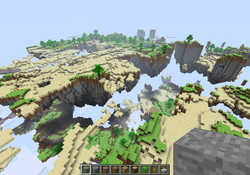

[<返回](https://github.com/Hailaycraft/Minecraft-Learning-note/目录.md)

如果你不知道如何开始你的Minecraft之旅,你可以阅读该教程!本教程使用Minecraft1.12困难模式下进行编写.(本教程可能不适用于我的世界中国版)

# 第一章 第一节

## 游戏启动

Minecraft Java Edition是由Java编写的,游戏本体并不是.exe的可执行文件,所以我们需要启动器,这里推荐几款好用的启动器(如果有能力,请支持正版!):

- [官方启动器](https://minecraft.net/zh-hans/store/minecraft/?ref=fm)
- [HelloMinecraft启动器](http://www.mcbbs.net/thread-142335-1-1.html)
- [PlainCraft启动器](http://www.mcbbs.net/thread-627838-1-1.html)
- [Chocola启动器](http://www.mcbbs.net/thread-719579-1-1.html)

开启启动器后,我们需要下载对应的Minecraft版本,待下载完后开启游戏.

## 游戏界面

进入游戏后,您会发现界面为英文的:

点击语言按钮:
找到中文(简体)并切换.

##  按键控制

- W键,向前移动
- S键,向后移动；
- A键,向左移动；
- D键,向右移动；
- Space键,跳跃(在深水中，长按Space键可以使角色上浮)
- ⇧ Shift键，潜行(在方块边缘行走时，按住⇧ Shift键行走在可以避免从方块边缘掉落，且能够在梯子上保持位置不下滑)
  Ctrl键,疾跑
- E键,打开物品栏
- F键,交换左右手物品
- 鼠标右击,使用/放置方块
- 鼠标中键,选取方块
- 鼠标左击,攻击/破坏方块

> 同时你也可以在选项-`控制`里切换按键
> 

- F1可以隐藏或显示图形用户界面
- F2可以截取游戏画面
- F3打开调试屏幕
- F3+H高级信息框
- F3+⇧ Shift可以显示（或隐藏）完整的调试信息和资源分配饼状图
- F3+F+⇧ Shift会提高渲染距离
- F3+F 会降低渲染距离
- F5 切换人称视角
- F11 开启全屏模式

> 参考页面 https://minecraft-zh.gamepedia.com/%E6%95%99%E7%A8%8B/%E8%8F%9C%E9%B8%9F%E6%89%8B%E5%86%8C


# Mods

（重定向自[Mod](https://minecraft-zh.gamepedia.com/index.php?title=Mod&redirect=no)）

  **该页面的内容不受Mojang AB、Minecraft Wiki、Minecraft IRC频道与Minecraft论坛的官方支持。**




**Mods（Modifications的缩写）**，也叫**模组**，是指任何基于Minecraft原本游戏内容所作出的任何修改。

## 目录

- [1用途](https://minecraft-zh.gamepedia.com/Mods#.E7.94.A8.E9.80.94)
- 2Mod 类型
  - [2.1客户端 Mod](https://minecraft-zh.gamepedia.com/Mods#.E5.AE.A2.E6.88.B7.E7.AB.AF_Mod)
  - [2.2服务器Mod](https://minecraft-zh.gamepedia.com/Mods#.E6.9C.8D.E5.8A.A1.E5.99.A8Mod)
  - [2.3整合包](https://minecraft-zh.gamepedia.com/Mods#.E6.95.B4.E5.90.88.E5.8C.85)
- [3错误](https://minecraft-zh.gamepedia.com/Mods#.E9.94.99.E8.AF.AF)
- [4另见](https://minecraft-zh.gamepedia.com/Mods#.E5.8F.A6.E8.A7.81)

## 用途

许多Mod向游戏添加更多的额外内容来改变游戏的方式和可塑性，或给予玩家更大的刺激，或给予玩家与*Minecraft*世界更多交互的方式。许多制作*Minecraft* Mod的人（也称Mod制作者）使用*Minecraft* Coder Pack和ModLoader或Minecraft Forge来制作Mod。一些Mod可能会比较大，而其它一些Mod会添加更多的设置和选项来自定义游戏速度、视频渲染和游戏玩法。服务器Mod和插件则为服务器管理员提供了更多管理上的方便和选择；大多数单人模式中的Mod都提供了服务器版以在多人模式中使用。

理想的情况下，一个Mod的制作者会随游戏的更新而更新Mod——带来更多的内容、漏洞修复或优化。否则，这个Mod就可能不会在新游戏版本中工作。

iOS上的基岩版可以通过越狱来启用Mod，而在Android设备上则使用例如["BlockLauncher"](https://play.google.com/store/apps/details?id=net.zhuoweizhang.mcpelauncher&hl=en)之类的App来启用Mod。主机版没有 Mod。

## Mod 类型

### 客户端

客户端Mod是对游戏客户端进行了修改的模组。它们不是独立的，它们需要修改minecraft.jar。

Minecraft服务器端会忽略客户端中的自定义元素，因此多数添加新元素的Mod不会在多人模式中工作，除非服务器端也安装了相同的Mod。一些客户端Mod的作者也编写了服务器版的Mod使得Mod能用于多人模式，但并不是所有。一些API和启动器类的Mod（如ModLoader和AudioMod）和很多功能性Mod（如 [Optifine](http://www.optifine.net/)、[Rei's Minimap](http://www.minecraftforum.net/topic/482147-152/)、和[TooManyItems](https://minecraft-zh.gamepedia.com/Mods/TooManyItems)）不需要服务器的支持就能运作，并能造成影响。

[在Minecraft社区里的Mod列表](http://www.minecraftforum.net/forums/mapping-and-modding/minecraft-mods)

### 服务器Mod

服务器Mod是对官方*Minecraft*服务器软件修改的模组。它们的设计主要是通过实现服务器权限分层限制来让服务器的管理变得更加简单（例如踢人和封人等）。它们经常以“包”的形式运行，这表明它们并不是在修改服务器的.jar文件，而是检测它的输出并向其发出命令。

### 整合包

整合包是Mod的合集，这些Mod都已被配置，并且可以一起工作。整合包通常以科技、探索或魔法为主题。整合包通常还带有自定义启动器或安装器，让安装和运行Mod包更容易。一些流行的整合包如[Feed The Beast](https://minecraft-zh.gamepedia.com/Mods/Feed_The_Beast)、 [Tekkit](http://www.technicpack.net/tekkit/)和[Hexxit](http://www.technicpack.net/hexxit)。当然也有许多更小的整合包，例如[Crafting Dead](http://www.craftingdead.com/)和[Blocklauncher](http://www.blocklaunch.net/)，多数使用[Technic Pack](http://www.technicpack.net/)上的Minecraft Technic Launcher。

## 错误

当你安装了一个Mod后，它可能会停止游戏的正常工作。如果你在使用一个Mod时遇到问题，并想报告它，首先移除*所有Mod*（如果是通过Forge使用Mod，可以试着在非Forge模式下（即原版游戏）启动），并查看问题是否仍未解决。如果问题仍未解决，可以将其报告到[漏洞追踪器](https://bugs.mojang.com/browse/MC)。否则，尝试使用最少数量的Mod来重现问题，然后报告问题到 Mod 的作者。

有些mod必须和其他mod一起运行才能正常，比如NotEnoughItems（NEI）必须要对应的ChickenCore，装LittleBlocks必须要添加SlimeVoid。Forge启动时可以自动检测安装错误。例如，如果你安装NEI没有安装ChickenCore，Forge的Minecraft在启动时就会显示提示，告诉你缺少ChickenCore Mod（较新版本的Forge能够以中文显示报告）。

如果*Minecraft*崩溃，修改过的游戏会在*崩溃报告*里进行标记。接下来的链接解释了[如何获取崩溃报告](https://minecraft-zh.gamepedia.com/%E5%B4%A9%E6%BA%83#.E5.A6.82.E4.BD.95.E8.8E.B7.E5.8F.96.E5.B4.A9.E6.BA.83.E6.8A.A5.E5.91.8A)。（注意：如果你的*Minecraft*还未崩溃过，按照接下来的说明去做将不会找到任何东西。）

崩溃报告文字将会在一行的顶部附近标注：

```
Is Modded: Probably not. Jar signature remains and client brand is untouched
Is Modded: Very likely
Is Modded: Definitely: client brand changed to (present loader, such as "fml,forge" or modloader)
```

下面是一个简短的示例崩溃报告：

| 崩溃报告 [隐藏]                                              |
| :----------------------------------------------------------- |
| `Minecraft has crashed!            ----------------------      Minecraft has stopped running because it encountered a problem; Unexpected error--- BEGIN ERROR REPORT 1aa09c6 --------Generated 03/09/12 12:00- Minecraft Version: 12w34a- Operating System: Windows 7 (amd64) version 5.2- Java Version: 1.7.0_03, Oracle Corporation- Java VM Version: Java HotSpot(TM) 64-Bit Server VM (mixed mode), Oracle Corporation- Memory: 500000000 bytes (500 MB) / 600000000 bytes (600 MB) up to 900000000 bytes (900 MB)- LWJGL: 2.4.2- OpenGL: NVidia ABC 999 Ti/PCI/SSE2 GL version 0.9.0, NVIDIA Corporation'''- Is Modded: Probably not. Jar signature remains and client brand is untouched- Type: Client- Profiler Position: N/A (disabled)- World MpServer Entities: 1 total; [anx['Blockbuilder567'/1135, l='MpServer', x=8.50, y=66.62, z=8.50]]...` |

检查Mod的代码相当简单，并且它总是不是正确的；它可能会说“probable not”，甚至当Mod未安装时。然而，如果你修改了minecraft.jar那么你将很难获取“very likely”信息，因此本质上是一个“yes”。还有一个“definitely”信息，可以看见Bukkit服务器崩溃，并且在其他类似的情况下，像在Minecraft Forge API被安装后。

'Probably not'会在客户端/服务器进行内部检查，检查文件是否没有变化（通常叫做“vanilla”）以及META-INF是否仍然还在那里。当不是vanilla时，“Definitely”会加上客户端名字显示。例如，你会看到像这样的：

```
Is Modded: Definitely: Client brand changed to 'fml,forge'
```

## 另见

- [Plugin API](https://minecraft-zh.gamepedia.com/Plugin_API)，一个即将到来的特性，允许Mod作者可以更容易地向游戏添加内容。
- [作弊的利用](https://minecraft-zh.gamepedia.com/Mods/%E4%BD%9C%E5%BC%8A)。
- [Mods/安装](https://minecraft-zh.gamepedia.com/Mods/%E5%AE%89%E8%A3%85)，指导如何安装Mod。
- [Mods/安装Forge Mod](https://minecraft-zh.gamepedia.com/Mods/%E5%AE%89%E8%A3%85Forge_Mod)，指导如何使用Forge安装Mod。
- [Mod/制作](https://minecraft-zh.gamepedia.com/Mods/%E5%88%B6%E4%BD%9C)，指导如何创建Mod。
- [辅助程序与编辑器/Mod工具](https://minecraft-zh.gamepedia.com/%E8%BE%85%E5%8A%A9%E7%A8%8B%E5%BA%8F%E4%B8%8E%E7%BC%96%E8%BE%91%E5%99%A8/Mod%E5%B7%A5%E5%85%B7)，展示了安装和制作Mod的工具。
- [本Wiki中所有介绍具体的Mod的页面](https://minecraft-zh.gamepedia.com/Special:%E5%89%8D%E7%BC%80%E7%B4%A2%E5%BC%95/Mod)。